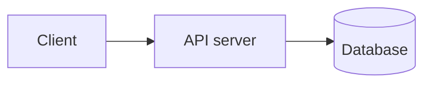
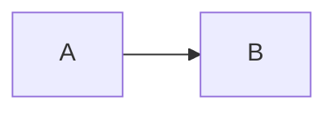

# ByteArchitect

An interactive, text-first system design course platform. Lessons are written in MDX with build-time architecture diagrams, step-through slide illustrations and quizzes. Learners sign in with email and password, verify their email, and their progress and quiz scores are saved to Firestore.

**Live:** https://bytearchitect.web.app

It ships with one course, **System Design Mastery**:

|                  |                                                     |
| ---------------- | --------------------------------------------------- |
| Parts / chapters | 5 / 50                                              |
| Lessons          | 208, each with an inline quiz (about 205,000 words) |
| Chapter quizzes  | 45, including a 20-question final assessment        |
| Quiz questions   | 931                                                 |
| Diagrams         | 488 (rendered to SVG at build time, light and dark) |
| Points to ponder | 208 questions with reveal-on-click answers          |

The platform is multi-course ready: a course is a self-contained folder of MDX files plus an outline.

It also has a LeetCode-style **interview practice** section, with one problem set, **Google Interview Questions (2024)**: 19 coding questions reported from Google phone screens and onsites, compiled from [this LeetCode Discuss post](https://leetcode.com/discuss/post/6185127/2024-google-interview-questions-compilat-mjrf/). Each problem has a statement, examples, hidden tests, an editorial, and reference solutions in JavaScript and Python. Learners write code in an in-browser editor, **Run** it against the examples or their own inputs, and **Submit** it against every hidden test in JavaScript, TypeScript or Python. Verdicts follow LeetCode (Accepted, Wrong Answer, Runtime Error, Time Limit Exceeded, Compile Error), and each submission is saved with its runtime and the first failing test.

## Tech stack

- **App:** React 19, TypeScript, Vite, React Router, TanStack Query
- **UI:** Tailwind CSS v4, shadcn/ui (Radix), lucide icons
- **Content:** MDX (`@mdx-js/rollup`), remark/rehype plugins, Shiki syntax highlighting, and Mermaid rendered to inline SVG at build time with `mermaid-isomorphic`, so no Mermaid runtime is shipped
- **Code runner:** CodeMirror 6 editor; code runs in a Web Worker, with TypeScript types stripped by Sucrase and Python 3 run by [Pyodide](https://pyodide.org) (CPython compiled to WebAssembly, loaded from the jsDelivr CDN on the first Python run)
- **Backend:** Firebase Auth (email/password + verification) and Firestore Lite; Firebase Hosting
- **Quality:** Vitest + Testing Library, ESLint, Prettier

## Quick start (local, no Firebase account needed)

Local development runs against the Firebase **emulators** with a `demo-` project, so no credentials are required.

Prerequisites: Node 22.12+ (Node 24 recommended), Java 21+ (for the Firebase emulators) and either Google Chrome or Playwright's Chromium (used to render diagrams at build time).

```bash
corepack enable                       # provides the pinned Yarn 4
yarn install
yarn playwright install chromium      # optional if Google Chrome is installed

cp .env.example .env.local            # then set the values below
```

`.env.local` for emulator development:

```ini
VITE_FIREBASE_API_KEY=demo-key
VITE_FIREBASE_AUTH_DOMAIN=demo-bytearchitect.firebaseapp.com
VITE_FIREBASE_PROJECT_ID=demo-bytearchitect
VITE_FIREBASE_APP_ID=demo-app-id
VITE_USE_EMULATORS=true
```

Then, in two terminals:

```bash
yarn emulators    # Auth on :9099, Firestore on :8080, Emulator UI on http://localhost:4000
yarn dev          # http://localhost:5173
```

Sign up in the app. No email is sent: the emulator prints the verification link in the `yarn emulators` terminal ("To verify the email address …, follow this link"). Open it, then click **I've verified** in the app.

The first build or dev-server visit renders every diagram once (a minute or two); results are cached in `node_modules/.cache/mermaid-svg`.

## Scripts

| Command                                        | What it does                                                                          |
| ---------------------------------------------- | ------------------------------------------------------------------------------------- |
| `yarn dev`                                     | Start the dev server                                                                  |
| `yarn build`                                   | Typecheck and build to `dist/`                                                        |
| `yarn preview`                                 | Serve the production build locally                                                    |
| `yarn typecheck` / `yarn lint` / `yarn format` | TypeScript, ESLint, Prettier                                                          |
| `yarn test`                                    | Unit, component and content tests                                                     |
| `yarn emulators`                               | Firebase Auth + Firestore emulators (demo project)                                    |
| `yarn deploy`                                  | Production build, then deploy Hosting, Firestore rules and indexes, and auth settings |

## Project structure

```text
build/                      Build-time plugins: Mermaid → SVG, lesson reading-time stats, env guard
src/
  app/                      Router, providers, App shell
  components/
    ui/                     shadcn/ui primitives
    layout/                 Header, user menu, shell
    mdx/                    Lesson widgets: Diagram, Slides, Callout, Ponder, KeyTakeaways, Tabs (registry in index.ts)
    theme/                  Light/dark theme provider and toggle
  features/                 Feature slices, each with a public index.ts
    auth/                   AuthService interface + Firebase adapter, guards, auth pages
    courses/                Course engine: outline DSL, defineCourse, catalog/overview/lesson pages
    practice/               Problem sets, code runner (worker, JS/TS/Python harnesses, judge),
                            SubmissionRepository + Firestore adapter, workspace pages
    progress/               ProgressRepository interface + Firestore adapter, hooks
    quiz/                   Quiz types, grading logic and components
  content/courses/
    index.ts                Registered courses
    system-design/          course.ts (outline), lessons/<chapter>/<slug>.mdx + .quiz.ts
  content/practice/
    index.ts                Registered problem sets
    google-2024/            set.ts (outline), problems/<slug>.problem.ts + .mdx + .solution.mdx
  lib/firebase.ts           The only place the Firebase app is initialized
```

Module boundaries are enforced by ESLint: other code imports a feature only through its `index.ts`, and only `src/lib/firebase.ts` and `*.firebase.ts` adapters may import the Firebase SDK.

## Writing content

Each outline entry in `src/content/courses/<course>/course.ts` maps to files in `lessons/<chapter>/`:

- **Lesson:** `<slug>.mdx` plus `<slug>.quiz.ts` (the quiz is appended to the lesson automatically).
- **Chapter quiz:** only `<slug>.quiz.ts`.

A lesson file:

````mdx
---
title: 'Design: Encoding and Key Generation'
---

Prose in Markdown…



<Slides title="Step by step">
<Slide caption="1. First step">



</Slide>
</Slides>

<Callout type="tip">Callout types: note, tip, warning, interview.</Callout>

<Ponder question="A question for the learner to think about?">
  The answer, hidden until the learner reveals it.
</Ponder>

<KeyTakeaways>- Every lesson ends with key takeaways.</KeyTakeaways>
````

A quiz file:

```ts
import { defineQuiz } from '@/features/quiz'

export default defineQuiz([
  {
    prompt: 'Which store fits large immutable files?',
    options: [{ text: 'Blob store', correct: true }, { text: 'Graph database' }],
    explanation: 'Blob stores are built for large binary objects.',
  },
])
```

A question with several correct options becomes multi-select.

`yarn test` runs content checks that fail on:

- outline entries without files, and files without outline entries;
- MDX that does not compile;
- lessons under 450 words, without `<KeyTakeaways>` or without at least one `<Ponder>`;
- invalid quizzes;
- lesson quizzes outside 2–5 questions, chapter quizzes under 6 and a final assessment under 15.

Mermaid gotchas: avoid `;` and `#` inside diagram text, and quote labels that contain punctuation. MDX gotcha: a literal `<` followed by a letter or digit (such as `<1%`) is parsed as a tag; write it out in words or put it in a code span.

### Adding a practice problem

Each entry in `src/content/practice/<set>/set.ts` links to the report it came from and maps to three files in `problems/`:

- **`<slug>.problem.ts`**: the signature, examples, hidden tests and reference solutions.
- **`<slug>.mdx`**: the statement. Put `<Examples />` where the examples go; they are rendered from the data, so they always match the tests.
- **`<slug>.solution.mdx`**: the editorial.

```ts
import { defineProblem } from '@/features/practice'

export default defineProblem({
  signature: {
    kind: 'function', // or 'class' for design problems, driven by LeetCode-style operation lists
    name: 'twoSum',
    params: [
      { name: 'nums', type: 'int[]' },
      { name: 'target', type: 'int' },
    ],
    returns: 'int[]',
  },
  examples: [{ args: [[2, 7, 11, 15], 9], expected: [0, 1], explanation: '…' }],
  tests: [{ args: [[3, 3], 6], expected: [0, 1] }],
  solution: { javascript: `function twoSum(nums, target) { … }`, python: `class Solution: …` },
})
```

The signature generates the starter code for every language. The JavaScript reference solution also computes the expected output when a learner runs their own inputs.

`yarn test` judges both reference solutions against every test with the same harness the browser uses (Python through the `pyodide` package). It also fails on:

- outline entries without files, and files without outline entries;
- tests that don't match the signature's types, and duplicate test inputs;
- starter code that doesn't compile;
- statements without `<Examples />` or constraints, and MDX that doesn't compile.

Include a few large tests so that brute-force solutions exceed the time limit (3 s per test for JavaScript and TypeScript, 8 s for Python). Build large inputs with code, such as `Array.from(…)`, instead of literal data.

### Adding a course

1. Create `src/content/courses/<id>/` with `course.ts` (the `meta` and `parts` outline), `files.ts` (the two `import.meta.glob` calls; copy from `system-design`), `index.ts` (calls `defineCourse`) and `lessons/`.
2. Add it to the array in `src/content/courses/index.ts`.

## Deploying to Firebase (free Spark plan)

Everything runs on the no-cost **Spark** plan: Hosting, Authentication and Firestore. There are no Cloud Functions or Cloud Storage, which Spark doesn't include.

The production site is **https://bytearchitect.web.app**: Firebase project `bytearchitect`, with Firestore in `asia-south1`. `.firebaserc` points the CLI at it. Everything that can live in code is in `firebase.json`: Hosting, the Firestore location, rules and indexes, and the Email/Password sign-in provider.

### Redeploying

1. Sign in with an account that has access to the project: `yarn firebase login`.
2. Put the web app config in **`.env.production.local`**. The file is gitignored, and Vite loads it for production builds, so it overrides the emulator settings in `.env.local`. `yarn firebase apps:sdkconfig web` prints the values:

   ```ini
   VITE_FIREBASE_API_KEY=...
   VITE_FIREBASE_AUTH_DOMAIN=bytearchitect.firebaseapp.com
   VITE_FIREBASE_PROJECT_ID=bytearchitect
   VITE_FIREBASE_APP_ID=...
   VITE_USE_EMULATORS=false
   ```

3. Run `yarn deploy`. It builds the app and deploys Hosting, the Firestore rules and indexes, and the Email/Password provider setting.

The build refuses to produce a production bundle that points at a `demo-` project or has no project ID, so an accidental deploy with only the emulator config fails fast.

### Deploying to your own project

Every step runs from the CLI, and no billing account is needed:

```sh
yarn firebase projects:create <project-id> --display-name "ByteArchitect"
yarn firebase apps:create web "ByteArchitect Web" --project <project-id>
yarn firebase apps:sdkconfig web --project <project-id>   # copy into .env.production.local
yarn firebase use --add                                    # choose the project, alias it "default"
# Set "firestore.location" in firebase.json first: it can't be changed after the database exists.
yarn deploy                                                # the first run also creates the Firestore database
yarn firebase firestore:databases:update "(default)" --delete-protection ENABLED
```

Then, in the [Firebase console](https://console.firebase.google.com/):

- Set a **public-facing name** under Project settings → General. The verification and password-reset emails show it as the app name.
- Optionally customize the email templates, and add a custom domain under Hosting. A custom domain is also added to Authentication → Settings → **Authorized domains**, so verification emails can link back to it. On hosts that aren't authorized, such as preview channels, the email is sent without the link back.

The emulators always use the demo project, so local development is unaffected either way.

Hosting serves app routes (any path without a file extension) as `no-cache`, so every visit picks up the latest deploy. Hashed files in `/assets` are cached as `immutable`. If a tab opened before a deploy requests a chunk that no longer exists, the app reloads once to pick up the new version.

### Free-tier budget

Limits can change, so check [Firebase pricing](https://firebase.google.com/pricing) and the [Auth limits](https://firebase.google.com/docs/auth/limits).

| Resource                               | Spark limit                                                    | How this app stays within it                                                                                                                                                                                                                                                                                                                                                                                                                                   |
| -------------------------------------- | -------------------------------------------------------------- | -------------------------------------------------------------------------------------------------------------------------------------------------------------------------------------------------------------------------------------------------------------------------------------------------------------------------------------------------------------------------------------------------------------------------------------------------------------- |
| Hosting storage                        | 10 GB                                                          | The build is about 17 MB                                                                                                                                                                                                                                                                                                                                                                                                                                       |
| Hosting transfer                       | 360 MB/day                                                     | About 205 KB gzip for the app shell; lessons are lazy chunks of about 5–40 KB gzip; diagrams are inline SVG with no Mermaid runtime; hashed assets are cached as `immutable`, so returning visitors re-download almost nothing. This is roughly 1,500+ new visitors per day. The practice workspace loads the editor (about 110 KB gzip) and one language grammar lazily; the Python runtime (about 6 MB compressed) comes from the jsDelivr CDN, not Hosting. |
| Firestore                              | 50K reads, 20K writes, 20K deletes per day; 1 GiB              | One progress document per learner per course, cached by React Query, with one write per completion or quiz submission. This supports roughly 1,000+ daily active learners. Code submissions add one write each; "Run" writes nothing, and a problem's history (at most 20 reads) is fetched only when the Submissions tab opens.                                                                                                                               |
| Auth                                   | Email/password sign-in; generous monthly active user allowance | Standard email/password accounts                                                                                                                                                                                                                                                                                                                                                                                                                               |
| Verification and password-reset emails | Daily caps (password reset is the lowest, around 150/day)      | Resend buttons have a cooldown; watch the reset cap if you grow                                                                                                                                                                                                                                                                                                                                                                                                |

If you outgrow Spark, upgrading to **Blaze** keeps the same free allowances and bills only for usage above them.

### Continuous deployment (optional)

`.github/workflows/ci.yml` typechecks, lints, tests and builds every push and pull request. To also deploy, with `main` going live and pull requests getting temporary preview channels:

1. In the repository's **Settings → Secrets and variables → Actions**:
   - **Variables:** `VITE_FIREBASE_API_KEY`, `VITE_FIREBASE_AUTH_DOMAIN`, `VITE_FIREBASE_PROJECT_ID`, `VITE_FIREBASE_APP_ID`.
   - **Secret:** `FIREBASE_SERVICE_ACCOUNT`, the JSON key of a service account with the _Firebase Hosting Admin_ role. `yarn firebase init hosting:github` can create it for you.
2. Push to `main`.

The deploy job is skipped until `VITE_FIREBASE_PROJECT_ID` is set. CI deploys Hosting only. After changing `firestore.rules` or the auth settings in `firebase.json`, run `yarn deploy`.

## Data model and security

- `users/{uid}`: profile (`displayName`, `email`, `createdAt`).
- `users/{uid}/courses/{courseId}`: progress (`completed`, `quizzes`, `lastLessonId`, `updatedAt`). Problem sets use the same document, keyed by set id: solved problems are `completed`.
- `users/{uid}/problems/{setId}__{slug}/submissions/{id}`: one immutable document per submission (`language`, `code`, `verdict`, `passed`, `total`, `runtimeMs`, `createdAt`, and the first failure's `input`, `output`, `expected`, `error` and `stdout`, truncated).

`firestore.rules` lets users read and write only their own documents, requires a verified email for progress and submissions, validates field names and sizes, makes submissions immutable with a server timestamp, and denies everything else.

Learner code never leaves the browser except as a saved submission. It runs in a Web Worker, which has no access to the page. JavaScript and TypeScript get a fresh worker per run, and any run that exceeds its time limit is stopped by terminating the worker.

## License

See [LICENSE](LICENSE).
