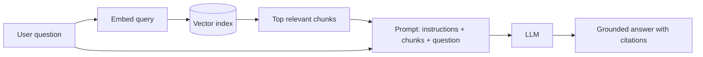

Part IV applies the course's methods to four AI-era design problems. Each combines classic building blocks with AI-specific components. This lesson previews them, introduces shared concepts and adapts the SCALED framework for AI problems.

## The four problems

| Chapter | Problem | Characteristic hard part |
| --- | --- | --- |
| Conversational LLM service | A ChatGPT-style assistant | GPU-efficient inference, streaming, conversation state, cost at scale |
| Data infrastructure for AI/ML | Pipelines and storage for training and serving models | Huge datasets, reproducibility, feature consistency between training and serving |
| LLM customer support bot | Answers questions from a company's knowledge base | Retrieval quality, grounding, escalation to humans, safety |
| AI code assistant | Completion and chat inside an editor | Latency per keystroke, context selection from large codebases, privacy |

## Shared concepts

**Tokens.** Models read and write tokens, which are roughly three-quarters of a word in English. Cost, latency and context limits are all measured in tokens.

**Context window.** The maximum number of tokens the model can consider at once, including the prompt, retrieved documents, conversation history and output. Choosing what goes into the window is a central design task.

**Prefill and decode.** Inference has two phases. **Prefill** processes the entire prompt in parallel and is compute-heavy. **Decode** generates one token at a time and is limited by memory bandwidth. Time to first token depends mostly on prefill; generation speed depends on decode.

**KV cache.** During decoding, the model stores intermediate attention state for all previous tokens. This cache consumes GPU memory proportional to context length and batch size, and it limits how many requests a GPU can serve at once.

**Embeddings.** Numeric vectors that represent meaning. Similar texts have nearby vectors, which enables semantic search through a vector index.

**Retrieval-augmented generation (RAG).** Retrieve relevant documents for a query and include them in the prompt, so the model answers from current, specific knowledge rather than memory alone.

## SCALED for AI problems

- **Scope:** besides features, define quality targets (accuracy, helpfulness), safety requirements, latency goals such as time to first token, and cost limits.
- **Capacity:** estimate requests per second, tokens per request (input and output), GPU throughput in tokens per second and the resulting GPU count and cost.
- **API and data model:** streaming APIs, conversation or session storage, document and embedding stores, feedback records.
- **Layout:** gateway, orchestration layer, retrieval, inference cluster, safety filters, storage and evaluation pipelines.
- **Evolve:** deep dives into batching and scheduling on GPUs, retrieval quality, caching and model routing.
- **Defend:** quality evaluation, failure modes such as hallucinations and injection, cost trade-offs and fallbacks when models are overloaded.

## A quick GPU estimate

Suppose a service must generate 10 million responses per day with 500 output tokens each: 5 billion output tokens per day, about 58,000 tokens per second on average and perhaps 150,000 at peak. If one GPU server generates about 3,000 tokens per second across its batched requests, peak load needs about 50 servers, before redundancy. Doubling the average response length doubles the fleet. Estimates like this make cost trade-offs concrete.

<KeyTakeaways>
- Part IV covers an LLM chat service, ML data infrastructure, a support bot and a code assistant.
- Tokens, context windows, prefill and decode phases, KV caches, embeddings and RAG are the shared vocabulary.
- SCALED adapts to AI by adding quality, safety and cost to scope, and token-based estimates to capacity.
- GPU fleet size follows from tokens per second, so response length and traffic directly drive cost.
</KeyTakeaways>
