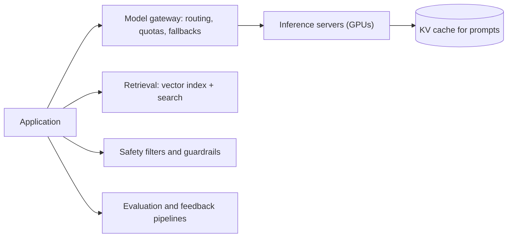

Large language models and other generative AI systems have moved from research labs into everyday products: chat assistants, coding tools, search, customer support and content creation. Building these products introduced new components, new bottlenecks and new failure modes into system design. The fundamentals from this course still apply, but they combine in new ways around a very unusual kind of backend: a model that is expensive, slow, probabilistic and enormous.

## What is different about AI workloads

| Traditional service | LLM-backed service |
| --- | --- |
| Requests take milliseconds | Requests take seconds, output is streamed token by token |
| CPU-bound, cheap per request | GPU-bound, expensive per request |
| Deterministic results | Probabilistic outputs that can be wrong or unsafe |
| Cost scales with requests | Cost scales with tokens in and out |
| Scale by adding commodity servers | Scale limited by scarce accelerators and memory |
| Caching exact responses works well | Exact-match caching rarely hits; semantic and prefix caching help |

These differences reshape familiar decisions.

## New building blocks

- **Inference serving** runs models on accelerators with techniques such as continuous batching, quantization and caching of attention state for shared prompt prefixes.
- **Model gateways** route requests across models and providers, enforce quotas, track costs and fall back when a model is overloaded.
- **Vector databases and retrieval** find relevant documents for a query using embeddings, enabling retrieval-augmented generation (RAG).
- **Guardrails** filter inputs and outputs for safety, privacy and policy compliance.
- **Evaluation pipelines** measure quality continuously, because outputs cannot be checked with simple assertions.
- **Data infrastructure** for training and fine-tuning, including feature stores, dataset versioning and large-scale preprocessing.

## Familiar principles in a new setting

- **Latency** becomes about time to first token and tokens per second. Streaming responses over server-sent events or WebSockets makes long generations feel responsive.
- **Capacity planning** is measured in GPU memory and tokens per second, not requests per second. A request with a long prompt costs far more than a short one.
- **Rate limiting** uses token budgets as well as request counts.
- **Caching** shifts from exact responses to reusing computation for shared prefixes, such as a long system prompt, and to semantic caching of similar questions.
- **Reliability** includes model quality regressions: a new model version can be "up" yet worse. Canary releases compare quality metrics, not just error rates.
- **Cost** becomes a first-class design constraint, driving choices such as routing easy requests to smaller models.

## New failure modes

- **Hallucinations:** confident but wrong answers. Grounding with retrieval and citations reduces them.
- **Prompt injection:** malicious instructions hidden in user input or retrieved documents that try to hijack the model's behavior.
- **Data leakage:** models revealing sensitive information from prompts, documents or training data.
- **Non-determinism:** the same input may give different outputs, which complicates testing and debugging.

<Callout type="note">
AI design problems are still system design problems. Interviewers expect you to use queues, caches, sharding and load balancing, while showing awareness of GPU constraints, token economics and model quality.
</Callout>

## Latency, measured differently

| Metric | Meaning | What drives it |
| --- | --- | --- |
| Time to first token (TTFT) | How long until the first word appears | Queueing, prompt length (prefill), network |
| Time per output token (TPOT) | Gap between streamed tokens | Model size, batch size, memory bandwidth |
| End-to-end latency | TTFT + output tokens × TPOT | Mostly the length of the answer |
| Throughput | Tokens per second per GPU | Batching efficiency, quantization |

A 400-token answer at 30 ms per token takes 12 seconds to finish even though the first word appears in half a second — which is why streaming is essential and why "requests per second" alone says little about capacity.

<Ponder question="An LLM-backed feature returns HTTP 200 for every request, and error-rate dashboards are green, yet users say answers got worse after a model upgrade. What monitoring was missing?">
Quality monitoring. With models, a response can be successful at the protocol level but wrong, unhelpful or unsafe. The system needs evaluation sets run before rollout, online signals such as thumbs-up/down, regeneration rates and escalation rates, and canary comparisons of those signals between old and new models — the model equivalent of comparing error rates during a deployment.
</Ponder>

<KeyTakeaways>
- LLM workloads are slow, expensive, GPU-bound, probabilistic and billed by tokens.
- New building blocks include inference servers, model gateways, retrieval with vector indexes, guardrails and evaluation pipelines.
- Classic principles adapt: time to first token, token-based rate limits, prefix caching and quality-aware canaries.
- Hallucinations, prompt injection, data leakage and non-determinism are new failure modes to design for.
- Time to first token and time per output token replace simple request latency as the key performance metrics.
</KeyTakeaways>
