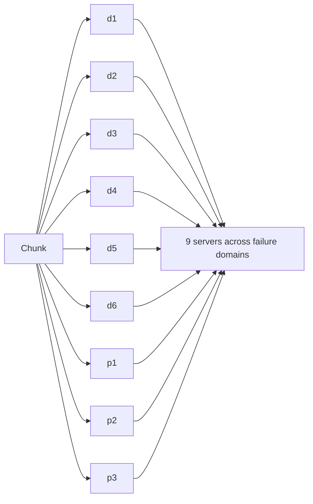

The high-level design raises several important questions: how to achieve extreme durability affordably, how to partition metadata, and how to keep storage efficient over time.

## Replication versus erasure coding

**Replication** stores full copies of each chunk — typically three — on different racks or zones. It is simple and reads are fast, but it costs 200% extra storage.

**Erasure coding** splits a chunk into `k` data fragments and computes `m` parity fragments, so that **any `k` of the `k + m` fragments** can reconstruct the chunk. For example, with `k = 6, m = 3`:



- Survives the loss of **any 3** of 9 fragments.
- Storage overhead is only **50%** (9 / 6) instead of 200%.
- The cost: reconstructing lost fragments requires reading `k` fragments and CPU for decoding, and small reads may touch several servers.

### The simplest erasure code: parity

To build intuition, consider one parity fragment computed with XOR over two data fragments:

```text
d1 = 1011, d2 = 0110   →   p = d1 XOR d2 = 1101
Lose d2:  d2 = d1 XOR p = 1011 XOR 1101 = 0110   ✓ recovered
```

Real systems use Reed–Solomon or related codes that generalize this to several parity fragments, so any `m` fragments can be lost.

### Comparing schemes on 1 PB of data

| Scheme | Raw storage needed | Fragments that can be lost | Read of a healthy chunk | Repair of one lost piece |
| --- | --- | --- | --- | --- |
| 3× replication | 3 PB | 2 | 1 server | Copy 1 replica |
| RS (6, 3) | 1.5 PB | 3 | Up to 6 servers | Read 6 fragments, decode |
| RS (10, 4) | 1.4 PB | 4 | Up to 10 servers | Read 10 fragments, decode |

At exabyte scale, the difference between 3 PB and 1.5 PB per petabyte stored is hundreds of millions of dollars of hardware. Some systems use **locally repairable codes**, which add a few extra local parities so that the common case — one lost fragment — can be repaired from a small group of fragments instead of all `k`, cutting repair traffic.

A common strategy is **tiered**: new and frequently accessed ("hot") data is replicated for speed; older, colder data is converted to erasure-coded form to save space.

## Placement across failure domains

Replicas or fragments must be spread so that a single rack, power circuit or availability zone failure cannot destroy too many. The placement manager tracks the topology and enforces rules such as "no two fragments of the same chunk in the same rack." With nine fragments across three zones (three per zone), losing an entire zone still leaves six fragments — exactly enough to read and rebuild.

## Repairing lost data

Disks fail constantly in large fleets. The placement manager detects missing replicas or fragments through heartbeats and periodic **scrubbing** (reading data and verifying checksums), then schedules **repairs** that recreate the missing pieces elsewhere. Repairs are prioritized by risk: a chunk that has lost two of three replicas is repaired before one that has lost only one.

Repair speed matters enormously. When a 20 TB disk dies, its data must be rebuilt somewhere. If a single replacement disk rebuilt it at 200 MB/s, it would take more than a day — a long window for a second failure. Because each chunk on the failed disk has its other replicas scattered across hundreds of disks, repair can run in parallel across the whole cluster and finish in minutes.

## Estimating durability

Durability comes from how unlikely it is to lose too many pieces of a chunk before repair completes. A rough model:

- Probability that a given disk fails during a one-hour repair window: with a 2% annual failure rate, about `0.02 / 8,760 ≈ 2.3 × 10⁻⁶`.
- With 3× replication, losing a chunk requires the other two replicas' disks to fail during the window after the first: roughly `(2.3 × 10⁻⁶)² ≈ 5 × 10⁻¹²` per incident.

Real calculations also account for correlated failures (a rack losing power), silent corruption and operator error — which is why placement across failure domains, scrubbing and versioning matter as much as the raw arithmetic.

## Partitioning metadata

The metadata service must handle billions of entries and very high request rates. It is partitioned by a key such as `(account, container, blob name)`:

- **Range partitioning** on names keeps names with a common prefix together, making prefix **listing** efficient. But sequential names (such as timestamps) can create hot partitions, which are split dynamically.
- **Hash partitioning** spreads load evenly but makes listing require a scatter-gather query.

Many systems use range partitioning with automatic splitting and merging of partitions based on load.

<Callout type="tip">
If an application writes thousands of objects per second with names like `logs/2026-09-27T12:00:01.json`, every write hits the same metadata range. Prefixing names with a short hash (`a3f/logs/…`) spreads the load across partitions, at the cost of harder chronological listing.
</Callout>

## Versioning and immutability

Treating chunks as **immutable** simplifies caching, replication and consistency: an "overwrite" writes new chunks and atomically switches the metadata pointer to them. Keeping previous versions enables recovery from accidental deletions or overwrites, at the cost of storage until old versions expire. Stores can also offer **object lock** (write-once-read-many) retention, preventing deletion even by administrators — valuable for compliance and ransomware protection.

## Storage tiers

Access frequency drops sharply with age. Blob stores offer tiers:

| Tier | Access pattern | Cost per GB | Retrieval |
| --- | --- | --- | --- |
| Hot | Frequent | Highest | Immediate |
| Cool | Infrequent | Lower | Immediate, per-access fee |
| Archive | Rare | Lowest | Minutes to hours |

**Lifecycle policies** automatically move blobs between tiers — for example, to cool after 30 days and archive after a year.

<Ponder question="Why would a blob store keep a newly uploaded video replicated three times for its first week and only then convert it to erasure coding?">
New uploads are read heavily (the video is shared and watched right away) and may still be deleted or replaced. Replicas serve each read from one server with no decoding and make early deletes cheap. After a week, reads drop off, so the store converts to erasure coding to halve the storage cost, accepting slower reads and more expensive repairs for data that is rarely accessed.
</Ponder>

<KeyTakeaways>
- Replication is simple and fast but costs 200% overhead; erasure coding survives similar failures with far less overhead but costs more to read and repair.
- Hot data is often replicated and cold data erasure-coded; locally repairable codes reduce repair traffic.
- Placement across failure domains, scrubbing and fast, parallel, prioritized repair preserve durability.
- Durability estimates depend on failure rates and repair windows, plus correlated failures and human error.
- Metadata is partitioned, often by range for efficient listing, with dynamic splitting of hot ranges.
- Immutable chunks, versioning, object lock and lifecycle-driven storage tiers improve safety and cost.
</KeyTakeaways>
