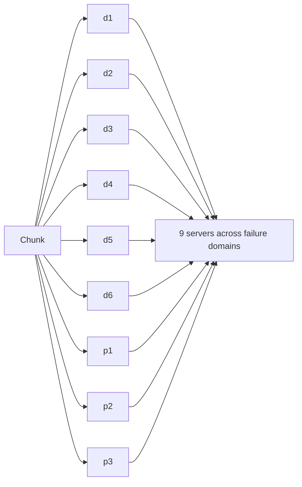

The high-level design raises several important questions: how to achieve extreme durability affordably, how to partition metadata, and how to keep storage efficient over time.

## Replication versus erasure coding

**Replication** stores full copies of each chunk — typically three — on different racks or zones. It is simple and reads are fast, but it costs 200% extra storage.

**Erasure coding** splits a chunk into `k` data fragments and computes `m` parity fragments, so that **any `k` of the `k + m` fragments** can reconstruct the chunk. For example, with `k = 6, m = 3`:

- Survives the loss of **any 3** of 9 fragments.
- Storage overhead is only **50%** (9 / 6) instead of 200%.
- The cost: reconstructing lost fragments requires reading `k` fragments and CPU for decoding, and small reads may touch several servers.

A common strategy is **tiered**: new and frequently accessed ("hot") data is replicated for speed; older, colder data is converted to erasure-coded form to save space.

## Placement across failure domains

Replicas or fragments must be spread so that a single rack, power circuit or availability zone failure cannot destroy too many. The placement manager tracks the topology and enforces rules such as “no two fragments of the same chunk in the same rack.”

## Repairing lost data

Disks fail constantly in large fleets. The placement manager detects missing replicas or fragments through heartbeats and periodic **scrubbing** (reading data and verifying checksums), then schedules **repairs** that recreate the missing pieces elsewhere. Repairs are prioritized by risk: a chunk that has lost two of three replicas is repaired before one that has lost only one.

## Partitioning metadata

The metadata service must handle billions of entries and very high request rates. It is partitioned by a key such as `(account, container, blob name)`:

- **Range partitioning** on names keeps names with a common prefix together, making prefix **listing** efficient. But sequential names (such as timestamps) can create hot partitions, which are split dynamically.
- **Hash partitioning** spreads load evenly but makes listing require a scatter-gather query.

Many systems use range partitioning with automatic splitting and merging of partitions based on load.

## Versioning and immutability

Treating chunks as **immutable** simplifies caching, replication and consistency: an “overwrite” writes new chunks and atomically switches the metadata pointer to them. Keeping previous versions enables recovery from accidental deletions or overwrites, at the cost of storage until old versions expire.

## Storage tiers

Access frequency drops sharply with age. Blob stores offer tiers:

| Tier | Access pattern | Cost per GB | Retrieval |
| --- | --- | --- | --- |
| Hot | Frequent | Highest | Immediate |
| Cool | Infrequent | Lower | Immediate, per-access fee |
| Archive | Rare | Lowest | Minutes to hours |

**Lifecycle policies** automatically move blobs between tiers — for example, to cool after 30 days and archive after a year.

<KeyTakeaways>
- Replication is simple and fast but costs 200% overhead; erasure coding survives similar failures with far less overhead.
- Hot data is often replicated and cold data erasure-coded.
- Placement across failure domains and continuous scrubbing and repair preserve durability.
- Metadata is partitioned, often by range for efficient listing, with dynamic splitting of hot ranges.
- Immutable chunks, versioning and lifecycle-driven storage tiers improve safety and cost.
</KeyTakeaways>
