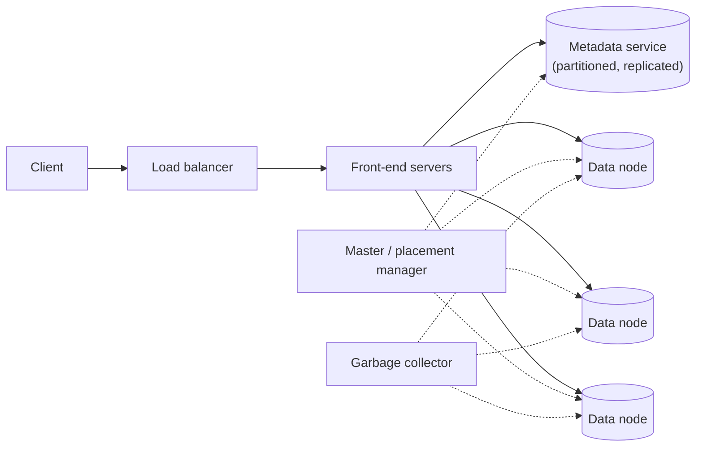
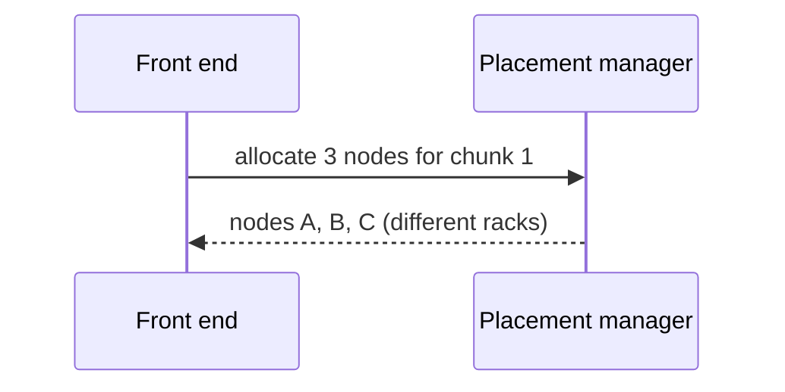
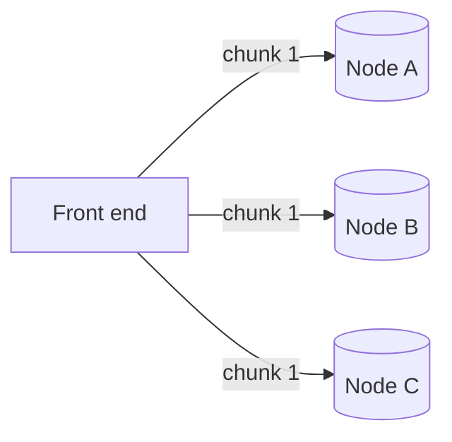
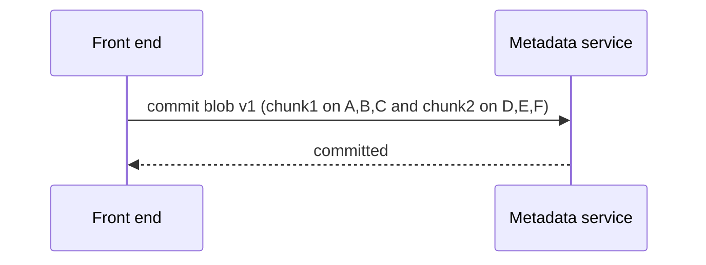

A blob store separates two very different concerns: **metadata** (which blobs exist, who can access them and where their chunks live) and **data** (the chunks themselves). Separating them lets each scale independently.

## Components

- **Front-end servers** — stateless; authenticate requests, enforce permissions, split and assemble chunks and coordinate with metadata and data nodes.
- **Metadata service** — stores accounts, containers, blob names, versions, sizes, access policies and the **chunk map** (which chunks make up each blob and where they live). It is partitioned by container and blob name and replicated for availability.
- **Data nodes** — store chunks on local disks and serve reads and writes. There are thousands of them.
- **Placement manager (master)** — tracks data-node health and free space, decides where new chunks go, and triggers re-replication when nodes fail.
- **Garbage collector** — reclaims space from deleted blobs and orphaned chunks asynchronously.

## Write path

<Slides title="Uploading a blob">
<Slide caption="1. The front end authenticates the request and asks the placement manager for data nodes to hold each chunk.">

</Slide>
<Slide caption="2. The chunk is written to the chosen nodes, which persist it and return checksums.">

</Slide>
<Slide caption="3. After all chunks are durable, the front end commits the blob's metadata and chunk map atomically.">

</Slide>
</Slides>

Committing metadata **last** is important: if the upload fails midway, no metadata points to the partial chunks, and the garbage collector later removes them. Readers never see a half-written blob.

## Read path

1. The front end looks up the blob in the metadata service (often cached) to get its chunk map.
2. It fetches chunks from data nodes — in parallel for throughput, choosing the nearest or least loaded replica.
3. It verifies checksums and streams the bytes to the client, supporting byte ranges.

Because chunks are immutable and checksummed, any replica can serve a read, and front ends can retry a slow or failed node on another replica without affecting correctness. Hedged reads — sending a second request if the first is slow — reduce tail latency for large downloads.

For popular public content, a CDN sits in front of the blob store so most reads never reach it.

## Delete path

Deletes are fast because they are **logical**: the metadata service marks the blob as deleted (or removes its entry), and the garbage collector reclaims chunk storage later. This keeps deletes cheap and allows short undelete windows.

<KeyTakeaways>
- A blob store separates metadata (names, policies, chunk maps) from data (chunks on data nodes).
- Stateless front ends coordinate with the metadata service, placement manager and data nodes.
- Writes place chunks on nodes in different failure domains, then commit metadata last.
- Reads use the chunk map to fetch chunks in parallel and verify checksums.
- Deletes are logical; garbage collection reclaims space asynchronously.
</KeyTakeaways>
