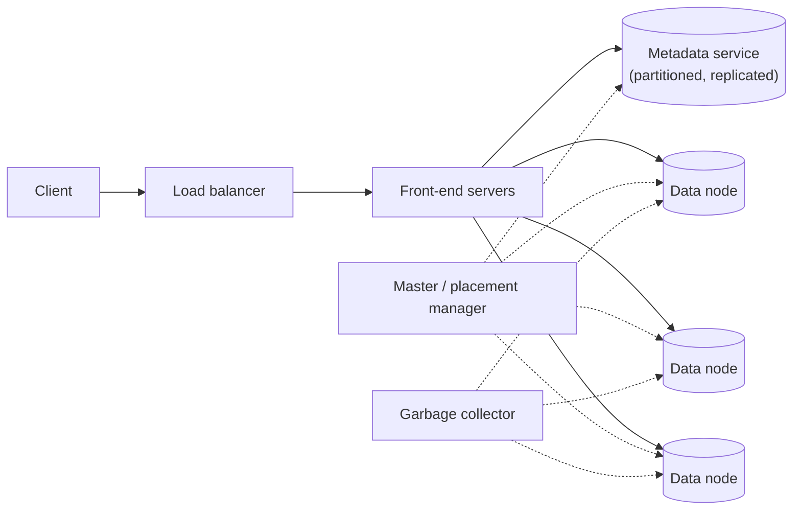
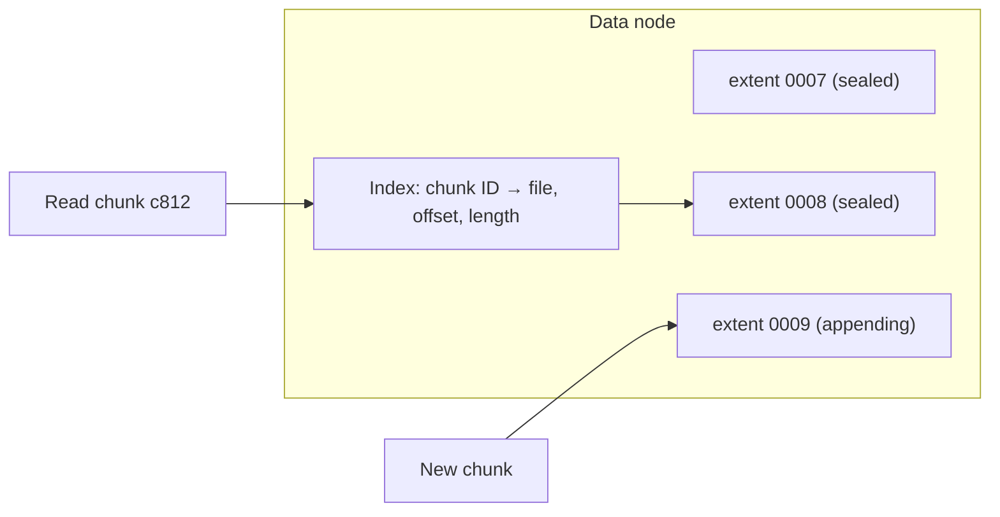
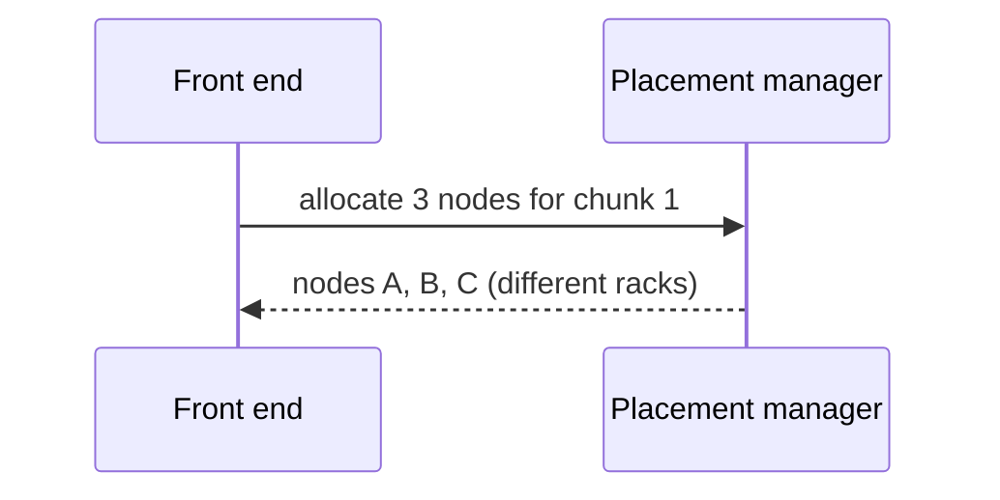
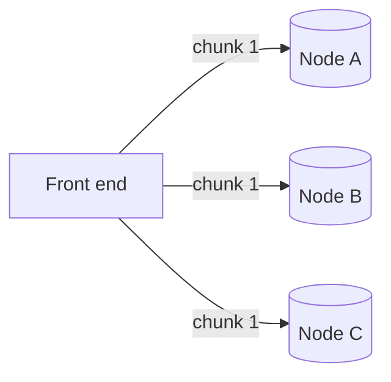
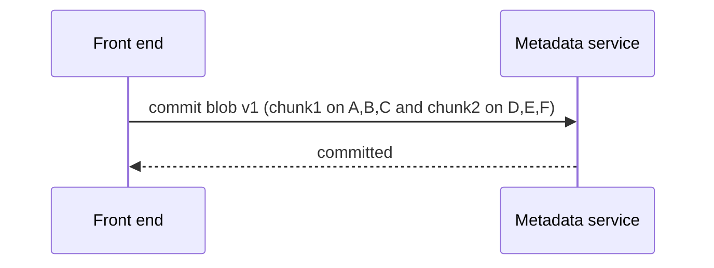

A blob store separates two very different concerns: **metadata** (which blobs exist, who can access them and where their chunks live) and **data** (the chunks themselves). Separating them lets each scale independently.

## Components



- **Front-end servers** — stateless; authenticate requests, enforce permissions, split and assemble chunks and coordinate with metadata and data nodes.
- **Metadata service** — stores accounts, containers, blob names, versions, sizes, access policies and the **chunk map** (which chunks make up each blob and where they live). It is partitioned by container and blob name and replicated for availability.
- **Data nodes** — store chunks on local disks and serve reads and writes. There are thousands of them.
- **Placement manager (master)** — tracks data-node health and free space, decides where new chunks go, and triggers re-replication when nodes fail.
- **Garbage collector** — reclaims space from deleted blobs and orphaned chunks asynchronously.

## The metadata model

| Table | Key | Main fields |
| --- | --- | --- |
| containers | (account, container) | owner, access policy, versioning on or off, created_at |
| blobs | (account, container, name, version) | size, content type, checksum, created_at, deleted flag |
| chunk_map | (blob version, chunk index) | chunk ID, length, locations (data nodes or erasure-coded fragments) |
| data_nodes | node ID | rack, zone, capacity, free space, last heartbeat |

The blobs table is sorted by name within a container, which makes `listBlobs(prefix)` a range scan.

## Inside a data node

Storing each chunk as a separate file would mean billions of small files and heavy file-system overhead. Instead, data nodes append chunks into large **extent files** (for example, 1–4 GB each) and keep an index from chunk ID to (file, offset, length). Writes are sequential appends; reads are a single seek. Every chunk is stored with a **checksum** that is verified on each read.



## Write path

<Slides title="Uploading a blob">
<Slide caption="1. The front end authenticates the request and asks the placement manager for data nodes to hold each chunk.">



</Slide>
<Slide caption="2. The chunk is written to the chosen nodes, which persist it and return checksums.">



</Slide>
<Slide caption="3. After all chunks are durable, the front end commits the blob's metadata and chunk map atomically.">



</Slide>
</Slides>

Committing metadata **last** is important: if the upload fails midway, no metadata points to the partial chunks, and the garbage collector later removes them. Readers never see a half-written blob.

### Choosing where chunks go

The placement manager picks nodes that:

- are in **different racks and zones** from the chunk's other replicas,
- have **free space** and are not already overloaded with writes,
- are **healthy** according to recent heartbeats.

Choosing randomly among eligible nodes, weighted by free space, spreads new data evenly and avoids hot spots such as every new chunk landing on the one freshly added, empty rack.

## Read path

1. The front end looks up the blob in the metadata service (often cached) to get its chunk map.
2. It fetches chunks from data nodes — in parallel for throughput, choosing the nearest or least loaded replica.
3. It verifies checksums and streams the bytes to the client, supporting byte ranges.

A range request only needs the chunks that overlap the range:

```text
GET beach.mp4, Range: bytes=100,000,000-104,999,999   with 16 MB chunks
→ first chunk index = floor(100,000,000 / 16,777,216) = 5
→ last chunk index  = floor(104,999,999 / 16,777,216) = 6
→ fetch chunks 5 and 6 only, trim to the requested bytes
```

Because chunks are immutable and checksummed, any replica can serve a read, and front ends can retry a slow or failed node on another replica without affecting correctness. Hedged reads — sending a second request if the first is slow — reduce tail latency for large downloads.

For popular public content, a CDN sits in front of the blob store so most reads never reach it.

## Delete path

Deletes are fast because they are **logical**: the metadata service marks the blob as deleted (or removes its entry), and the garbage collector reclaims chunk storage later. This keeps deletes cheap and allows short undelete windows.

The garbage collector periodically compares the chunks each data node holds with the chunks referenced by live metadata. Unreferenced chunks older than a safety period (so that in-progress uploads are not collected) are marked dead. When most of an extent file is dead, its live chunks are copied into a new extent and the old file is deleted — **compaction**, similar to log-structured storage.

<Ponder question="Why might a data node hold a chunk that no metadata references, even without any deletes?">
An upload wrote the chunk to data nodes, but the upload failed or was abandoned before the metadata commit, or a front end crashed between the two steps. Because metadata is committed last, such chunks are invisible and harmless, but they waste space. The garbage collector reclaims them after a grace period long enough to cover uploads that are still in progress.
</Ponder>

<KeyTakeaways>
- A blob store separates metadata (names, policies, chunk maps) from data (chunks on data nodes).
- Stateless front ends coordinate with the metadata service, placement manager and data nodes.
- Data nodes append chunks into large extent files with an index and per-chunk checksums.
- Writes place chunks on healthy nodes in different failure domains, then commit metadata last.
- Reads use the chunk map to fetch only the needed chunks in parallel and verify checksums.
- Deletes are logical; garbage collection and compaction reclaim space asynchronously.
</KeyTakeaways>
