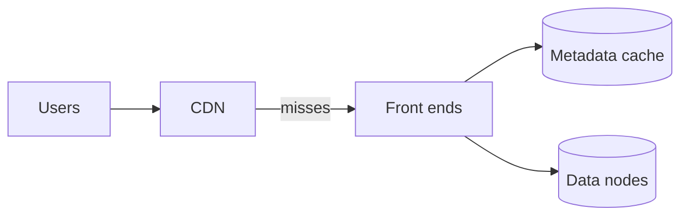

Let's evaluate our blob store design against the requirements.

## Durability

- Chunks are stored with **replication or erasure coding** across independent failure domains.
- **Checksums** on every chunk detect corruption on disk and in transit.
- **Background scrubbing** finds silent corruption proactively, and **prioritized repair** restores redundancy quickly after disk or node failures.
- **Versioning** and delayed garbage collection protect against accidental deletes and overwrites.

Durability can be estimated from failure rates and repair times: the faster a lost replica is repaired, the smaller the window in which additional failures could cause data loss. Parallel repair across many nodes keeps that window short.

## Availability

- Stateless front ends and a replicated metadata service avoid single points of failure.
- Reads succeed as long as enough replicas or fragments are reachable, and front ends route around failed nodes.
- Zone-redundant placement keeps data available even when a whole availability zone is down.

### Failure scenarios

| Failure | Effect | Handling |
| --- | --- | --- |
| Disk fails | Chunks on it lose one replica or fragment | Reads use other copies; parallel repair restores redundancy within minutes |
| Data node fails | Same, for all its disks | Placement manager marks it dead after missed heartbeats and schedules repairs |
| Silent corruption | A chunk's bytes no longer match its checksum | Detected on read or by scrubbing; repaired from healthy copies |
| Metadata partition leader fails | Brief write unavailability for its key range | Consensus elects a new leader in seconds |
| Availability zone fails | One-third of copies unreachable | Remaining zones hold enough replicas or fragments to serve and rebuild |
| Accidental delete by a user | Blob disappears from listings | Restore from the previous version within the retention window |

## Scalability

- **Metadata** scales by partitioning, with automatic splitting of hot ranges.
- **Data** scales by adding data nodes; the placement manager directs new chunks to nodes with free capacity.
- Chunking spreads large blobs across many nodes, so throughput for one huge object scales with parallelism.

## Throughput and latency

- Parallel chunk uploads and downloads saturate available bandwidth.
- Byte-range reads fetch only needed chunks.
- A **CDN** in front of public content removes most read traffic.
- Metadata caching at front ends avoids a metadata lookup for every read of popular blobs.

Time to first byte for a small object is dominated by one metadata lookup and one data-node read — typically tens of milliseconds. For large objects, throughput matters more than latency, and parallel range requests across chunks let a single client download at many gigabits per second.

## Cost efficiency

- Erasure coding for colder data cuts overhead from 200% to roughly 40–50%.
- Lifecycle policies move data to cheaper tiers automatically.
- Dense storage servers with large hard drives keep cost per gigabyte low for bulk data.
- Direct client uploads and downloads with presigned URLs avoid paying for application servers to proxy bytes.

## Consistency

Modern blob stores typically provide **strong read-after-write consistency** for individual blobs: once a put is acknowledged, subsequent reads return the new data. This is achieved by committing metadata in a strongly consistent, replicated store as the final step of a write. Listing operations may be eventually consistent in some designs, since they read secondary structures that can lag slightly.

## Requirements summary

| Requirement | How the design meets it |
| --- | --- |
| Durability (eleven nines) | Replication or erasure coding across zones, checksums, scrubbing, fast parallel repair, versioning |
| Availability | Stateless front ends, replicated metadata, reads from any sufficient set of copies |
| Scalability | Partitioned metadata, thousands of data nodes, chunking |
| Throughput | Parallel chunk transfer, range reads, CDN offload |
| Cost | Erasure coding for cold data, storage tiers, lifecycle rules, direct transfers |
| Consistency | Metadata committed last in a strongly consistent store |

<Ponder question="A team stores user uploads in one blob store region. The region suffers a long outage. Their data is durable — why are users still unable to see their photos, and what would fix it?">
Durability protects against data **loss**, not unavailability: the bytes are safe inside the unreachable region, but nobody can read them. For availability across regional outages, replicate objects asynchronously to a bucket in another region (cross-region replication) and have the application or CDN fall back to it. The trade-off is roughly double storage cost and a short replication lag during which the newest uploads exist in only one region.
</Ponder>

<KeyTakeaways>
- Redundancy across failure domains, checksums, scrubbing and fast repair deliver extreme durability.
- Stateless front ends, replicated metadata and zone-redundant placement provide availability through the listed failure scenarios.
- Partitioned metadata and chunking across many data nodes provide scalability and throughput.
- CDNs and metadata caching reduce read latency; erasure coding, tiers and direct transfers reduce cost.
- Strongly consistent metadata commits give read-after-write consistency for blobs.
- Durability is not availability: cross-region replication protects against regional outages.
</KeyTakeaways>
