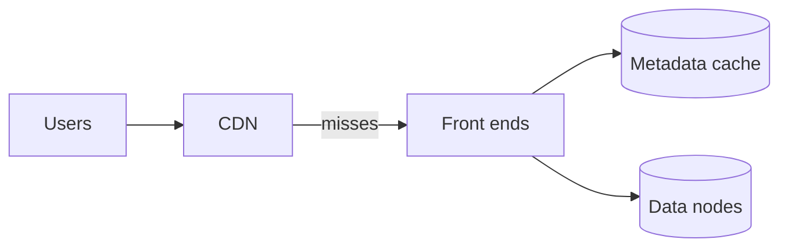

Let's evaluate our blob store design against the requirements.

## Durability

- Chunks are stored with **replication or erasure coding** across independent failure domains.
- **Checksums** on every chunk detect corruption on disk and in transit.
- **Background scrubbing** finds silent corruption proactively, and **prioritized repair** restores redundancy quickly after disk or node failures.
- **Versioning** and delayed garbage collection protect against accidental deletes and overwrites.

Durability can be estimated from failure rates and repair times: the faster a lost replica is repaired, the smaller the window in which additional failures could cause data loss. Parallel repair across many nodes keeps that window short.

## Availability

- Stateless front ends and a replicated metadata service avoid single points of failure.
- Reads succeed as long as enough replicas or fragments are reachable, and front ends route around failed nodes.
- Zone-redundant placement keeps data available even when a whole availability zone is down.

## Scalability

- **Metadata** scales by partitioning, with automatic splitting of hot ranges.
- **Data** scales by adding data nodes; the placement manager directs new chunks to nodes with free capacity.
- Chunking spreads large blobs across many nodes, so throughput for one huge object scales with parallelism.

## Throughput and latency

- Parallel chunk uploads and downloads saturate available bandwidth.
- Byte-range reads fetch only needed chunks.
- A **CDN** in front of public content removes most read traffic.
- Metadata caching at front ends avoids a metadata lookup for every read of popular blobs.

## Cost efficiency

- Erasure coding for colder data cuts overhead from 200% to roughly 40–50%.
- Lifecycle policies move data to cheaper tiers automatically.
- Dense storage servers with large hard drives keep cost per gigabyte low for bulk data.

## Consistency

Modern blob stores typically provide **strong read-after-write consistency** for individual blobs: once a put is acknowledged, subsequent reads return the new data. This is achieved by committing metadata in a strongly consistent, replicated store as the final step of a write. Listing operations may be eventually consistent in some designs.

<KeyTakeaways>
- Redundancy across failure domains, checksums, scrubbing and fast repair deliver extreme durability.
- Stateless front ends, replicated metadata and zone-redundant placement provide availability.
- Partitioned metadata and chunking across many data nodes provide scalability and throughput.
- CDNs and metadata caching reduce read latency; erasure coding and tiers reduce cost.
- Strongly consistent metadata commits give read-after-write consistency for blobs.
</KeyTakeaways>
