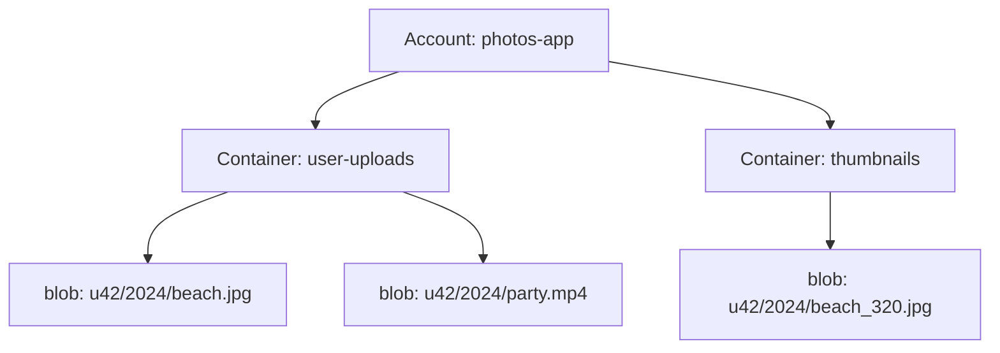

Photos, videos, audio files, documents, backups, machine-learning datasets — much of the world's data consists of large, unstructured files. Databases are a poor fit for them: they are optimized for small, structured records, and storing gigabyte-sized values bloats indexes, slows replication and makes backups painful. A **blob store** (binary large object store, often called an object store) is designed specifically for storing huge numbers of large, mostly immutable objects cheaply and durably.

## Characteristics of blob data

- **Large.** Objects range from kilobytes to many gigabytes or terabytes.
- **Unstructured.** The store treats contents as opaque bytes plus some metadata.
- **Write once, read many.** Objects are rarely modified after upload; updates usually create a new object or version.
- **Enormous in aggregate.** Platforms store petabytes to exabytes across billions of objects.

## The data model

Blob stores typically organize data as:

- **Accounts** — owned by a user or organization.
- **Containers** (or buckets) — namespaces within an account, with their own access policies.
- **Blobs** (or objects) — the files themselves, identified by a name within the container.

Blob names often look like paths, but the namespace is flat; the slashes are just part of the name.

## Where blob stores appear in designs

- Media in photo- and video-sharing services.
- Attachments in messaging and email.
- File storage and sync services.
- Static website assets served through a CDN.
- Data lakes for analytics and machine learning.
- Backups and archives.

Blob stores also differ from file systems. A traditional file system supports in-place edits, locking, hierarchical directories and POSIX semantics, which are hard to scale across thousands of machines. A blob store deliberately offers a simpler contract — whole-object writes, reads by name, and listing by prefix — in exchange for near-unlimited scale, high durability and a simple HTTP interface that any client can use.

A common pattern pairs a blob store with a database: the **database stores metadata** (owner, caption, timestamps, blob location), while the **blob store holds the bytes**.

<Callout type="interview">
Never store large media in your primary database. Say: “Media goes to a blob store; the database stores the blob's key and metadata; a CDN serves popular media.” It is one of the most common and important patterns in design interviews.
</Callout>

<KeyTakeaways>
- Blob stores hold large, unstructured, mostly immutable objects at massive scale.
- Data is organized into accounts, containers and blobs in a flat namespace.
- Databases handle metadata; blob stores handle the bytes; CDNs deliver popular content.
- Blob stores appear in nearly every media, file or analytics-heavy design.
</KeyTakeaways>
