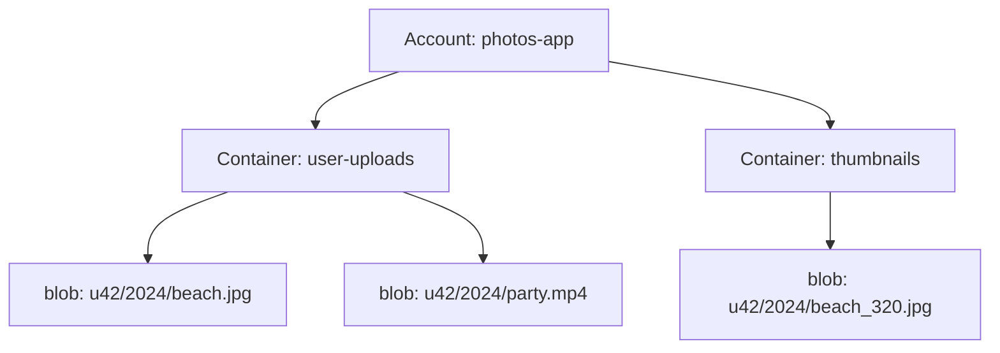
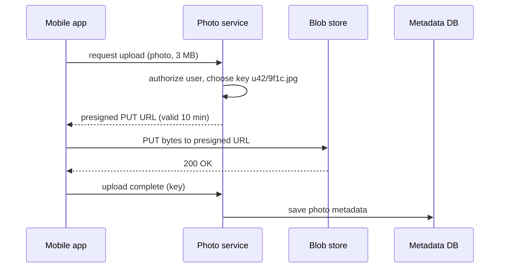

Photos, videos, audio files, documents, backups, machine-learning datasets — much of the world's data consists of large, unstructured files. Databases are a poor fit for them: they are optimized for small, structured records, and storing gigabyte-sized values bloats indexes, slows replication and makes backups painful. A **blob store** (binary large object store, often called an object store) is designed specifically for storing huge numbers of large, mostly immutable objects cheaply and durably.

## Characteristics of blob data

- **Large.** Objects range from kilobytes to many gigabytes or terabytes.
- **Unstructured.** The store treats contents as opaque bytes plus some metadata.
- **Write once, read many.** Objects are rarely modified after upload; updates usually create a new object or version.
- **Enormous in aggregate.** Platforms store petabytes to exabytes across billions of objects.

## Block, file and object storage

| | Block storage | File storage | Object (blob) storage |
| --- | --- | --- | --- |
| Unit | Fixed-size blocks on a virtual disk | Files in a directory tree | Whole objects in a flat namespace |
| Interface | Disk device (read and write blocks) | POSIX: open, seek, write, lock, rename | HTTP: PUT, GET, DELETE, LIST |
| Modify in place | Yes | Yes | No — replace the object or write a new version |
| Scale | One volume attached to one server | Shared, but hard to scale globally | Practically unlimited |
| Typical use | Database and VM disks | Shared home directories, legacy apps | Media, backups, data lakes, static assets |

Block storage gives databases the low-latency random writes they need. File storage offers familiar semantics to many clients. Object storage gives up in-place edits and directories to gain near-unlimited scale, very high durability and a simple interface any client can use over HTTP.

## The data model

Blob stores typically organize data as:

- **Accounts** — owned by a user or organization.
- **Containers** (or buckets) — namespaces within an account, with their own access policies.
- **Blobs** (or objects) — the files themselves, identified by a name within the container.

Blob names often look like paths, but the namespace is flat; the slashes are just part of the name. Listing "folders" is really listing names that share a prefix.

Some blob stores offer different **blob types** optimized for different workloads: **block blobs** assembled from uploaded blocks (most files), **append blobs** that support efficient appends (logs), and **page blobs** with random-access pages (virtual disks).

## Where blob stores appear in designs

- Media in photo- and video-sharing services.
- Attachments in messaging and email.
- File storage and sync services.
- Static website assets served through a CDN.
- Data lakes for analytics and machine learning.
- Backups and archives.

A common pattern pairs a blob store with a database: the **database stores metadata** (owner, caption, timestamps, blob location), while the **blob store holds the bytes**.

## Uploading directly to the blob store

Routing every upload through application servers wastes their bandwidth and CPU. Instead, the application hands the client a short-lived **presigned URL** that authorizes one specific upload, and the client sends the bytes straight to the blob store.

The same idea works for downloads of private files: a presigned GET URL lets a client or CDN fetch one object for a limited time without the application proxying the bytes.

<Callout type="interview">
Never store large media in your primary database. Say: "Media goes to a blob store; the database stores the blob's key and metadata; a CDN serves popular media." It is one of the most common and important patterns in design interviews.
</Callout>

<Ponder question="In the presigned upload flow, the client uploads the photo but crashes before telling the API it finished. What state is the system in, and how would you clean it up?">
The blob exists in the store but no metadata references it — an orphan that no user can see. Handle it with a lifecycle rule or background job that deletes objects under the upload prefix that have no metadata row after, say, 24 hours; or have the blob store emit an "object created" event that the service consumes to create or verify the metadata itself, so completion does not depend on the client.
</Ponder>

## Chapter roadmap

1. **Requirements** — operations, durability and capacity.
2. **Design** — separating metadata from data, and the write, read and delete paths.
3. **Design considerations** — replication versus erasure coding, placement, repair, metadata partitioning and storage tiers.
4. **Evaluation** — how the design meets its requirements.

<KeyTakeaways>
- Blob stores hold large, unstructured, mostly immutable objects at massive scale.
- Object storage trades in-place edits and directories for scale, durability and a simple HTTP interface, unlike block and file storage.
- Data is organized into accounts, containers and blobs in a flat namespace.
- Databases handle metadata; blob stores handle the bytes; CDNs deliver popular content.
- Presigned URLs let clients upload and download directly, keeping large transfers off application servers.
</KeyTakeaways>
