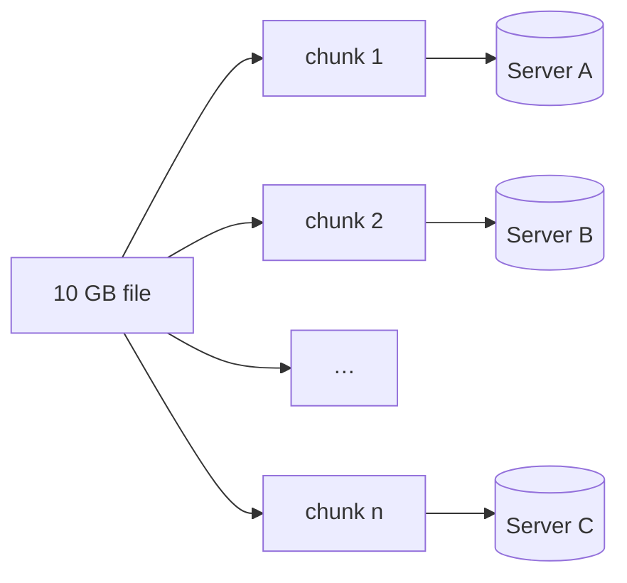

Let's define the requirements for a general-purpose blob store serving many applications.

## Functional requirements

- **Create and delete containers.**
- **Put (upload) a blob** into a container, including very large blobs uploaded in parts.
- **Get (download) a blob**, including byte-range reads for streaming and resumable downloads.
- **Delete a blob.**
- **List blobs** in a container, optionally filtered by name prefix.
- **Access control** — private blobs, public blobs and time-limited signed URLs.

```text
createContainer(account, container)
putBlob(container, name, data)                     -> version
initiateUpload / uploadPart / completeUpload       // multipart for large blobs
getBlob(container, name, range?)                   -> bytes
deleteBlob(container, name)
listBlobs(container, prefix, pageToken)            -> names, nextPageToken
```

## Non-functional requirements

- **Durability.** Once written, data must essentially never be lost — targets like eleven nines (99.999999999%) annual durability are common.
- **Availability.** Reads and writes should succeed even when disks, servers, racks or zones fail.
- **Scalability.** Billions of blobs, exabytes of data and millions of requests per second.
- **Throughput.** High bandwidth for large uploads and downloads, parallelizable across servers.
- **Cost efficiency.** Storage cost per gigabyte must be low, since data volume is enormous.

<Callout type="note">
Durability and availability are different. A blob can be perfectly durable (safely stored in several places) yet temporarily unavailable (the servers holding it are unreachable). Blob stores typically target far higher durability than availability.
</Callout>

## Capacity snapshot

Suppose a video platform uploads 500 hours of video every minute, stored at an average of 1 GB per hour across all resolutions:

```text
500 hours/min × 1 GB/hour  = 500 GB/min
× 60 × 24                  ≈ 720 TB/day
× 365                      ≈ 260 PB/year
```

With naive three-way replication that would be over 780 PB per year — which is why cost-efficient redundancy schemes such as **erasure coding** matter so much at this scale.

## Handling large objects

Uploading a 10 GB file in a single request is fragile: a network hiccup at 99% forces a restart. Blob stores split large objects into **chunks** (for example, 4–64 MB each):

- Clients upload chunks in **parallel**, increasing throughput.
- Failed chunks are **retried individually**; uploads can **resume**.
- Chunks are spread across many storage servers, so no single server holds or serves the whole object.



<KeyTakeaways>
- Core operations: containers, put, get (with ranges), delete, list and access control.
- Durability targets are extremely high; availability targets are high but lower.
- The system must scale to billions of blobs and exabytes while keeping cost per gigabyte low.
- Large objects are split into chunks for parallel, resumable uploads spread across servers.
</KeyTakeaways>
