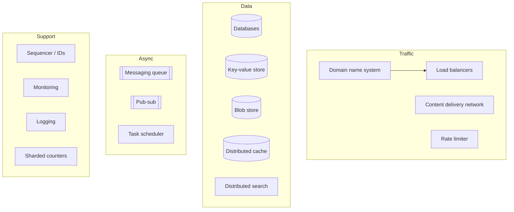

If you look inside a video platform, a ride-hailing service and a messaging app, you will find surprisingly similar components: load balancers spreading traffic, caches absorbing reads, queues decoupling slow work, blob stores holding media and databases holding metadata. These reusable components are **building blocks**. Knowing them well lets you assemble designs quickly and reason about their behavior with confidence.

## Why study building blocks separately

In an interview there is no time to design a distributed cache from scratch while also designing a video platform. Instead, you use the cache as a known block — and because you have studied its design, you can answer questions about eviction, consistency and hotspots when they arise.

Separating building blocks from design problems has three benefits:

1. **Reuse.** The same block appears in many designs; you learn it once.
2. **Depth on demand.** You can zoom into a block's internals when the interviewer asks.
3. **Clear communication.** “A pub-sub system with at-least-once delivery” conveys a lot in a few words.

## The building blocks in this course

| Building block | What it provides |
| --- | --- |
| **Domain name system** | Maps names to IP addresses; basic global traffic steering |
| **Load balancers** | Distribute requests across servers and remove unhealthy ones |
| **Databases** | Durable structured storage with replication and partitioning |
| **Key-value store** | Massively scalable, highly available key-based storage |
| **Content delivery network** | Serves static and media content from locations near users |
| **Sequencer** | Generates unique, often time-ordered identifiers |
| **Distributed monitoring** | Detects problems on servers and in clients |
| **Distributed cache** | Low-latency access to frequently used data |
| **Messaging queue** | Asynchronous, decoupled, point-to-point communication |
| **Pub-sub** | Broadcasts events to many independent subscribers |
| **Rate limiter** | Protects services from overuse and abuse |
| **Blob store** | Stores large unstructured objects such as images and videos |
| **Distributed search** | Full-text search over large data sets |
| **Distributed logging** | Collects and searches logs across services |
| **Task scheduler** | Runs jobs reliably at scale, on schedule or on demand |
| **Sharded counters** | Counts extremely hot values such as likes at high write rates |

## How each chapter is structured

Each building-block chapter treats the block as a design problem in its own right. We define its requirements, sketch a high-level design, go deep on the tricky parts and evaluate the design against its requirements. This mirrors the SCALED framework and gives you extra practice with it.

<Callout type="tip">
While reading each chapter, note the one or two sentences you would use to justify the block in a larger design, such as: “We put a queue between upload and transcoding so that slow transcoding never blocks users, and so that bursts of uploads are absorbed.”
</Callout>

<KeyTakeaways>
- Building blocks are reusable components that appear in nearly every large system.
- Studying them separately lets you use them quickly in designs and zoom in when asked.
- This course covers sixteen blocks spanning traffic, data, asynchronous processing and support services.
- Each chapter designs its block from requirements to evaluation, reinforcing the SCALED framework.
</KeyTakeaways>
