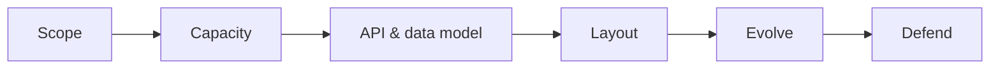
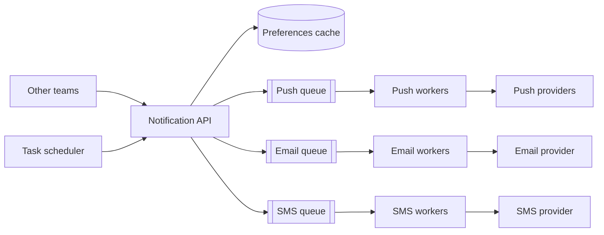

Part III of the course applies the building blocks to complete products. Each design follows the **SCALED** framework introduced earlier. This lesson shows how the framework maps to the structure of the upcoming chapters and how to adapt it to different kinds of problems.

## SCALED revisited

- **Scope:** functional and non-functional requirements, and what is out of scope.
- **Capacity:** estimates for requests, storage, bandwidth and servers.
- **API and data model:** the interface and the core entities and access patterns.
- **Layout:** the high-level design built from building blocks.
- **Evolve:** deep dives into the hardest parts.
- **Defend:** evaluation against requirements, trade-offs and failure scenarios.

In the chapters ahead, lessons named “Requirements” cover Scope and Capacity; “Design” or “High-level design” covers the API, data model and Layout; “Detailed design” covers Evolve; and “Evaluation” covers Defend.

## Recognizing problem archetypes

Most design problems belong to a few archetypes, each with a characteristic hard part:

| Archetype | Examples | Characteristic hard part |
| --- | --- | --- |
| Read-heavy content | Video platform, photo sharing, Q&A | Caching, CDN, feed generation |
| Write-heavy ingestion | Logging, metrics, web crawler | Partitioning, batching, back-pressure |
| Real-time communication | Messaging, collaborative editing | Connection management, ordering, delivery |
| Geospatial | Maps, proximity, ride-hailing | Spatial indexing, location updates at scale |
| Strong consistency | Payments, ticket booking | Transactions, idempotency, concurrency control |
| Search and discovery | Typeahead, search | Indexing, low-latency ranking |

Identifying the archetype early tells you where to spend your deep-dive time.

## Adapting the framework

- **Very large problems** (“design a video platform”): narrow the scope explicitly to a few core features, such as upload, watch and search, and state what you are skipping.
- **Infrastructure problems** (“design a rate limiter”): the API is internal and the data model is small; spend more time on algorithms and distributed coordination.
- **Consistency-critical problems** (“design a payment system”): spend more time on data model, transactions and failure scenarios than on scaling.
- **Follow-up questions:** interviewers often add a twist after the main design (“now make it multi-region,” “now support 10× traffic”). Return to the Defend step: identify what breaks and evolve the design.

<Callout type="interview">
A useful opening line: “Let me start by clarifying requirements and scale, then I'll propose an API and a high-level design, and we can dive deeper into the most interesting parts — I suspect that will be X.” Naming X shows you have already recognized the archetype.
</Callout>

## How to use Part III

For each problem:

1. Read only the problem statement and try the design yourself for 30–40 minutes using SCALED.
2. Compare your design with the lessons, noting differences in requirements, building blocks and deep dives.
3. Take the chapter quiz, then revisit the problem a week later from scratch.

## A two-minute SCALED sketch: a notification service

To see how quickly the framework produces a skeleton, consider "design a service that sends push, email and SMS notifications for other teams".

- **Scope:** send single or bulk notifications, respect user preferences and quiet hours, track delivery. Non-functional: 1 billion notifications a day, never lose one, no duplicates visible to users where avoidable, per-channel rate limits imposed by providers.
- **Capacity:** 1 billion per day ≈ 11,600 per second on average; bulk campaigns cause 10× peaks.
- **API:** `send(userId, template, channel?, idempotencyKey)`, `sendBulk(segment, template, schedule)`, `status(notificationId)`.
- **Layout:** API → **queue** per channel → channel workers → third-party providers; a **task scheduler** for scheduled campaigns; a preferences **cache**; **rate limiters** per provider; a **key-value store** for delivery status.
- **Evolve:** deduplication with idempotency keys, retries with backoff when providers throttle, prioritizing password resets over marketing.
- **Defend:** at-least-once delivery with idempotent sends, isolation between channels so an SMS provider outage does not delay emails, and monitoring of queue lag per channel.

Every box is a building block you now understand; the design work was choosing them and naming the hard parts.

<Ponder question="An interviewer gives you a problem you have never seen: 'design a system that tracks packages for a delivery company'. How can recognizing its archetypes help you start?">
It combines archetypes you know: write-heavy ingestion (scan events and GPS updates from vans), geospatial (where is the van now, which packages are nearby), and read-heavy lookups (customers checking status, mostly for recent packages). That immediately suggests a partitioned event stream for scans, a location index for vans, a status store keyed by tracking number with a cache, and push notifications on status changes — a solid skeleton before any detail work.
</Ponder>

<KeyTakeaways>
- SCALED maps onto each design chapter: requirements, design, detailed design and evaluation.
- Most problems fit an archetype whose characteristic hard part deserves deep-dive time.
- Adapt the framework to the problem type: scope large problems, emphasize algorithms for infrastructure, and transactions for consistency-critical systems.
- Practice each problem yourself before reading, then revisit it later.
- Even a two-minute SCALED sketch produces a defensible skeleton built entirely from known blocks.
</KeyTakeaways>
