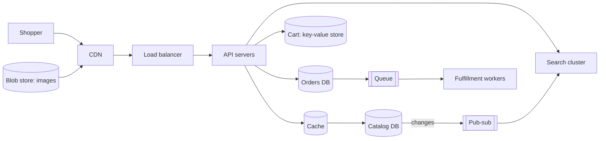

Now that you know the building blocks, let's practice identifying them in a real product. This exercise walks through an online store — product browsing, search, cart, checkout and order fulfillment — and asks which blocks each feature needs and why. Try to answer each question yourself before reading the discussion.

## The product

An online marketplace with 50 million monthly users. Shoppers browse and search a catalog of 100 million products, add items to a cart, check out with a card, and track their orders. Sellers upload product listings with images. Traffic spikes tenfold during seasonal sales.

## Step 1: Getting users to the service

**Question:** Which blocks sit between the user's browser and the application servers?

**Discussion:** **DNS** resolves the store's domain, ideally with geographic routing to the nearest region. A **CDN** serves product images, scripts and stylesheets from edge locations. **Load balancers** distribute requests across stateless web and API servers, and a **rate limiter** at the gateway protects the APIs from scrapers and bots.

## Step 2: The catalog and search

**Question:** Where do product details, images and search live?

**Discussion:** Product metadata lives in a **database** — partitioned by product ID — with a **distributed cache** in front, because product pages are read far more often than they change. Product images live in a **blob store**, served through the CDN. **Distributed search** powers keyword queries with filters (price, brand, rating), fed by a change stream from the catalog database. Each product needs a unique ID from a **sequencer**.

## Step 3: The shopping cart

**Question:** What storage suits carts, and what consistency do they need?

**Discussion:** Carts are accessed by user ID, updated frequently and must be highly available — losing the ability to add to cart loses sales. A **key-value store** with high availability fits well. Merging concurrent updates (adding items from two devices) favors a union-based merge, as discussed in the key-value store chapter.

## Step 4: Checkout and orders

**Question:** Which parts need strong consistency, and which can be asynchronous?

**Discussion:** Placing an order and reserving inventory must be **strongly consistent** — overselling is costly — so orders and inventory live in a transactional **database**. Payment calls must be **idempotent**. After the order is committed, slow follow-up work — confirmation emails, warehouse notifications, analytics — is published to **pub-sub** and handled by consumers through **messaging queues**. A **task scheduler** runs delayed jobs such as “cancel unpaid orders after 30 minutes.”

## Step 5: Operating the platform

**Question:** What supports the platform operationally?

**Discussion:** **Distributed monitoring** tracks golden signals and business metrics such as orders per minute; **client-side monitoring** watches checkout errors on devices; **distributed logging** with trace IDs debugs failed checkouts. **Sharded counters** track views and “number sold” on hot products during sales.

<Callout type="tip">
Notice how each block was justified by a specific requirement — read-heavy catalog, highly available cart, strongly consistent orders, slow asynchronous follow-ups. That habit is exactly what interviewers look for.
</Callout>

## Step 6: Surviving the seasonal sale

**Question:** Traffic jumps tenfold for a flash sale on 1,000 discounted items. Which blocks absorb it, and where is the real bottleneck?

**Discussion:** The CDN and cache absorb the jump in page views; stateless API servers autoscale. The true bottleneck is **inventory**: thousands of shoppers compete for the same few rows. Options include reserving stock atomically with conditional updates (`UPDATE stock SET qty = qty − 1 WHERE id = ? AND qty > 0`), splitting a hot item's stock into several **sharded counters** that are decremented independently, and putting a **queue** in front of checkout so orders are admitted at a rate the database can sustain, with a waiting-room page for the rest.

| Estimate | Value |
| --- | --- |
| Normal checkout rate | ~200 orders per second |
| Flash-sale peak | ~2,000 orders per second for a few minutes |
| Product page views at peak | ~200,000 per second, mostly served by CDN and cache |
| Hot inventory rows | ~1,000 items receiving most of the checkout attempts |

<Ponder question="Why store the cart in a highly available key-value store but the order in a transactional database?">
The cart tolerates brief inconsistency — merging two devices' additions is fine, and being able to add items at all times directly protects revenue — so availability wins. An order commits money and inventory; overselling or double-charging is costly and visible, so correctness wins. Choosing storage per data type, by the cost of each kind of error, is the central habit this exercise practices.
</Ponder>

<KeyTakeaways>
- DNS, CDN, load balancers and rate limiters bring users to the service and protect it.
- Catalog data uses a partitioned database plus cache; images use a blob store and CDN; search uses a distributed search cluster fed by change streams.
- Carts suit a highly available key-value store; orders and inventory need a transactional database.
- Pub-sub, queues and a task scheduler handle asynchronous and delayed work.
- Monitoring, logging and sharded counters support operations and hot metrics.
- The flash-sale bottleneck is hot inventory, handled with conditional updates, sharded stock counters and an admission queue.
</KeyTakeaways>
