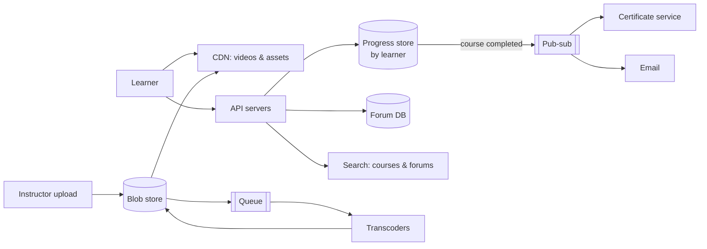

Let's practice again with a different product: an online learning platform — much like the one you are using now — with video lectures, interactive text lessons, quizzes, progress tracking, discussion forums and certificates. As before, try to answer each question before reading the discussion.

## The product

The platform serves 10 million learners across the world. Courses contain video lectures, text lessons, quizzes and coding exercises. Learners' progress and quiz scores are saved. Each course has a discussion forum. Instructors upload videos and publish course content. Certificates are issued when a learner completes a course.

## Step 1: Delivering course content

**Question:** How should videos and lesson pages reach learners worldwide?

**Discussion:** Uploaded videos are stored in a **blob store** and transcoded into several resolutions by workers fed from a **messaging queue**. A **CDN** delivers video segments and static lesson assets near learners. Lesson text and quiz definitions change rarely, so they can be served as static, cacheable content — or even bundled with the web application, as this course does.

## Step 2: Tracking progress

**Question:** What storage suits progress and quiz scores, and how often are they written?

**Discussion:** Progress is keyed by learner and course: “which lessons are complete, what is my best score.” A **key-value or document store** partitioned by learner ID fits naturally, since most reads fetch one learner's progress for one course. Writes happen when a learner completes a lesson or submits a quiz — frequent, but small and independent. Grouping one learner's progress for a course into a single document keeps reads to one lookup.

## Step 3: Forums and search

**Question:** Which blocks support discussions and finding courses?

**Discussion:** Forum posts go in a **database** partitioned by course or thread, with a **cache** for popular threads. **Distributed search** indexes course titles, descriptions and forum posts. Post and thread IDs come from a **sequencer**, giving time-ordered IDs that make “newest first” sorting easy.

## Step 4: Certificates and notifications

**Question:** How are certificates issued when a learner finishes a course?

**Discussion:** When the progress service records a course completion, it publishes an event to **pub-sub**. A certificate service consumes the event and generates a PDF — stored in the **blob store** — while an email service notifies the learner. A **task scheduler** sends reminder emails to learners who have been inactive for a week.

## Step 5: Protecting and operating the platform

**Question:** What else does the platform need?

**Discussion:** **Rate limiters** protect login and quiz-submission endpoints from abuse. **Monitoring** tracks video start failures and playback buffering from the client side, and API latency on the server side. **Logging** with trace IDs helps debug failed quiz submissions. **Sharded counters** track enrollments and views for trending courses.

<Callout type="interview">
Two exercises, many of the same building blocks. The skill being practiced is mapping requirements to blocks and justifying each choice in a sentence. With practice, this mapping takes only a few minutes in an interview.
</Callout>

<KeyTakeaways>
- Videos flow through a blob store, transcoding queue and CDN; static lesson content is cacheable.
- Progress is best stored per learner and course in a partitioned key-value or document store.
- Forums use a partitioned database, cache, search and time-ordered IDs.
- Course completion events drive certificates and emails through pub-sub; a scheduler sends reminders.
- Rate limiting, monitoring, logging and counters support security and operations.
</KeyTakeaways>
