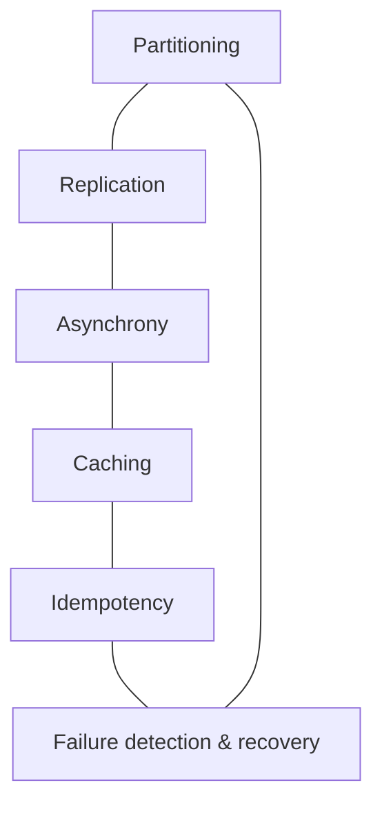

We have designed sixteen building blocks from scratch. Before applying them to complete products, let's step back and look at the patterns they share. These recurring ideas are the real toolkit of system design; the blocks are their most common packaging.

## Recurring patterns

**Partitioning.** Almost every block splits its data or work across machines: consistent hashing in key-value stores and caches, partitions in queues and pub-sub, shards in search indexes and counters, metadata partitions in blob stores. The key questions are always the same — what is the partition key, how do we avoid hotspots, and how do we rebalance?

**Replication.** Blocks keep multiple copies for availability and durability: leader–follower in databases and queues, leaderless quorums in key-value stores, replicas of index shards, erasure-coded fragments in blob stores. The trade-off is always consistency versus latency and availability.

**Asynchrony and decoupling.** Queues, pub-sub, schedulers and change streams let slow or bursty work happen in the background, and let producers and consumers evolve independently.

**Caching.** CDNs, distributed caches, metadata caches, result caches and local near-caches all trade freshness for speed.

**Idempotency and at-least-once processing.** Queues, schedulers, pub-sub consumers and counters all assume messages or tasks may be processed more than once, so operations must be safe to repeat.

**Failure detection and recovery.** Heartbeats, gossip, leases, health checks, hinted handoff and anti-entropy appear throughout, because at scale something is always failing.

## A quick reference

| Need | Reach for |
| --- | --- |
| Route users to the right region | DNS, global load balancing |
| Spread requests over servers | Load balancer |
| Serve static or media content globally | CDN + blob store |
| Low-latency reads of hot data | Distributed cache |
| Simple key lookups at massive scale | Key-value store |
| Transactions and relational queries | Relational database |
| Full-text search | Distributed search |
| Background or slow work | Messaging queue |
| Broadcast events to many services | Pub-sub |
| Delayed or recurring jobs | Task scheduler |
| Unique, sortable IDs | Sequencer |
| Protect APIs from overload | Rate limiter |
| Extremely hot counters | Sharded counters |
| Visibility into health | Monitoring and logging |

## Composing blocks

Real systems combine blocks into pipelines. A photo upload might touch a load balancer, an API server, a sequencer, a blob store, a database, a queue, image-processing workers, a CDN and pub-sub, all within seconds. Understanding each block's guarantees — and where those guarantees end — is what lets you reason about the whole pipeline's behavior under load and failure.

<Callout type="tip">
When you are unsure how to approach a new design problem, walk through the table above. Ask which needs the product has, and which blocks address them. You will rarely need anything that is not on this list.
</Callout>

<KeyTakeaways>
- Six patterns recur across the building blocks: partitioning, replication, asynchrony, caching, idempotency and failure handling.
- Each block packages these patterns for a common need, summarized in the quick-reference table.
- Real designs compose many blocks; understanding each block's guarantees lets you reason about the whole.
</KeyTakeaways>
