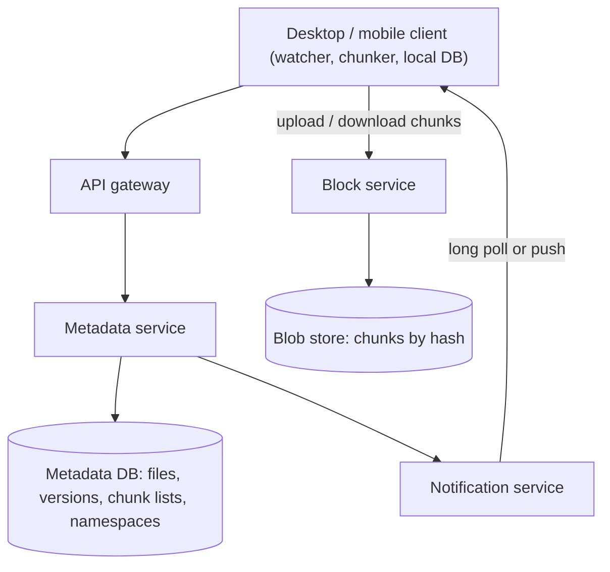
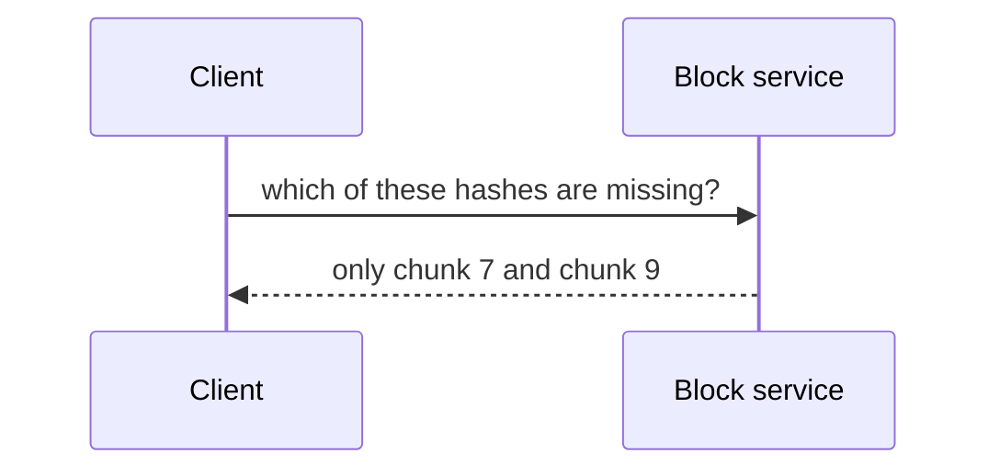
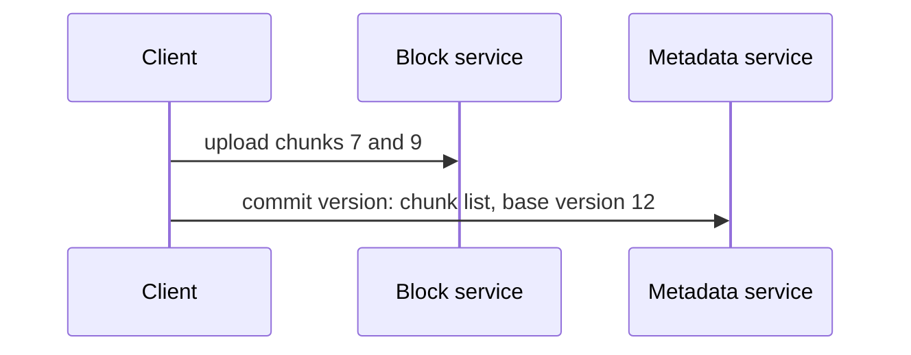
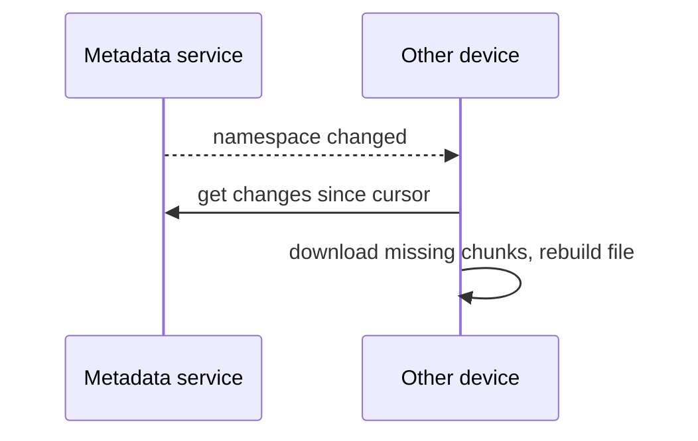

A cloud file storage service keeps a folder in sync across a user's laptop, phone and the web, and lets them share files and folders with others. Save a file on one device and it appears on the others moments later. The design problem centers on **efficient synchronization**: moving as few bytes as possible, detecting changes reliably and resolving conflicts when two devices edit the same file.

## Requirements

- **Functional:** upload, download and sync files across devices; share files and folders; keep version history; work offline and sync later.
- **Non-functional:** durability (never lose a file), consistency of the file tree across devices, efficient bandwidth use, and scale to hundreds of millions of users and billions of files.
- **Estimates:** 500 million users with an average of 200 files of 1 MB each is about 100 PB of data, plus versions. If 50 million users change 10 files a day, that is 500 million file updates per day, about 6,000 per second.

## Key idea: chunking

Files are split into **chunks** of a few megabytes each, and each chunk is identified by the hash of its content. This one idea delivers several benefits:

- **Delta sync:** when a large file changes, only the modified chunks are uploaded.
- **Deduplication:** identical chunks, whether in the same user's files or across users, are stored once.
- **Resumable transfers:** an interrupted upload resumes from the last complete chunk.
- **Parallelism:** chunks upload and download in parallel.

Content-defined chunking, which places chunk boundaries based on the content rather than fixed offsets, keeps most chunks unchanged even when bytes are inserted at the start of a file.

## Architecture

- The **client** watches the local folder, splits changed files into chunks, keeps a local database of known file states and talks to the services.
- The **block service** stores and serves chunks keyed by content hash in a blob store.
- The **metadata service** stores the file tree: each file version is a list of chunk hashes, with names, sizes, timestamps and sharing permissions.
- The **notification service** tells other devices that something changed, using long polling or a push connection.

## Syncing a change

<Slides title="Uploading an edited file">
<Slide caption="1. The client detects a change, re-chunks the file and asks the block service which chunk hashes it does not already have.">

</Slide>
<Slide caption="2. The client uploads only the missing chunks, then commits a new file version to the metadata service with the full chunk list.">

</Slide>
<Slide caption="3. The metadata service notifies the user's other devices, which fetch the new chunk list and download only the chunks they lack.">

</Slide>
</Slides>

## Consistency and conflicts

The metadata service is the source of truth and must be strongly consistent: commits use **optimistic concurrency**, stating the base version they modify. If two devices edit the same file offline and both commit, the second commit fails because its base version is stale. Instead of overwriting, the client saves its copy as a **conflicted copy** next to the original, so no work is lost. Each device tracks a **cursor** into the per-user change log, which lets it fetch exactly the changes it missed.

Metadata is sharded by user or namespace (a shared folder is its own namespace), keeping each sync operation within one shard. Chunks are immutable, so the blob store needs no coordination beyond durability.

<KeyTakeaways>
- Content-hashed chunks enable delta sync, deduplication, resumable and parallel transfers.
- A block service stores immutable chunks; a strongly consistent metadata service stores file versions as chunk lists.
- Clients upload only missing chunks, commit versions and notify other devices, which fetch changes since their cursor.
- Optimistic concurrency detects conflicting edits; conflicted copies ensure no work is lost.
- Metadata is sharded by user or shared namespace so sync operations stay on one shard.
</KeyTakeaways>
