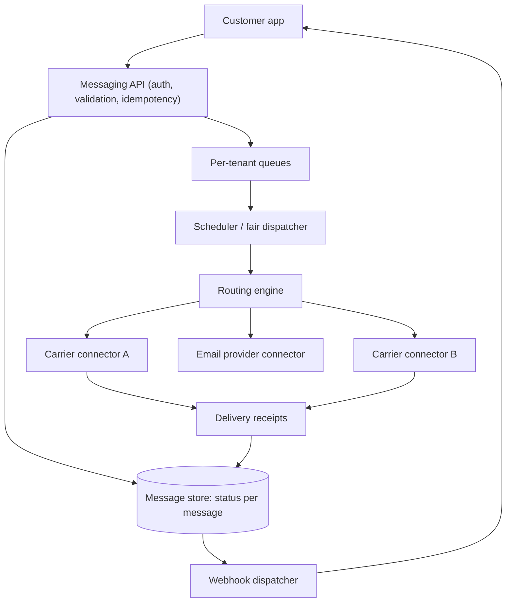
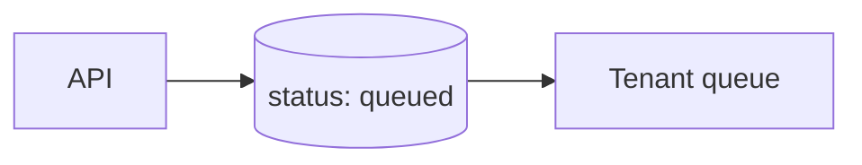
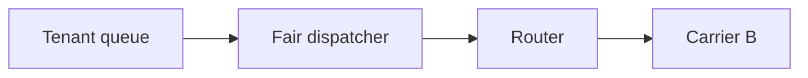
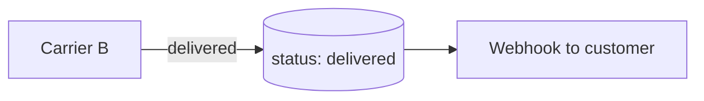
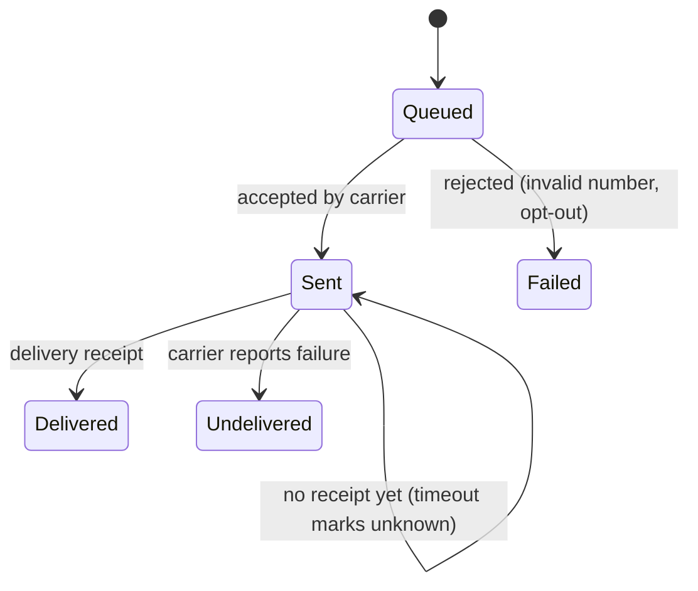

Communication platforms offer APIs that let developers send SMS messages, make phone calls, send emails and push verification codes with a single HTTP request. Behind that request, the platform must route messages to hundreds of telecom carriers and email providers worldwide, each with its own protocols, rate limits and failure modes, and report delivery status back to the customer. This case study covers the design of a multi-tenant messaging API.

## Requirements

- **Functional:** an API to send SMS and email; delivery status callbacks (webhooks) to customers; scheduling; templates; number and sender management; opt-out handling.
- **Non-functional:** high availability for the API, reliable delivery with at-least-once semantics, fair sharing of capacity among tenants, compliance with regional regulations, and observability of every message's journey.
- **Scale:** billions of messages per month, with individual customers sending bursts of millions (for example, a bank alerting every customer).

## Architecture



### Accepting requests

The API authenticates the customer, validates the destination and content, checks opt-out lists and account balance, and stores the message with status `queued`. It returns a message ID immediately; delivery happens asynchronously. An **idempotency key** header lets customers retry API calls without sending duplicates.

### Fairness across tenants

If one customer submits 10 million messages, a single shared queue would delay everyone else's time-sensitive verification codes. Messages go into **per-tenant queues**, and a dispatcher pulls from them using weighted fair queuing: each tenant gets a share of throughput according to its plan, and idle capacity is redistributed. Verification codes and other urgent traffic can use a separate high-priority lane.

### Routing to carriers

The routing engine chooses a carrier connection for each message based on destination country and network, cost, current delivery success rates and latency. Each carrier connection has strict **throughput limits**, so the engine applies per-connection rate limiting and spreads load across alternatives. If a carrier's success rate drops, traffic automatically shifts to others, much like health-based load balancing.

<Slides title="Journey of one SMS">
<Slide caption="1. Accepted: the API stores the message and queues it for the tenant.">



</Slide>
<Slide caption="2. Routed: the dispatcher selects it fairly, and the router picks the healthiest, cheapest carrier for the destination.">



</Slide>
<Slide caption="3. Reported: the carrier's delivery receipt updates the status, and a webhook notifies the customer.">



</Slide>
</Slides>

### Delivery status and webhooks

Carriers send **delivery receipts** asynchronously, sometimes minutes later, and sometimes never. The message store records each state transition (queued, sent, delivered, failed, undelivered). The webhook dispatcher posts updates to customers' endpoints with retries and exponential backoff, and signs each request so customers can verify it. Because customers' endpoints may be slow or down, webhook delivery is isolated per customer, so one failing endpoint cannot back up others.

## Compliance and abuse

Regulations differ by country: registered sender IDs, quiet hours, consent requirements and mandatory opt-out keywords. The platform enforces these centrally. It also watches for fraud, such as traffic pumping, where attackers trigger verification messages to premium numbers they profit from, using rate limits per destination prefix and anomaly detection.

## Message record and states

| Field | Example |
| --- | --- |
| message_id | `SM9f1c...` |
| tenant_id, idempotency_key | `acct_77`, `otp-user42-0927-1` |
| to, from, channel | `+4915…`, registered sender, SMS |
| body or template reference | "Your code is 482915" |
| status | queued → sent → delivered, or failed or undelivered |
| carrier, segments, price | carrier B, 1 segment, cost |
| timestamps per transition | for latency metrics and billing |



## Estimates

```text
Messages per month:       5 billion → ~2,000/s average
Burst from one customer:  10 million alerts in 10 minutes → ~17,000/s for that tenant
Carrier connection limit: e.g. 100–1,000 messages/s per connection
Delivery receipts:        roughly one per message, arriving seconds to hours later
```

The burst from a single customer exceeds the platform's average rate many times over, which is exactly why per-tenant queues and fair dispatching are essential: the burst drains at the tenant's share of capacity while other customers' messages keep flowing.

<Ponder question="A customer's webhook endpoint is down for an hour while millions of status updates are generated for them. What should the platform do with those updates?">
Queue them per customer and retry with exponential backoff, without letting that backlog affect other customers' webhooks. Keep updates durable for a bounded period (for example 24–72 hours), collapse multiple updates for the same message into the latest state where possible, and expose a status API so the customer can fetch what they missed after recovering. Alert the customer when their endpoint is failing.
</Ponder>

<KeyTakeaways>
- A communication API accepts requests quickly, stores them and delivers asynchronously with status tracking.
- Idempotency keys let customers retry API calls safely.
- Per-tenant queues with weighted fair dispatching keep one large sender from delaying everyone else.
- A routing engine chooses carriers by destination, cost and live health, respecting per-connection rate limits.
- Signed, retried webhooks report delivery status, isolated per customer; compliance and fraud controls are enforced centrally.
- A single customer's burst can exceed the platform average many times, so fairness per tenant is essential.
</KeyTakeaways>
