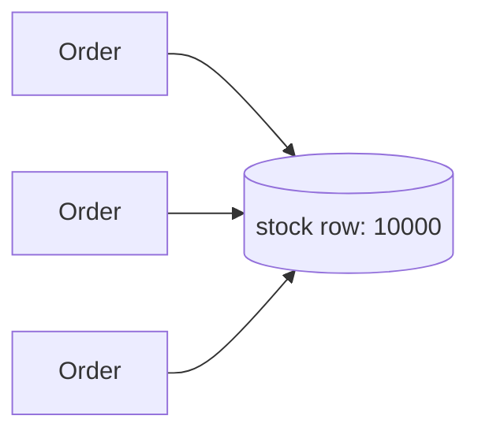
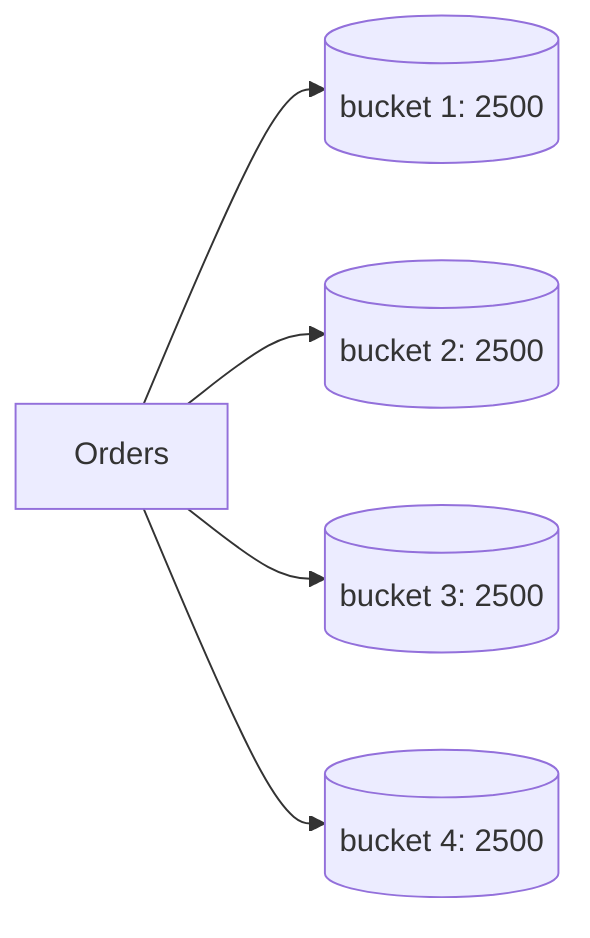
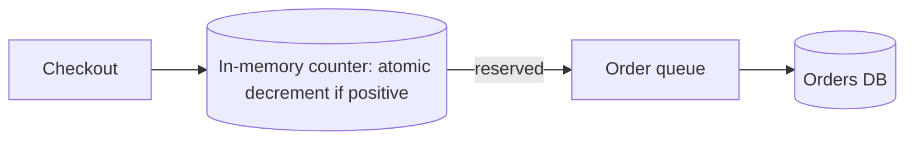

Flash sales, limited product drops and annual shopping events concentrate a year's worth of excitement into minutes. Traffic can jump to ten or a hundred times normal levels, all aimed at a few products with limited stock. The system must stay up, never oversell inventory and give customers a fair chance. This case study applies several building blocks to a problem defined by extreme, predictable spikes.

## Requirements

- **Functional:** browse deals, add to cart, check out, and see accurate stock ("only 12 left").
- **Non-functional:** stay available under a massive spike, never sell more units than exist, keep checkout latency reasonable, and degrade gracefully rather than crash.
- **Scale:** normal traffic of 20,000 requests per second might spike to 1 million per second at the start of a sale, with most requests hitting a handful of product pages.

## Principles

**1. Prepare, because the spike is predictable.** Run load tests at expected peak traffic, pre-scale services and databases, warm caches with deal pages and freeze risky deployments before the event.

**2. Serve reads from the edge.** Product pages, images and deal listings are cached at the CDN. Stock counts shown on pages can be approximate and refreshed every few seconds; the final check happens at checkout.

**3. Protect the core with admission control.** A waiting room or token-based admission lets only as many shoppers into checkout as the inventory and payment systems can handle.

**4. Make inventory decrements cheap and atomic.** This is the heart of the problem.

## Inventory without overselling

A naive design decrements stock in a single database row for each order. With thousands of orders per second for one product, that row becomes a **hot spot**, and lock contention collapses throughput.

<Slides title="Scaling hot inventory">
<Slide caption="1. Naive: every checkout decrements one row. Contention on the hot row limits throughput.">



</Slide>
<Slide caption="2. Split stock into buckets, each holding part of the inventory. Orders decrement a random bucket, spreading contention.">



</Slide>
<Slide caption="3. Reserve in a fast in-memory store with atomic decrements, then record orders asynchronously through a queue into the database.">



</Slide>
</Slides>

The in-memory approach performs a single atomic "decrement if greater than zero" operation per purchase attempt, which can handle hundreds of thousands of operations per second. If the decrement succeeds, the customer has a **reservation** and proceeds to payment; the order is written durably through a queue. If payment fails or times out, the reservation is released and the unit returns to stock. Periodic reconciliation compares the in-memory counters with the durable order records.

Bucketed inventory has a subtle issue: one bucket may run out while others still have stock. The checkout retries another bucket, and a rebalancer moves remaining units between buckets near the end of the sale.

## Graceful degradation

When load exceeds capacity despite preparation:

- **Shed non-essential features:** recommendations, reviews and personalized banners are turned off with feature flags, freeing capacity for browsing and checkout.
- **Rate limit** per user and per IP to stop bots from consuming capacity.
- **Queue rather than fail:** asynchronous order processing lets the system accept orders quickly and confirm them seconds later.
- **Fail with a friendly message** when a product sells out, served from cache.

<Callout type="tip">
Flash-sale designs are mostly about isolation: keep the hot path (reserve, pay, confirm) small and protected, and push everything else to caches, queues or off switches.
</Callout>

## Rough numbers for one product drop

```text
Stock:                       10,000 units
Shoppers at start:           1,000,000
Product page requests:       ~500,000/s for the first minute → almost all from CDN
Checkout attempts admitted:  5,000/s (admission controller)
In-memory reservations:      ~5,000 atomic decrements/s → trivial for one node
Sell-out time:               ~2–5 seconds of admitted traffic, plus payment failures returning units
```

The inventory operation itself is cheap; what must be protected is everything around it — sessions, carts, payment calls and databases — from the million shoppers who will not get a unit.

## Evaluation

| Requirement | How the design meets it |
| --- | --- |
| Availability under the spike | CDN for reads, admission control, pre-scaling, feature shedding |
| No overselling | Atomic decrement-if-positive reservations; releases on payment failure; reconciliation |
| Reasonable checkout latency | Small protected hot path; asynchronous order persistence |
| Fairness | Queue positions, per-user limits, bot defenses |
| Graceful degradation | Feature flags, friendly sold-out pages from cache |

<Ponder question="The in-memory inventory counter's node crashes mid-sale. How do you recover without overselling?">
Keep the counter replicated (with synchronous replication for this key, or a small consensus-backed store) so a replica takes over with the current value. If the value is uncertain, recompute it conservatively from durable data — initial stock minus confirmed orders minus reservations still in the queue — and pause checkout for a few seconds while doing so. Pausing briefly is far better than resuming from a stale, higher count and selling units that do not exist.
</Ponder>

<KeyTakeaways>
- Flash-sale spikes are predictable, so load testing, pre-scaling and cache warming are essential.
- Reads are served from the CDN with approximate stock; accurate checks happen at checkout.
- Admission control protects inventory and payment systems from the full spike.
- Atomic in-memory reservations, bucketed stock and asynchronous order writes avoid hot-row contention and overselling.
- Graceful degradation sheds non-essential features and queues work rather than failing.
- The inventory operation is cheap; the design's real job is shielding everything around it from the crowd.
</KeyTakeaways>
