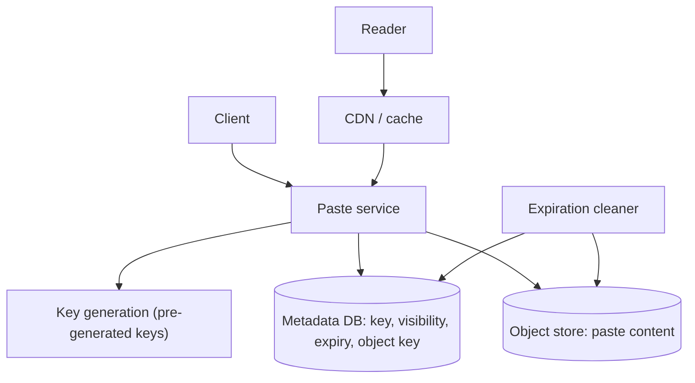

A text-sharing service lets users paste a block of text, such as a code snippet, log output or configuration, and get a short link to share it. Visitors open the link to read the text. It resembles a URL shortener, but instead of mapping a key to a URL, it maps a key to potentially large content. That difference changes where the data lives and how it is served.

## Requirements

- **Functional:** create a paste and receive a unique link; view a paste by link; optional expiration (for example 10 minutes, 1 day, never); optional "burn after reading"; public, unlisted or private visibility; syntax highlighting.
- **Non-functional:** high availability and low latency for reads, durability until expiration, unguessable links for unlisted pastes, and a size limit per paste, say 1 MB.

## Estimates

| Assumption | Value |
| --- | --- |
| New pastes per day | 1 million |
| Read-to-write ratio | 10:1 |
| Average paste size | 10 KB |
| Retention | many expire; assume half kept for years |

**Writes:** about 12 per second. **Reads:** about 120 per second on average, with spikes when a paste is shared widely.

**Storage:** 1 million × 10 KB = 10 GB per day, about 3.6 TB per year. Metadata (key, owner, visibility, expiry, size) is only about 200 bytes per paste, roughly 70 GB per year.

## Key design decision: separate content from metadata

Storing 10 KB to 1 MB text blobs in the same table as small metadata rows bloats the database, slows scans and makes backups expensive. Instead:

- **Metadata** goes into a database keyed by paste ID.
- **Content** goes into an object store, keyed by paste ID or by content hash.



## Creating and reading a paste

1. The client submits text and options. The service validates the size, takes a unique key from a pre-generated pool, as in the URL shortener, writes the content to the object store and then writes the metadata row.
2. It returns a link such as `paste.example/Xy7Kp2Qa`. Unlisted pastes use longer keys, perhaps 8 to 10 characters, so they cannot be guessed.

Readers request the link. The service reads metadata, checks visibility and expiry, fetches content from the object store and renders it with syntax highlighting, either server-side or in the browser. Public pastes are immutable, so the rendered page and raw content can be cached at the CDN with a long time-to-live, and a popular paste costs almost nothing to serve.

## Expiration and burn after reading

Expiration uses the same two mechanisms as the URL shortener: check `expires_at` on every read (return 404 after expiry), and delete expired content in a background job. Object stores often support **lifecycle rules** that delete objects automatically by age, which simplifies cleanup for fixed expiry periods.

**Burn after reading** requires the first read to atomically mark the paste as consumed, for example with a conditional update on the metadata row, so two simultaneous readers cannot both see it. Such pastes must never be cached.

## Abuse considerations

Paste services are used to share leaked credentials and malware configuration. Rate limits per IP address and account, automated scanning for secrets and known malicious patterns, and a reporting and takedown process are standard. Private and unlisted pastes are excluded from search engines with appropriate headers.

## API

```http
POST   /v1/pastes   { content, syntax?, expiresIn?, visibility, burnAfterRead? } -> { key, url }
GET    /v1/pastes/{key}          -> { content, syntax, createdAt, expiresAt }
GET    /raw/{key}                -> text/plain (cacheable for public pastes)
DELETE /v1/pastes/{key}          (owner only)
```

## Sizing the key space

With 1 million pastes per day kept for years, the service might hold a few billion pastes. Eight base-62 characters give about 218 trillion keys — tens of thousands of times more than needed — so random unlisted keys are practically unguessable, while public pastes can use shorter keys for convenience.

## Evaluation

| Requirement | How the design meets it |
| --- | --- |
| Low-latency reads | CDN caching of immutable public pastes; metadata cache for the rest |
| Durability until expiry | Object store with replication; metadata written only after content is stored |
| Unguessable links | Longer random keys for unlisted pastes; rate limiting on reads |
| Expiration | Read-time checks plus lifecycle rules and background cleanup |
| Burn after reading | Atomic first-read transition; never cached |

<Ponder question="The service writes content to the object store first and metadata second. What happens if the service crashes between the two writes, and why is that order better than the reverse?">
With content first, a crash leaves an orphaned object that no metadata points to — invisible to users and removable by a periodic cleanup job. With metadata first, a crash would leave a visible paste whose content does not exist, so readers would get errors. Writing the "commit record" (metadata) last is the same pattern used by blob stores and multipart uploads.
</Ponder>

<KeyTakeaways>
- A paste service maps keys to potentially large content, so content and metadata are stored separately.
- Metadata lives in a database; content lives in an object store; keys come from a pre-generated pool.
- Immutable public pastes are cached at the CDN, making popular pastes cheap to serve.
- Expiration combines read-time checks with background deletion or object-store lifecycle rules.
- Burn-after-reading needs an atomic first-read transition and must bypass caches.
- Writing content before metadata means a crash leaves only an invisible orphan, never a broken paste.
</KeyTakeaways>
