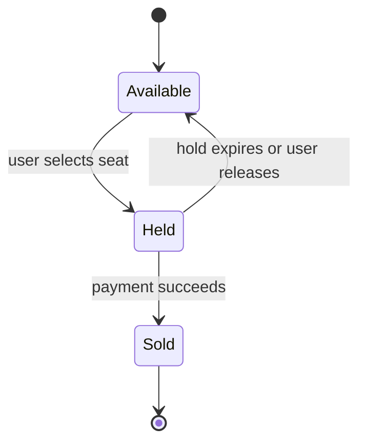
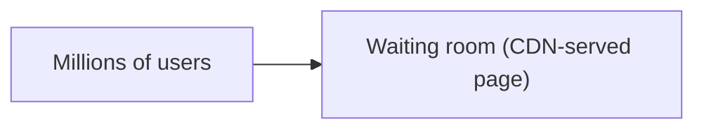
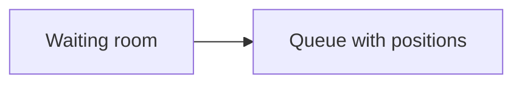
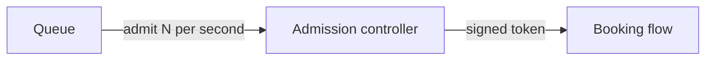

A ticket booking system sells seats for concerts, sports and theater. Most of the time it is a quiet catalog. Then a popular artist's tour goes on sale, and millions of fans arrive at the same minute to compete for tens of thousands of seats. The system must never sell the same seat twice, must stay up under a massive surge and should treat fans fairly.

## Requirements

- **Functional:** browse events, view a seat map with availability, select seats, hold them for a few minutes while paying, complete the purchase and receive tickets.
- **Non-functional:** **no double booking** (strong consistency for seat inventory), high availability during on-sales, fairness, and protection against bots.
- **Estimates:** a big on-sale might attract 2 million users for 50,000 seats. Seat-map views and availability checks can hit hundreds of thousands of requests per second, while successful purchases are limited by the number of seats.

## The seat lifecycle



A **hold** reserves seats for a short time, perhaps 5 to 10 minutes, while the user pays. Without holds, users would lose seats mid-payment; with holds that never expire, abandoned carts would lock inventory forever.

## Preventing double booking

Seat state changes must be atomic. Options include:

- **Conditional update in a relational database:** `UPDATE seats SET status = 'held', hold_id = ?, expires_at = ? WHERE seat_id IN (...) AND status = 'available'`. If the number of rows updated is less than requested, someone else got a seat first, and the transaction rolls back.
- **Optimistic concurrency** with version numbers on each seat row.
- **An in-memory store with atomic operations**, such as a Redis script that checks and sets several seats at once with an expiry, backed by the database as the source of truth.

Expired holds are released lazily (a seat whose hold has expired counts as available) and cleaned up by a background job. Payment completion converts a valid hold into a sale in one transaction; if the hold expired first, the payment is refunded or the user is asked to reselect.

## Surviving the on-sale surge

The inventory database can process only so many seat transactions per second, and letting 2 million users hammer it would cause timeouts and failures for everyone. The standard solution is a **virtual waiting room**.

<Slides title="Virtual waiting room">
<Slide caption="1. Before the sale, arriving users are placed in a waiting room served by a lightweight, cacheable page.">



</Slide>
<Slide caption="2. At sale time, users receive a random or arrival-ordered position in a queue. They see their position and estimated wait.">



</Slide>
<Slide caption="3. The admission controller lets users in at a rate the booking system can handle, issuing each a signed access token valid for a limited time.">



</Slide>
</Slides>

The waiting room turns an unmanageable spike into a steady flow, and gives users an honest, fair experience. Seat maps shown to admitted users can be served from a cache with slightly stale availability, since the atomic hold operation is the final arbiter.

## Fairness and bots

Bots try to buy tickets in bulk for resale. Defenses include per-account and per-payment-method purchase limits, CAPTCHA challenges before admission, device fingerprinting, verified-fan pre-registration, and detecting inhuman request patterns at the edge.

## API and data model

```http
GET  /v1/events/{id}/seatmap                 -> sections, seats with availability (cacheable, slightly stale)
POST /v1/events/{id}/holds  { seatIds, accessToken }   -> { holdId, expiresAt } | 409 seats taken
POST /v1/holds/{holdId}/purchase { paymentToken, idempotencyKey } -> { orderId, tickets }
DELETE /v1/holds/{holdId}
```

| Table | Key | Fields |
| --- | --- | --- |
| events | event_id | venue, start time, on-sale time, status |
| seats | (event_id, seat_id) | section, row, price tier, status, hold_id, expires_at, version |
| holds | hold_id | user_id, event_id, seat_ids, expires_at |
| orders | order_id | user_id, hold_id, payment reference, status |

Partitioning seats by event keeps every hold transaction for an event on one database partition, where conditional updates are cheap and atomic. A huge stadium event can be split by section if one partition becomes a bottleneck.

## How many transactions does the database really see?

With a waiting room admitting, say, 2,000 users per second, and each admitted user making one or two hold attempts, the inventory database handles a few thousand conditional updates per second — easily within one well-provisioned partition per event. Without the waiting room, two million simultaneous users retrying failed holds could generate hundreds of thousands of contended transactions per second on the same rows, and almost all would fail or time out.

## Evaluation

| Requirement | How the design meets it |
| --- | --- |
| No double booking | Atomic conditional updates on seat rows within one partition |
| Availability under surge | Waiting room and admission control; cacheable seat maps |
| Fairness | Randomized or ordered queue positions, purchase limits, bot defenses |
| Abandoned carts | Expiring holds with lazy release and background cleanup |
| Payment correctness | Idempotent purchase with the payment patterns from the payment chapter |

<Ponder question="Two friends in the waiting room are admitted at different times. The first holds four seats together; the second tries to hold the seat next to them a minute later. What guarantees and what limits does the design have here?">
The hold is atomic per request, so the first friend's four seats are either all held or none are — they cannot end up with a partial set. But the design makes no promise that the adjacent seat will still be free a minute later; another admitted user may take it. Group purchases are best made in one request by one person, which is why ticketing sites encourage buying for friends in a single order.
</Ponder>

<KeyTakeaways>
- Seats move from available to held to sold; holds expire so abandoned carts free inventory.
- Double booking is prevented with atomic conditional updates or optimistic concurrency on seat rows.
- A virtual waiting room with an admission controller turns a massive surge into a steady, fair flow.
- Availability displays can be cached, because the atomic hold operation is the final arbiter.
- Purchase limits, challenges and bot detection protect fairness.
- Partitioning seats by event keeps holds single-partition; admission control keeps contention within what that partition can handle.
</KeyTakeaways>
