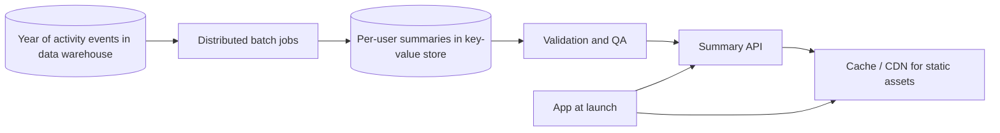
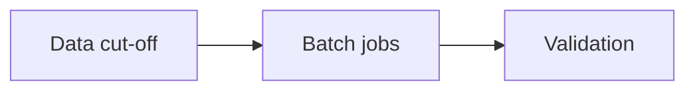
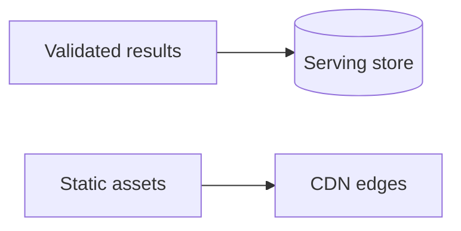

Every December, many apps show users a personalized summary of their year: top songs and artists, minutes listened, workouts completed, places visited. These features are hugely popular, often launched to hundreds of millions of users on the same day, and heavily shared on social media. They are a great case study in **precomputation**: doing enormous work in advance so that launch day is just a matter of serving results.

## Requirements

- **Functional:** for each eligible user, compute a set of yearly statistics and stories (for example top 5 artists, total minutes, favorite genre, a personality-style label); present them as an interactive, shareable experience; generate shareable images.
- **Non-functional:** available to everyone at a precise launch moment, fast to load despite a massive traffic spike, correct (users notice and complain about wrong numbers) and private (only the user sees their data unless they share it).
- **Scale:** 500 million users; each summary is derived from a year of activity logs, which may total petabytes.

## Why not compute on request?

Computing a user's summary at request time would mean scanning a year of their events and aggregating it, which is too slow for an interactive request and far too expensive at launch-time concurrency. Hundreds of millions of users opening the feature within hours would demand an impossible burst of compute against the event warehouse. Instead, the summaries are computed **ahead of time** in batch.

## Architecture



### Batch computation

1. **Cut-off:** data is collected up to a cut-off date, often weeks before launch, to leave time for computation and review.
2. **Distributed jobs:** a data processing framework computes aggregates per user in parallel over the warehouse: counts, top-N lists, percentiles compared with other users.
3. **Output:** each user's summary is a compact document, a few kilobytes, written to a key-value store keyed by user ID.
4. **Validation:** automated checks look for anomalies such as negative counts, empty lists, extreme outliers and distribution shifts compared with the previous year; staff review samples.

Batch jobs can be rerun if a bug is found, because the inputs are frozen. This makes correctness much easier to achieve than in a live system.

### Serving at launch

At launch, reading a summary is a single key-value lookup, easily scaled horizontally. Static assets, such as animations, fonts and templates, are pre-deployed to the CDN and pre-cached. Shareable images are either generated in the client from the summary data or pre-rendered in batch and stored in the blob store.

<Slides title="Preparing for launch day">
<Slide caption="1. Weeks before: freeze data at the cut-off, run batch jobs and validate results.">



</Slide>
<Slide caption="2. Days before: load summaries into the serving store, warm caches and push assets to CDN edges.">



</Slide>
<Slide caption="3. Launch: flip a feature flag gradually by region, watching load and error rates.">


</Slide>
</Slides>

### Controlling the spike

A launch moment creates a predictable thundering herd. Mitigations include pre-scaling the serving tier, releasing by time zone or region, using feature flags to throttle availability, and making the experience degrade gracefully: if the summary API is overloaded, the app shows a friendly "come back soon" message rather than failing.

## Sizing the batch and the launch

```text
Users:                    500 million
Events per user per year: ~20,000 (plays, skips, likes)  → ~10 trillion events
Summary per user:         ~5 KB                           → ~2.5 TB of results
Launch-day traffic:       100 million opens in 6 hours    → ~4,600 requests/s average,
                          with the first hour at maybe 5–10× that
```

The batch job is enormous but has weeks to run and can use cheap, preemptible compute. The serving side is modest by comparison — a few terabytes in a key-value store and tens of thousands of lookups per second — as long as nothing is computed on request.

## Computing "top 5 artists" at scale

A naive job sorts each user's plays by artist. A scalable job works in two stages:

1. **Map:** read events and emit `(user, artist) → play minutes`, combining counts locally before shuffling to cut network traffic.
2. **Reduce:** group by user, keep a small heap of the top 5 artists per user, and emit the summary document.

Percentile comparisons ("you were in the top 1% of listeners of this artist") need a second pass: first compute per-artist distributions of listening time across all users, then join each user's minutes against them.

<Ponder question="Engineers discover a bug in the genre calculation three days before launch. Why is the batch design a relief in this situation?">
Inputs are frozen at the cut-off date, so the fix can be applied and the affected jobs rerun deterministically — producing corrected summaries without depending on live data or user traffic. Validation runs again, and the corrected documents replace the old ones in the serving store before launch. In a compute-on-request design, the bug would be live the moment users opened the feature.
</Ponder>

<KeyTakeaways>
- Year-in-review features precompute each user's summary in batch rather than on request.
- A data cut-off, distributed batch jobs and automated validation make results correct and reproducible.
- Serving is a single key-value lookup per user, with static assets pre-positioned on the CDN.
- Launch spikes are managed by pre-scaling, gradual rollout by region and graceful degradation.
- The batch is huge but has weeks to run; the launch-day serving path is a modest key-value lookup.
</KeyTakeaways>
