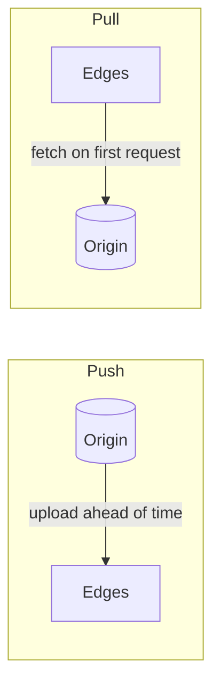
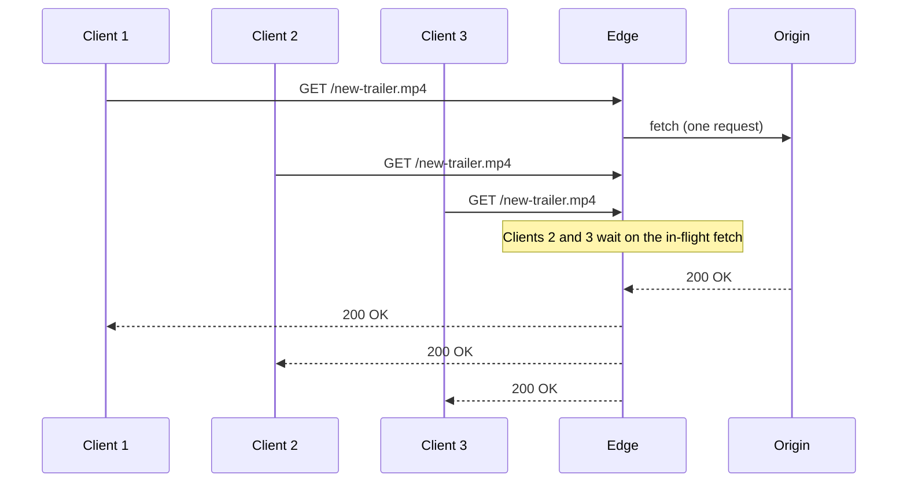

A CDN's performance depends on having the right content in the right place at the right time. This lesson examines how content gets to edges, how edges decide what to keep, and how PoPs are organized.

## Push versus pull CDNs

### Push

The origin **proactively uploads** content to the CDN, which distributes it to edges before anyone asks.

- **Pros:** first requests are fast; the origin controls exactly what is cached and when.
- **Cons:** the owner must manage uploads and storage; content that is never requested wastes space.
- **Best for:** large files released at known times — a game update, a new episode — or sites with little content that changes rarely.

### Pull

Edges **fetch content on demand** the first time it is requested, then cache it according to its TTL.

- **Pros:** simple for content owners; only requested content occupies cache space.
- **Cons:** the first request in each location is slow; a newly popular object can trigger a burst of origin fetches.
- **Best for:** sites with lots of content where popularity is unpredictable.

Many CDNs use a hybrid: pull by default, with prefetching for predictable hits. A video service, for example, can push the first minutes of a new series premiere to every PoP the night before release, and let the rest be pulled as viewers progress. Some private CDNs fill their caches during off-peak hours based on predicted popularity for the next day, when bandwidth is cheap.

## Request coalescing

When a popular object expires or first appears, thousands of simultaneous requests may miss at once — a **thundering herd**. Edges prevent this with **request coalescing** (also called collapsed forwarding): the first miss triggers a single upstream fetch, and all other requests for the same object wait for that response instead of sending their own.

## Eviction policies

Edge storage is finite, so edges evict content when full:

- **Least recently used (LRU)** — evict what has not been requested for the longest time. Simple and effective for most workloads.
- **Least frequently used (LFU)** — evict what is requested least often; better at keeping consistently popular items, but slow to adapt when popularity shifts.
- **Size-aware policies** — account for object size, since evicting one large rarely used video can make room for thousands of small popular images.
- **Admission policies** — not every object deserves caching. Requiring an object to be requested twice before caching it keeps one-hit wonders from polluting the cache.

### Why admission matters

Suppose a PoP sees a steady stream of popular images plus a crawler that requests millions of old, unique URLs once each. With plain LRU, each crawled URL is inserted at the head of the cache and pushes out a popular image, which then misses on its next request. A "second hit" admission rule (tracked cheaply with a probabilistic structure such as a counting Bloom filter) stores the crawled URLs' existence but not their bodies, so the popular images stay cached.

## Tiered storage on an edge server

| Tier | Size per server | Latency | Holds |
| --- | --- | --- | --- |
| RAM | Hundreds of GB | Microseconds | The hottest few percent of objects |
| NVMe SSD | Tens of TB | ~100 µs | The working set |
| HDD (in some deployments) | Hundreds of TB | ~10 ms | The long tail, for large catalogs |

Objects are promoted to faster tiers as they get hotter and demoted as they cool. Serving popular content from RAM also saves SSD wear, since flash has limited write endurance.

## Cache sharding within a PoP

A PoP contains many servers. If each server cached everything independently, the PoP's effective capacity would equal one server's. Instead, requests are distributed with **consistent hashing on the cache key**, so each object lives on one or a few servers in the PoP, multiplying effective capacity and hit ratio. Extremely popular objects can be replicated on several servers to spread load.

<TabGroup>
<Tab label="Independent caches">

Each of 20 servers caches whatever it happens to receive. Popular objects are duplicated 20 times; the PoP holds only about one server's worth of distinct objects. Hit ratio: low.

</Tab>
<Tab label="Hash-sharded caches">

Each object is assigned to one server by hashing its cache key. The PoP holds about 20 servers' worth of distinct objects. Hot objects are additionally replicated to a few servers. Hit ratio: much higher.

</Tab>
</TabGroup>

## Caching video: segments and ranges

Video is delivered as small **segments** of a few seconds (for adaptive streaming formats) or fetched with HTTP **range requests** for byte ranges of a large file. Both let the CDN cache pieces independently:

- Popular parts of a video — usually the beginning — stay hot, while later segments of rarely finished videos may be evicted.
- Each quality level (240p to 4K) is a separate set of segments, so the cache holds the qualities that viewers in that region actually use.
- The edge can **prefetch** the next few segments when a viewer requests one, so the following requests hit.

<Callout type="tip">
For video streaming, content is split into small segments of a few seconds. Segments are cached independently, so popular parts of a video — usually the beginning — stay hot while later segments may be evicted.
</Callout>

## Dynamic content acceleration

Even uncacheable responses benefit from a CDN:

- **Connection reuse.** Edges keep warm, long-lived connections to the origin, so a user's request avoids fresh TCP and TLS handshakes across the ocean.
- **Optimized routing.** CDNs route origin traffic over their own backbone, avoiding congested public paths.
- **Edge computing.** Small programs run at the edge to personalize responses, perform authentication, run A/B test assignments or assemble pages from cached fragments.
- **Micro-caching.** Even a one-second TTL on a busy dynamic endpoint collapses thousands of identical requests per second into one origin request.

<Ponder question="An online store's product pages are 'dynamic' because they show the logged-in user's name in the header. How could a CDN still cache most of the page?">
Separate the personalized part from the shared part. Cache the product page body (identical for everyone) at the edge with a short TTL, and fetch the small personalized fragment — the header with the user's name and cart count — separately via a client-side request or assemble it at the edge with edge computing. Only the tiny per-user piece goes to the origin.
</Ponder>

<KeyTakeaways>
- Push CDNs preload content; pull CDNs fetch on demand. Hybrids prefetch predictable hits and pull the rest.
- Request coalescing prevents thundering herds when popular content misses.
- Eviction (LRU, LFU, size-aware) and admission policies decide what stays cached; admission keeps one-hit wonders out.
- Edge servers tier content across RAM, SSD and sometimes HDD by popularity.
- Consistent hashing across servers in a PoP multiplies effective cache capacity.
- Video is cached as segments or ranges; CDNs accelerate dynamic content through connection reuse, routing, edge computing and micro-caching.
</KeyTakeaways>
