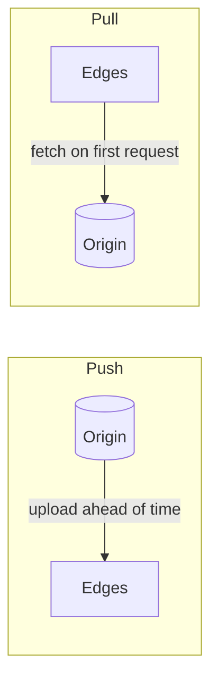

A CDN's performance depends on having the right content in the right place at the right time. This lesson examines how content gets to edges, how edges decide what to keep, and how PoPs are organized.

## Push versus pull CDNs

### Push

The origin **proactively uploads** content to the CDN, which distributes it to edges before anyone asks.

- **Pros:** first requests are fast; the origin controls exactly what is cached and when.
- **Cons:** the owner must manage uploads and storage; content that is never requested wastes space.
- **Best for:** large files released at known times — a game update, a new episode — or sites with little content that changes rarely.

### Pull

Edges **fetch content on demand** the first time it is requested, then cache it according to its TTL.

- **Pros:** simple for content owners; only requested content occupies cache space.
- **Cons:** the first request in each location is slow; a newly popular object can trigger a burst of origin fetches.
- **Best for:** sites with lots of content where popularity is unpredictable.

Many CDNs use a hybrid: pull by default, with prefetching for predictable hits.

## Request coalescing

When a popular object expires or first appears, thousands of simultaneous requests may miss at once — a **thundering herd**. Edges prevent this with **request coalescing**: the first miss triggers a single upstream fetch, and all other requests for the same object wait for that response instead of sending their own.

## Eviction policies

Edge storage is finite, so edges evict content when full:

- **Least recently used (LRU)** — evict what has not been requested for the longest time. Simple and effective for most workloads.
- **Least frequently used (LFU)** — evict what is requested least often; better at keeping consistently popular items, but slow to adapt.
- **Size-aware policies** — account for object size, since evicting one large rarely used video can make room for thousands of small popular images.
- **Admission policies** — not every object deserves caching. Requiring an object to be requested twice before caching it keeps one-hit wonders from polluting the cache.

## Cache sharding within a PoP

A PoP contains many servers. If each server cached everything independently, the PoP's effective capacity would equal one server's. Instead, requests are distributed with **consistent hashing on the URL**, so each object lives on one or a few servers in the PoP, multiplying effective capacity and hit ratio. Extremely popular objects can be replicated on several servers to spread load.

## Dynamic content acceleration

Even uncacheable responses benefit from a CDN:

- **Connection reuse.** Edges keep warm, long-lived connections to the origin, so a user's request avoids fresh TCP and TLS handshakes across the ocean.
- **Optimized routing.** CDNs route origin traffic over their own backbone, avoiding congested public paths.
- **Edge computing.** Small programs run at the edge to personalize responses, perform authentication or assemble pages from cached fragments.

<Callout type="tip">
For video streaming, content is split into small segments of a few seconds. Segments are cached independently, so popular parts of a video — usually the beginning — stay hot while later segments may be evicted.
</Callout>

<KeyTakeaways>
- Push CDNs preload content; pull CDNs fetch on demand. Hybrids combine both.
- Request coalescing prevents thundering herds when popular content misses.
- Eviction (LRU, LFU, size-aware) and admission policies decide what stays cached.
- Consistent hashing across servers in a PoP multiplies effective cache capacity.
- CDNs accelerate dynamic content through connection reuse, optimized routing and edge computing.
</KeyTakeaways>
