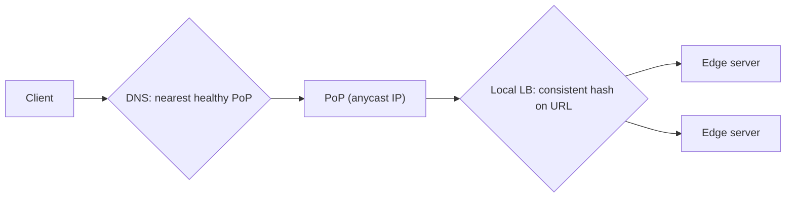

Two questions remain in our CDN design: how do we send each user to the **best** edge server, and how do we keep cached content **consistent** with the origin when it changes?

## Request routing

The goal is to direct each request to an edge server that is close (low latency), healthy and not overloaded. CDNs combine several techniques.

### DNS-based redirection

The CDN operates the authoritative DNS for content domains. When a resolver asks for `cdn.example.com`, the CDN's DNS server uses a map of network latency, PoP health and load to return the IP address of a suitable edge. Short TTLs let the CDN adjust quickly. The limitation, as with any DNS-based steering, is that decisions are based on the resolver's location and are cached.

### Anycast

All PoPs announce the **same IP prefix**, and Internet routing delivers packets to the topologically nearest one. Anycast is simple for clients, responds quickly to PoP failures by withdrawing routes, and naturally spreads DDoS traffic across many sites. It does not directly consider server load, so it is often combined with load balancing inside each PoP.

### HTTP redirection and client-side selection

An edge can redirect a client (HTTP 302) to a better server, and video players can measure throughput and switch servers mid-stream. These add flexibility but cost extra round trips.

## Keeping content consistent

Once content is cached in hundreds of locations, changes at the origin must propagate. There are several approaches, each trading freshness against cost.

### Time-to-live (TTL)

Each object expires after its TTL, after which the edge revalidates it with the origin (often cheaply, with a conditional request). Long TTLs mean better hit ratios but staler content; short TTLs mean fresher content but more origin traffic.

### Periodic polling

Edges proactively check with the origin for changes at regular intervals. This is simple but wasteful for content that rarely changes.

### Purge (invalidation)

The content owner calls the CDN's API to **purge** specific URLs or patterns. The CDN propagates the purge to all edges, typically within seconds. Purges are essential for urgent fixes — a wrong price, a removed image — but purging too broadly can flood the origin with misses.

### Versioned URLs

The most robust approach avoids invalidation entirely: when content changes, it gets a **new URL** (for example, with a content hash). Old URLs remain valid for anyone who has them, and new pages reference the new URL.

### Leases

An edge obtains a **lease** from the origin for an object: during the lease, the origin promises to notify the edge of changes. When the lease expires, the edge must renew it. Leases balance freshness and overhead but require the origin to track outstanding leases.

| Technique | Freshness | Origin cost | Complexity |
| --- | --- | --- | --- |
| TTL | Bounded staleness | Low–medium | Low |
| Polling | Bounded by interval | Medium–high | Low |
| Purge | Near-immediate | Spike after purge | Medium |
| Versioned URLs | Immediate for new references | Low | Low (needs build tooling) |
| Leases | Near-immediate | Medium | High |

<Callout type="interview">
A common interview follow-up is “how do you update an image that's already cached everywhere?” A strong answer: use versioned URLs for assets you control, short TTLs plus purge APIs for content that must change in place, and serve-stale-while-revalidate to keep latency low during refreshes.
</Callout>

<KeyTakeaways>
- DNS-based routing chooses PoPs using latency, health and load maps, limited by caching and resolver location.
- Anycast routes to the nearest PoP at the network layer and fails over by withdrawing routes.
- TTLs, polling, purges, versioned URLs and leases trade freshness against cost and complexity.
- Versioned URLs avoid invalidation for static assets; purges handle urgent in-place changes.
</KeyTakeaways>
