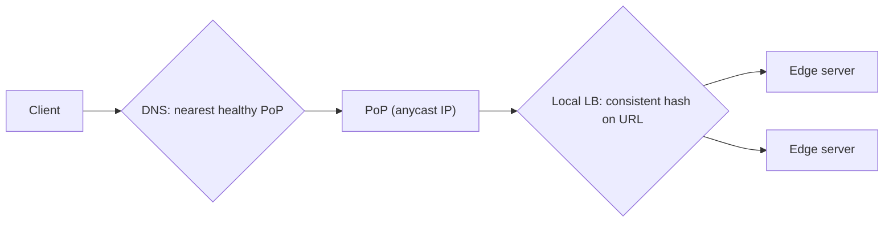
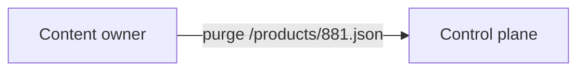
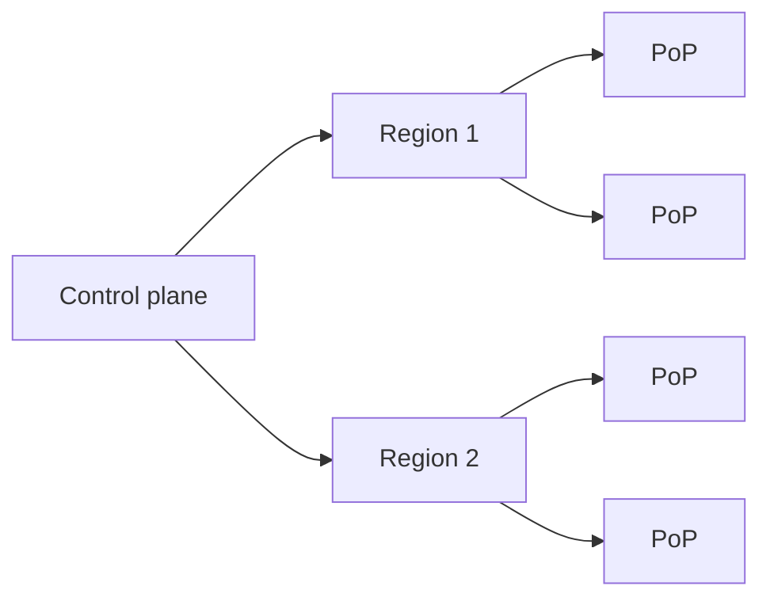
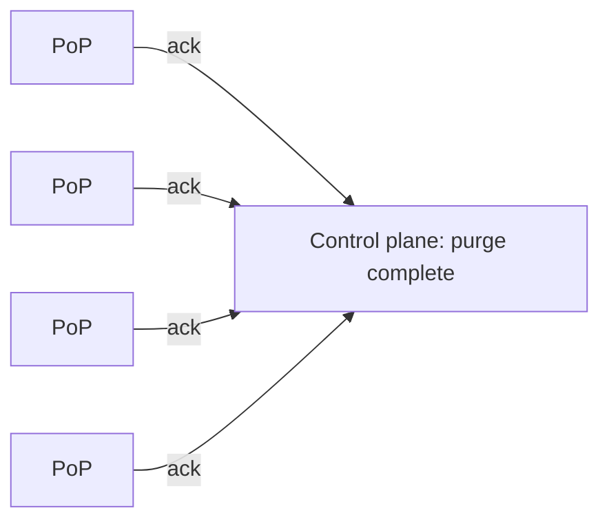

Two questions remain in our CDN design: how do we send each user to the **best** edge server, and how do we keep cached content **consistent** with the origin when it changes?

## Request routing

The goal is to direct each request to an edge server that is close (low latency), healthy and not overloaded. CDNs combine several techniques.

### Building the map

To choose well, the routing system needs a constantly updated **map** of the Internet from its point of view:

- **Latency measurements** — PoPs probe networks around the world, and real user measurements (small timing beacons from browsers and apps) record how long requests from each network take to each PoP.
- **Health** — PoP and server health checks, error rates and link status.
- **Load** — current traffic and spare capacity per PoP.
- **Cost and policy** — bandwidth prices at each location and contractual rules.

The mapping system combines these into a decision for each client network (for example, each resolver or each /24 prefix): "send them to PoP X, or Y if X is full". Decisions are recomputed every few seconds to minutes.

### DNS-based redirection

The CDN operates the authoritative DNS for content domains. When a resolver asks for `cdn.example.com`, the CDN's DNS server uses the map to return the IP address of a suitable edge. Short TTLs let the CDN adjust quickly. The limitation, as with any DNS-based steering, is that decisions are based on the resolver's location and are cached.

### Anycast

All PoPs announce the **same IP prefix**, and Internet routing delivers packets to the topologically nearest one. Anycast is simple for clients, responds quickly to PoP failures by withdrawing routes, and naturally spreads DDoS traffic across many sites. It does not directly consider server load, so it is often combined with load balancing inside each PoP, and CDNs may withdraw announcements from an overloaded PoP to shift traffic away.

### HTTP redirection and client-side selection

An edge can redirect a client (HTTP 302) to a better server, and video players can measure throughput and switch servers mid-stream. These add flexibility but cost extra round trips. Large video services often give the player a ranked list of candidate servers so that it can fail over instantly without another lookup.

| Technique | Decision granularity | Reacts to failure in | Considers load? |
| --- | --- | --- | --- |
| DNS redirection | Per resolver, per TTL | Seconds to minutes | Yes |
| Anycast | Per routing path | Seconds | Indirectly (route withdrawal) |
| HTTP redirect | Per request | Immediately | Yes |
| Client-side selection | Per session or segment | Immediately | Yes (measured throughput) |

## Keeping content consistent

Once content is cached in hundreds of locations, changes at the origin must propagate. There are several approaches, each trading freshness against cost.

### Time-to-live (TTL)

Each object expires after its TTL, after which the edge revalidates it with the origin (often cheaply, with a conditional request). Long TTLs mean better hit ratios but staler content; short TTLs mean fresher content but more origin traffic. With `stale-while-revalidate`, users never wait for the revalidation: the edge serves the stale copy once more while refreshing it in the background.

### Periodic polling

Edges proactively check with the origin for changes at regular intervals. This is simple but wasteful for content that rarely changes.

### Purge (invalidation)

The content owner calls the CDN's API to **purge** specific URLs, patterns or tags. The CDN propagates the purge to all edges, typically within seconds.

<Slides title="Propagating a purge">
<Slide caption="1. The owner calls the purge API for /products/881.json. The control plane records the purge with a sequence number.">

</Slide>
<Slide caption="2. The purge fans out through the distribution tree to every PoP, and each PoP forwards it to its servers.">

</Slide>
<Slide caption="3. Servers mark the object stale or delete it and acknowledge. The API reports completion once all PoPs confirm; PoPs that were unreachable apply missed purges when they reconnect.">

</Slide>
</Slides>

Two useful refinements:

- **Soft purge** marks content stale instead of deleting it, so edges revalidate with a cheap conditional request and can still serve the old copy if the origin is down.
- **Tag-based purge** lets the origin label responses (for example, `Surrogate-Key: product-881 category-shoes`) and purge every URL carrying a tag — all pages showing product 881 — without knowing their URLs.

Purges are essential for urgent fixes — a wrong price, a removed image — but purging too broadly can flood the origin with misses.

### Versioned URLs

The most robust approach avoids invalidation entirely: when content changes, it gets a **new URL** (for example, with a content hash). Old URLs remain valid for anyone who has them, and new pages reference the new URL.

### Leases

An edge obtains a **lease** from the origin for an object: during the lease, the origin promises to notify the edge of changes. When the lease expires, the edge must renew it. Leases balance freshness and overhead but require the origin to track outstanding leases.

| Technique | Freshness | Origin cost | Complexity |
| --- | --- | --- | --- |
| TTL | Bounded staleness | Low–medium | Low |
| Polling | Bounded by interval | Medium–high | Low |
| Purge | Near-immediate | Spike after purge | Medium |
| Versioned URLs | Immediate for new references | Low | Low (needs build tooling) |
| Leases | Near-immediate | Medium | High |

<Callout type="interview">
A common interview follow-up is "how do you update an image that's already cached everywhere?" A strong answer: use versioned URLs for assets you control, short TTLs plus purge APIs for content that must change in place, and serve-stale-while-revalidate to keep latency low during refreshes.
</Callout>

<Ponder question="A retailer purges its entire site from the CDN five minutes before a big sale starts. What happens, and what should they have done instead?">
Every cached object becomes a miss at once, so the first wave of sale traffic goes straight to the origin — at the worst possible moment — and may overload it. Better: use versioned URLs for assets, purge only the specific pages or tags that changed (prices, banners), use soft purges so edges can still serve stale copies if the origin struggles, and prefetch the key sale pages after purging so caches are warm before traffic arrives.
</Ponder>

<KeyTakeaways>
- The routing system builds a live map from latency measurements, health, load and cost.
- DNS-based routing chooses PoPs per resolver, limited by caching; anycast fails over by withdrawing routes; redirects and client-side selection decide per request.
- TTLs, polling, purges, versioned URLs and leases trade freshness against cost and complexity.
- Purges fan out through a distribution tree; soft purges and tag-based purges make invalidation safer and more precise.
- Versioned URLs avoid invalidation for static assets; purges handle urgent in-place changes.
</KeyTakeaways>
