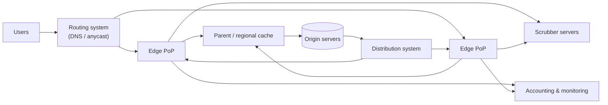
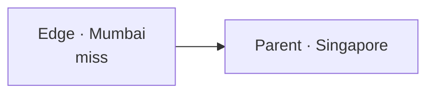
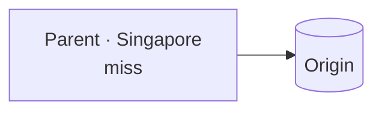
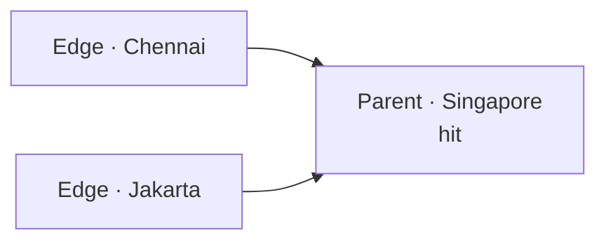
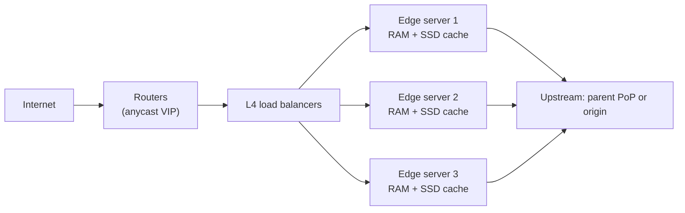

Let's assemble a CDN from its components and trace how content flows from origin to user.

## Components



- **Clients** — browsers and apps requesting content.
- **Routing system** — directs each client to the best edge server, using DNS, anycast or both. It considers proximity, server load and health.
- **Scrubber servers** — filter malicious traffic such as DDoS attacks before it reaches edge caches.
- **Edge (proxy) servers** — cache and serve content from PoPs near users.
- **Parent or regional caches** — a middle tier that edges query on a miss, reducing requests to the origin.
- **Distribution system** — pushes content and configuration from the origin to edges.
- **Origin servers** — the content owner's authoritative servers.
- **Management, accounting and monitoring** — collect logs and metrics for billing, analytics and operations.

## Request workflow

1. The origin registers content with the CDN, either by pushing it or by letting the CDN pull it on demand.
2. A client resolves the content's domain; the **routing system** returns a nearby, healthy edge.
3. The request passes through **scrubbers** if the traffic looks suspicious.
4. The **edge server** checks its cache. On a hit, it responds directly.
5. On a miss, the edge asks its **parent cache**; if the parent misses too, it fetches from the **origin**.
6. Responses are cached at each tier according to their TTLs.
7. Edges report usage to the **accounting** system and health to **monitoring**.

## A hierarchical cache

Why add parent caches? Without them, each of hundreds of edge PoPs fetches a newly popular object from the origin independently. With a hierarchy, many edges share a regional parent, so the origin sees one request per region.

<Slides title="Cache hierarchy on a miss">
<Slide caption="1. An edge in Mumbai misses and asks its regional parent in Singapore.">



</Slide>
<Slide caption="2. The parent also misses and fetches once from the origin.">



</Slide>
<Slide caption="3. Later misses from other edges in the region are served by the parent, not the origin.">



</Slide>
</Slides>

A special case is the **origin shield**: a single designated parent PoP through which *all* misses for a customer flow. It maximizes the chance that a miss is satisfied before reaching the origin, at the cost of an extra hop for some edges. Customers with fragile or expensive origins enable it.

### How much does the hierarchy save?

Suppose 300 edge PoPs, grouped under 10 regional parents, and a new video that becomes popular everywhere at once:

| Setup | Origin fetches for the first copy |
| --- | --- |
| Edges only | Up to 300 (one per PoP), more without coalescing |
| Edges plus 10 parents | 10 |
| Edges, parents and an origin shield | 1 |

## Inside a PoP



A PoP is a small data center: routers announce the CDN's addresses, load balancers spread connections across edge servers, and each edge server caches in RAM (hottest objects) and on SSDs (everything else). Servers inside a PoP split the cache between them by hashing on the cache key, as the next lesson explains. A typical edge server might hold tens of terabytes on SSD and serve tens of gigabits per second.

## The distribution system

Content owners push new objects and configuration (TTLs, cache-key rules, purges) to thousands of edge servers. Sending everything from one place would create a bottleneck, so the distribution system uses a **tree**: the origin or a control plane sends to regional distribution nodes, which forward to PoPs, which forward to their servers. Each layer fans out to many recipients, so an update reaches the whole fleet in a few hops, typically within seconds.

## Accounting and monitoring

Every edge server writes access logs: URL, bytes, status, cache result, client region and latency. Logs are aggregated in a streaming pipeline to produce:

- **Billing** — bytes and requests per customer.
- **Analytics** — hit ratios, top URLs, traffic by country.
- **Operations** — error rates and latency per PoP, which feed back into the routing system so that unhealthy or overloaded PoPs receive less traffic.

## API between components

Edges and origins communicate over HTTP, and the CDN exposes management APIs to content owners:

```text
retrieveContent(url)             edge → parent/origin, on a miss
deliverContent(url, clientInfo)  edge → client
purge(urlPattern)                owner → CDN, invalidate content
prefetch(urls)                   owner → CDN, warm caches (push)
getStats(timeRange, filters)     owner → CDN, usage and hit ratios
```

## Why this design meets the requirements

- **Performance:** most requests are served by a nearby edge; misses usually stop at a regional parent.
- **Availability:** many PoPs and servers per PoP; routing avoids unhealthy ones; stale content can be served if the origin is down.
- **Scalability:** capacity grows by adding servers and PoPs; the hierarchy keeps origin load flat as edges multiply.
- **Security:** scrubbers and massive distributed capacity absorb attacks.

<Ponder question="Why might a CDN route misses from its Sydney edge to a parent in Singapore rather than directly to an origin in Virginia, even though it adds a hop?">
The Singapore parent aggregates misses from many Asia-Pacific PoPs, so it is much more likely to have the object already — turning a 200 ms trans-Pacific fetch into a much shorter regional one for most misses, and protecting the origin. The CDN's backbone between Sydney and Singapore is also typically faster and more reliable than the public Internet path to the origin.
</Ponder>

<KeyTakeaways>
- A CDN combines routing, scrubbers, edge servers, parent caches, distribution, origin and monitoring components.
- Requests are routed to a nearby healthy edge; misses go to a parent cache, then the origin.
- Hierarchical caching and origin shields mean the origin sees roughly one request per region, or even one in total, for popular content.
- A PoP is a small data center with routers, load balancers and edge servers caching in RAM and SSD.
- Distribution trees push content and configuration quickly; logs feed billing, analytics and routing.
- Management APIs let content owners purge, prefetch and inspect their traffic.
</KeyTakeaways>
