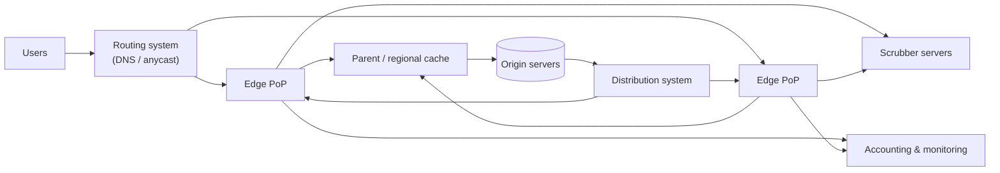
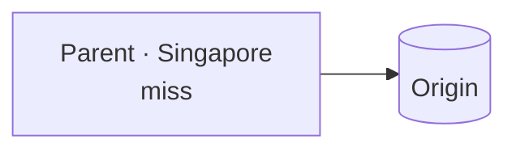
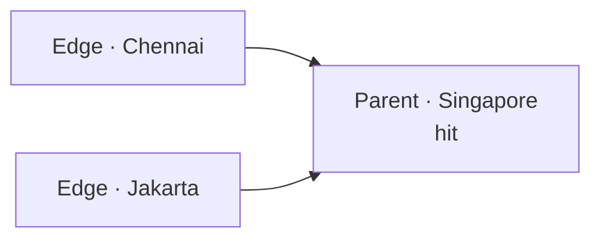

Let's assemble a CDN from its components and trace how content flows from origin to user.

## Components



- **Clients** — browsers and apps requesting content.
- **Routing system** — directs each client to the best edge server, using DNS, anycast or both. It considers proximity, server load and health.
- **Scrubber servers** — filter malicious traffic such as DDoS attacks before it reaches edge caches.
- **Edge (proxy) servers** — cache and serve content from PoPs near users.
- **Parent or regional caches** — a middle tier that edges query on a miss, reducing requests to the origin.
- **Distribution system** — pushes content and configuration from the origin to edges.
- **Origin servers** — the content owner's authoritative servers.
- **Management, accounting and monitoring** — collect logs and metrics for billing, analytics and operations.

## Request workflow

1. The origin registers content with the CDN, either by pushing it or by letting the CDN pull it on demand.
2. A client resolves the content's domain; the **routing system** returns a nearby, healthy edge.
3. The request passes through **scrubbers** if the traffic looks suspicious.
4. The **edge server** checks its cache. On a hit, it responds directly.
5. On a miss, the edge asks its **parent cache**; if the parent misses too, it fetches from the **origin**.
6. Responses are cached at each tier according to their TTLs.
7. Edges report usage to the **accounting** system and health to **monitoring**.

## A hierarchical cache

Why add parent caches? Without them, each of hundreds of edge PoPs fetches a newly popular object from the origin independently. With a hierarchy, many edges share a regional parent, so the origin sees one request per region.

<Slides title="Cache hierarchy on a miss">
<Slide caption="1. An edge in Mumbai misses and asks its regional parent in Singapore.">


</Slide>
<Slide caption="2. The parent also misses and fetches once from the origin.">



</Slide>
<Slide caption="3. Later misses from other edges in the region are served by the parent, not the origin.">



</Slide>
</Slides>

## API between components

Edges and origins communicate over HTTP, and the CDN exposes management APIs to content owners:

```text
retrieveContent(url)             edge → parent/origin, on a miss
deliverContent(url, clientInfo)  edge → client
purge(urlPattern)                owner → CDN, invalidate content
prefetch(urls)                   owner → CDN, warm caches (push)
```

## Why this design meets the requirements

- **Performance:** most requests are served by a nearby edge; misses usually stop at a regional parent.
- **Availability:** many PoPs and servers per PoP; routing avoids unhealthy ones; stale content can be served if the origin is down.
- **Scalability:** capacity grows by adding servers and PoPs; the hierarchy keeps origin load flat as edges multiply.
- **Security:** scrubbers and massive distributed capacity absorb attacks.

<KeyTakeaways>
- A CDN combines routing, scrubbers, edge servers, parent caches, distribution, origin and monitoring components.
- Requests are routed to a nearby healthy edge; misses go to a parent cache, then the origin.
- Hierarchical caching means the origin sees roughly one request per region for popular content.
- Management APIs let content owners purge and prefetch content.
</KeyTakeaways>
