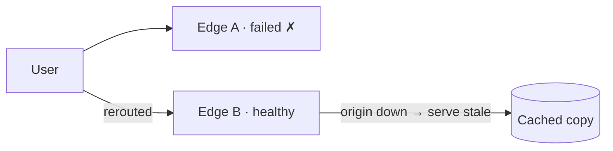

Let's evaluate our CDN against the requirements we set out and consider the remaining trade-offs.

## Performance

- **Proximity:** PoPs placed in major Internet exchanges and inside ISP networks keep round-trip times to single-digit milliseconds for most users.
- **High hit ratios:** hierarchical caching, consistent hashing within PoPs and admission policies maximize the proportion of requests served from cache.
- **Protocol optimizations:** edges terminate TLS near users, support modern protocols such as HTTP/2 and HTTP/3, and keep warm connections to origins. HTTP/3 runs over QUIC, which combines the transport and TLS handshakes and avoids head-of-line blocking on lossy mobile networks.
- **Request coalescing** avoids stampedes on popular misses.

### A latency budget for a cached image

| Step | Without CDN (Sydney → Virginia) | With CDN (Sydney edge) |
| --- | --- | --- |
| DNS lookup (cached at resolver) | ~10 ms | ~10 ms |
| TCP + TLS handshakes (2 round trips) | ~400 ms | ~10 ms |
| Request and response (1 round trip) | ~200 ms | ~5 ms |
| Server time | ~5 ms | ~1 ms (RAM hit) |
| **Total** | **~615 ms** | **~26 ms** |

## Availability

- **No single point of failure:** many servers per PoP and many PoPs per region. Anycast and DNS steer traffic away from failed sites within seconds.
- **Origin shielding:** parent caches reduce origin load, and edges can **serve stale content** when the origin is unavailable — a trade-off many sites happily make.
- **Attack resilience:** scrubbers and distributed capacity absorb large DDoS attacks. Anycast spreads an attack across all PoPs, so no single site receives all of it.



| Failure | Detection | Response |
| --- | --- | --- |
| One edge server | PoP load balancer health checks | Traffic moves to other servers in the PoP; its hash range is reassigned |
| Whole PoP | Routing system health checks | DNS and anycast send users to the next nearest PoP |
| Parent cache | Edge upstream errors | Edges fall back to another parent or the origin |
| Origin | Upstream errors or timeouts | Serve stale content within `stale-if-error` limits |

## Scalability

- Capacity grows horizontally by adding servers to PoPs and adding new PoPs.
- The cache hierarchy keeps origin traffic roughly constant as the number of edges grows.
- Management functions — purges, configuration and logging — are distributed systems themselves, designed to scale with the edge fleet.

## Reliability and security

- Checksums protect content integrity between tiers.
- TLS everywhere protects content in transit; **signed URLs** and tokens restrict access to private content, such as paid videos. A signed URL embeds an expiry time and a signature computed with a secret key shared by the origin and the CDN, so edges can verify it without contacting the origin.
- Web application firewall rules at the edge block common attacks before they reach the origin.
- Origins should accept traffic only from the CDN (by IP allow-list or a secret header), so attackers cannot bypass the CDN and hit the origin directly.

```text
https://cdn.example.com/videos/ep42/seg7.ts?expires=1790000000&sig=Yp3...9Qa
sig = HMAC(secret, "/videos/ep42/seg7.ts" + expires)
```

## Remaining trade-offs

| Decision | Benefit | Cost |
| --- | --- | --- |
| Long TTLs | High hit ratio | Staler content |
| Many PoPs | Lower latency | Lower per-PoP hit ratio, higher operating cost |
| Push distribution | Fast first access | Storage for unrequested content |
| Serve stale on origin failure | Availability | Users may see outdated content |

An important tension is **PoP count versus hit ratio**: more PoPs bring content closer to users, but each PoP sees fewer requests per object, so its hit ratio drops. Parent caches and careful placement balance these.

## Build versus buy

Most companies use commercial CDNs, which offer global footprints and DDoS protection that would be prohibitively expensive to replicate. Very large media companies build **private CDNs**, placing cache appliances inside ISPs, because their traffic volume makes it cost-effective and lets them tailor caching to their content. ISPs welcome the appliances because they keep heavy video traffic inside their own networks, reducing their transit costs too.

Some companies go further and use **multiple CDNs**: traffic is split between providers by DNS or by the client, based on real-time performance and price. This removes a dependency on any single provider and strengthens the company's negotiating position, at the cost of managing configuration, purges and certificates in several places.

| Option | Best for | Main drawback |
| --- | --- | --- |
| Single commercial CDN | Most companies | Dependency on one provider |
| Multi-CDN | Large sites needing maximum availability | Operational complexity |
| Private CDN inside ISPs | Very large video platforms | Huge up-front investment |

<Ponder question="A company's CDN bill is dominated by video egress, and its byte hit ratio is 85%. What are the main levers for cutting cost?">
Raise the byte hit ratio (more cache storage for large objects, better admission and eviction for video, longer TTLs on immutable segments, an origin shield) — going from 85% to 95% cuts origin egress by two-thirds. Reduce bytes served (more efficient codecs, adaptive bitrate that avoids sending higher quality than the screen can show). Negotiate or diversify with multi-CDN, and, at very large scale, consider placing private caches inside ISPs.
</Ponder>

<KeyTakeaways>
- Proximity, hierarchical caching and protocol optimizations such as HTTP/3 deliver low latency — tens of milliseconds instead of hundreds.
- Redundant PoPs, fast rerouting and serve-stale behavior provide high availability across server, PoP, parent and origin failures.
- The hierarchy keeps origin load flat as the edge fleet grows.
- Signed URLs, TLS, edge firewalls and locking origins to CDN traffic secure content.
- Key tensions include TTL versus freshness and PoP count versus hit ratio.
- Most companies buy CDN services; some use multiple CDNs, and very large media platforms build their own inside ISPs.
</KeyTakeaways>
