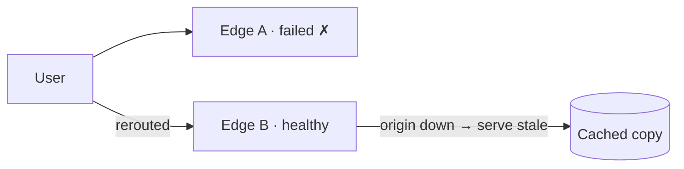

Let's evaluate our CDN against the requirements we set out and consider the remaining trade-offs.

## Performance

- **Proximity:** PoPs placed in major Internet exchanges and inside ISP networks keep round-trip times to single-digit milliseconds for most users.
- **High hit ratios:** hierarchical caching, consistent hashing within PoPs and admission policies maximize the proportion of requests served from cache.
- **Protocol optimizations:** edges terminate TLS near users, support modern protocols such as HTTP/2 and HTTP/3, and keep warm connections to origins.
- **Request coalescing** avoids stampedes on popular misses.

## Availability

- **No single point of failure:** many servers per PoP and many PoPs per region. Anycast and DNS steer traffic away from failed sites within seconds.
- **Origin shielding:** parent caches reduce origin load, and edges can **serve stale content** when the origin is unavailable — a trade-off many sites happily make.
- **Attack resilience:** scrubbers and distributed capacity absorb large DDoS attacks.

## Scalability

- Capacity grows horizontally by adding servers to PoPs and adding new PoPs.
- The cache hierarchy keeps origin traffic roughly constant as the number of edges grows.
- Management functions — purges, configuration and logging — are distributed systems themselves, designed to scale with the edge fleet.

## Reliability and security

- Checksums protect content integrity between tiers.
- TLS everywhere protects content in transit; signed URLs and tokens restrict access to private content, such as paid videos.
- Web application firewall rules at the edge block common attacks before they reach the origin.

## Remaining trade-offs

| Decision | Benefit | Cost |
| --- | --- | --- |
| Long TTLs | High hit ratio | Staler content |
| Many PoPs | Lower latency | Lower per-PoP hit ratio, higher operating cost |
| Push distribution | Fast first access | Storage for unrequested content |
| Serve stale on origin failure | Availability | Users may see outdated content |

An important tension is **PoP count versus hit ratio**: more PoPs bring content closer to users, but each PoP sees fewer requests per object, so its hit ratio drops. Parent caches and careful placement balance these.

## Build versus buy

Most companies use commercial CDNs, which offer global footprints and DDoS protection that would be prohibitively expensive to replicate. Very large media companies build **private CDNs**, placing cache appliances inside ISPs, because their traffic volume makes it cost-effective and lets them tailor caching to their content.

<KeyTakeaways>
- Proximity, hierarchical caching and protocol optimizations deliver low latency.
- Redundant PoPs, fast rerouting and serve-stale behavior provide high availability.
- The hierarchy keeps origin load flat as the edge fleet grows.
- Key tensions include TTL versus freshness and PoP count versus hit ratio.
- Most companies buy CDN services; very large media platforms may build their own.
</KeyTakeaways>
