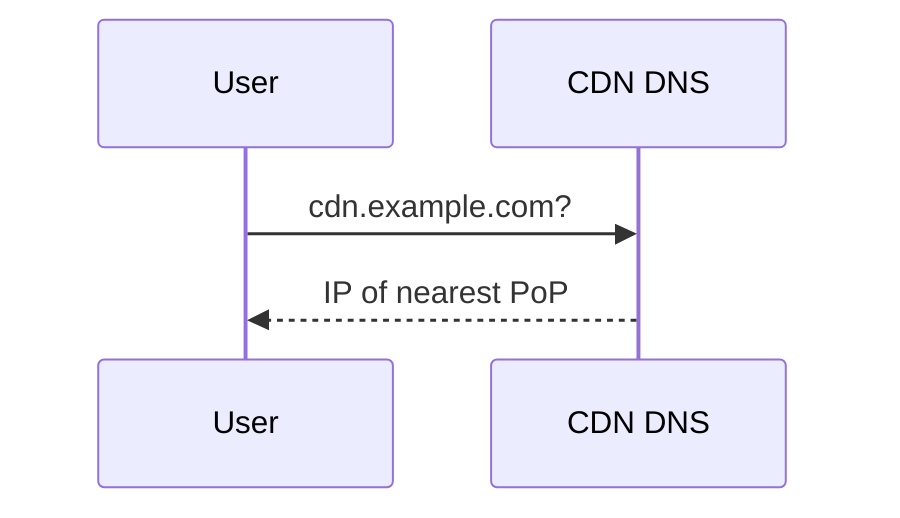
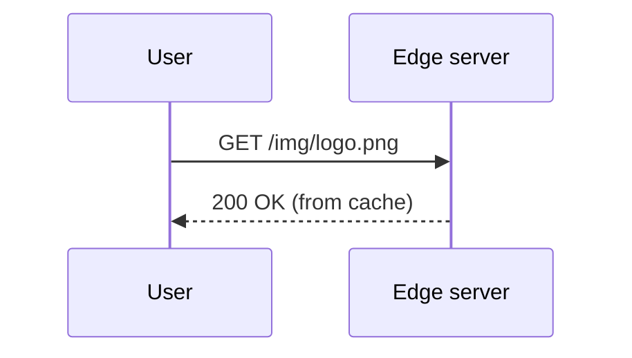
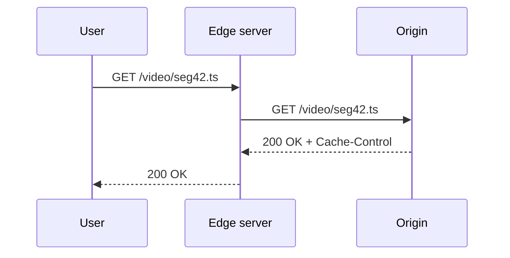

Before designing our own CDN, let's establish the vocabulary and core mechanics that every CDN shares.

## Key terms

- **Origin server** — the authoritative source of content, run by the content owner.
- **Edge server** (or proxy server) — a cache server near users that serves content on the origin's behalf.
- **Point of presence (PoP)** — a location, typically in a well-connected data center or Internet exchange, that hosts a cluster of edge servers.
- **Cache hit** — the requested content is present at the edge and can be served immediately.
- **Cache miss** — the content is absent or expired, so the edge must fetch it from a parent cache or the origin.
- **Time to live (TTL)** — how long content may be served from cache before it must be revalidated.

## How a request is served

<Slides title="Serving content through a CDN">
<Slide caption="1. The user's DNS lookup for cdn.example.com is answered with the address of a nearby PoP.">

</Slide>
<Slide caption="2. On a cache hit, the edge server returns the content immediately.">

</Slide>
<Slide caption="3. On a miss, the edge fetches from the origin, caches the response and returns it.">

</Slide>
</Slides>

## Controlling caching with HTTP

Origins tell CDNs how to cache using standard HTTP headers:

- `Cache-Control: max-age=86400` — cache for one day.
- `Cache-Control: no-store` — never cache (for example, personalized responses).
- `Cache-Control: s-maxage=...` — a TTL specifically for shared caches such as CDNs.
- `ETag` and `Last-Modified` — let edges **revalidate** stale content cheaply with conditional requests; the origin replies `304 Not Modified` if nothing changed.

A widespread pattern is to put a content hash in file names — `app.3f9a2c.js` — and cache them for a year. When the file changes, its name changes, so no invalidation is needed.

## Measuring CDN effectiveness

The key metric is the **cache hit ratio**: the fraction of requests served from cache. A high hit ratio means low latency and little origin traffic. It depends on content popularity, TTLs, cache capacity and how requests are distributed across servers. Popular content follows a long-tail distribution: a small set of objects receives most requests and caches extremely well, while the long tail of rarely requested content misses more often.

## Types of content

| Content | Cacheability |
| --- | --- |
| Static assets (JS, CSS, images) | Excellent; long TTLs with versioned names |
| Video-on-demand segments | Excellent; large and highly shared |
| Live video segments | Good; short-lived but many simultaneous viewers |
| Public API responses | Sometimes; short TTLs |
| Personalized pages | Poor; often not cached, but the CDN still accelerates connections |

<KeyTakeaways>
- CDNs consist of edge servers grouped into points of presence near users.
- DNS or anycast directs users to a nearby PoP; hits are served from cache, misses from the origin.
- HTTP headers such as Cache-Control and ETag control caching and revalidation.
- Content-hashed file names allow long TTLs without invalidation.
- The cache hit ratio is the primary measure of CDN effectiveness.
</KeyTakeaways>
