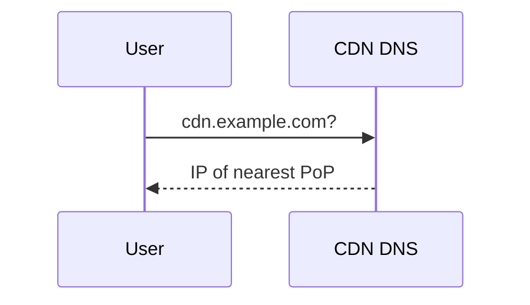
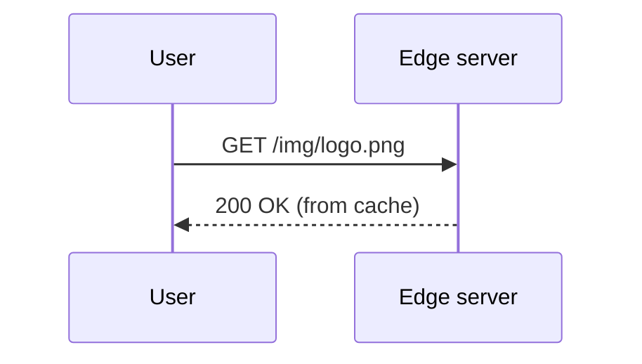
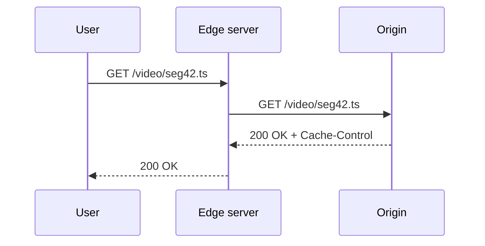
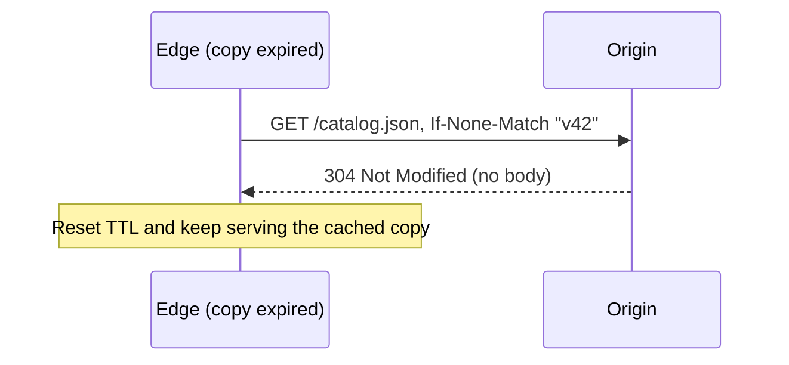

Before designing our own CDN, let's establish the vocabulary and core mechanics that every CDN shares.

## Key terms

- **Origin server** — the authoritative source of content, run by the content owner.
- **Edge server** (or proxy server) — a cache server near users that serves content on the origin's behalf.
- **Point of presence (PoP)** — a location, typically in a well-connected data center or Internet exchange, that hosts a cluster of edge servers.
- **Cache hit** — the requested content is present at the edge and can be served immediately.
- **Cache miss** — the content is absent or expired, so the edge must fetch it from a parent cache or the origin.
- **Time to live (TTL)** — how long content may be served from cache before it must be revalidated.
- **Cache key** — the identifier under which a response is stored, usually derived from the URL.

## How a request is served

<Slides title="Serving content through a CDN">
<Slide caption="1. The user's DNS lookup for cdn.example.com is answered with the address of a nearby PoP.">

</Slide>
<Slide caption="2. On a cache hit, the edge server returns the content immediately.">

</Slide>
<Slide caption="3. On a miss, the edge fetches from the origin, caches the response and returns it.">

</Slide>
</Slides>

## Controlling caching with HTTP

Origins tell CDNs how to cache using standard HTTP headers:

- `Cache-Control: max-age=86400` — cache for one day.
- `Cache-Control: no-store` — never cache (for example, personalized responses).
- `Cache-Control: private` — browsers may cache, shared caches such as CDNs may not.
- `Cache-Control: s-maxage=...` — a TTL specifically for shared caches such as CDNs.
- `Cache-Control: stale-while-revalidate=60` — after expiry, keep serving the stale copy for up to 60 seconds while fetching a fresh one in the background.
- `Cache-Control: stale-if-error=86400` — if the origin fails, keep serving the stale copy for up to a day.
- `ETag` and `Last-Modified` — let edges **revalidate** stale content cheaply with conditional requests; the origin replies `304 Not Modified` if nothing changed.

A widespread pattern is to put a content hash in file names — `app.3f9a2c.js` — and cache them for a year. When the file changes, its name changes, so no invalidation is needed.

## Cache keys and Vary

By default, the cache key is the URL. Two details often hurt hit ratios:

- **Query strings.** `/logo.png?utm_source=mail` and `/logo.png?utm_source=ad` are the same image but different keys. CDNs let you ignore or sort irrelevant parameters when building the key.
- **The Vary header.** `Vary: Accept-Encoding` tells caches to store separate copies for gzip, Brotli and uncompressed responses — reasonable. `Vary: User-Agent` creates a separate copy for every browser version string — thousands of variants of one file, and a collapsed hit ratio. Normalize such headers into a few buckets (for example, "mobile" or "desktop") before they reach the cache key.

## Measuring CDN effectiveness

The key metric is the **cache hit ratio**: the fraction of requests served from cache. A high hit ratio means low latency and little origin traffic. It depends on content popularity, TTLs, cache capacity and how requests are distributed across servers.

Two variants matter:

| Metric | Definition | Why it matters |
| --- | --- | --- |
| Request hit ratio | Hits ÷ requests | User-perceived latency |
| Byte hit ratio | Bytes served from cache ÷ bytes served | Origin bandwidth and cost |

They can differ a lot. A site might serve 98% of *requests* from cache (lots of small popular images) but only 80% of *bytes* (large, rarely watched videos miss more often). Improving the byte hit ratio from 80% to 90% halves origin egress.

Popular content follows a long-tail distribution: a small set of objects receives most requests and caches extremely well, while the long tail of rarely requested content misses more often.

## Types of content

| Content | Cacheability |
| --- | --- |
| Static assets (JS, CSS, images) | Excellent; long TTLs with versioned names |
| Video-on-demand segments | Excellent; large and highly shared |
| Live video segments | Good; short-lived but many simultaneous viewers |
| Software downloads and game patches | Excellent; enormous bursts at release time |
| Public API responses | Sometimes; short TTLs |
| Personalized pages | Poor; often not cached, but the CDN still accelerates connections |

<Ponder question="A news site sets Cache-Control: max-age=60 on its home page. During a breaking-news spike with 50,000 requests per second, roughly how many requests reach the origin per PoP?">
In the ideal case, about **one per minute per cache key per edge server** that holds it — each copy is fetched once, then served for 60 seconds. With request coalescing and a parent tier, the origin sees roughly one request per minute per region. Without coalescing, every request that arrives while the fresh copy is being fetched also misses, so a busy PoP could send hundreds of simultaneous requests at each expiry.
</Ponder>

<KeyTakeaways>
- CDNs consist of edge servers grouped into points of presence near users.
- DNS or anycast directs users to a nearby PoP; hits are served from cache, misses from the origin.
- HTTP headers such as Cache-Control, ETag, stale-while-revalidate and stale-if-error control caching, revalidation and resilience.
- Normalizing cache keys (query strings, Vary headers) prevents needless duplicate copies.
- Content-hashed file names allow long TTLs without invalidation.
- Request and byte hit ratios measure CDN effectiveness for latency and for cost.
</KeyTakeaways>
