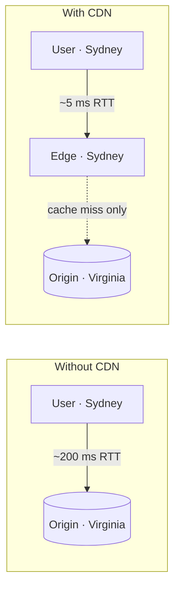

Imagine a video platform whose servers all live in one data center in Virginia. A viewer in Sydney requests a video: every byte crosses the Pacific, taking roughly 200 ms per round trip, competing with every other viewer for the same long-haul links, and loading the origin servers with millions of identical requests. The experience is slow, and the bandwidth bill is enormous.

A **content delivery network (CDN)** solves this by caching content on servers distributed around the world, close to users. The Sydney viewer fetches the video from a server in Sydney, and the origin sees only a tiny fraction of requests.

## Problems a CDN addresses

- **Latency.** Physical distance limits speed: light in fiber travels about 200 km per millisecond, and every request needs multiple round trips for TCP and TLS handshakes. Serving from nearby cuts these dramatically.
- **Bandwidth and cost.** Transferring popular content once to each region, then serving it locally, reduces expensive long-haul traffic and origin egress.
- **Origin load.** Absorbing repeated requests at the edge lets origin servers focus on dynamic work.
- **Availability.** If the origin is slow or briefly down, edge servers can keep serving cached content.
- **Traffic spikes and attacks.** A globally distributed CDN has enormous aggregate capacity to absorb flash crowds and distributed denial-of-service attacks.

## Requirements for our CDN

### Functional

- **Retrieve** content from origin servers when needed.
- **Deliver** content to users from the most suitable edge server.
- **Search** for content within the CDN hierarchy before going to the origin.
- **Update and invalidate** content when the origin changes it.
- **Delete** expired content automatically.

### Non-functional

- **Performance** — minimize latency for end users.
- **Availability** — keep serving during server, site or origin failures, and under sudden load.
- **Scalability** — handle growth in users, content and request rates by adding servers and sites.
- **Reliability and security** — avoid single points of failure and protect against attacks.

## What a CDN serves

CDNs started with static assets — images, scripts, stylesheets — and now serve video segments, software downloads and even dynamic API responses through techniques such as edge computing and connection optimization. Large media platforms often run their own CDNs, placing cache servers inside Internet service providers' networks.

<Callout type="interview">
Whenever a design serves large volumes of static or media content to geographically spread users — images, videos, downloads — add a CDN and say why: latency, egress cost and origin protection.
</Callout>

<KeyTakeaways>
- A CDN caches content on edge servers close to users.
- It reduces latency, bandwidth costs and origin load while improving availability.
- Globally distributed capacity helps absorb traffic spikes and attacks.
- Our CDN must retrieve, deliver, search, update and delete content with high performance, availability and scalability.
</KeyTakeaways>
