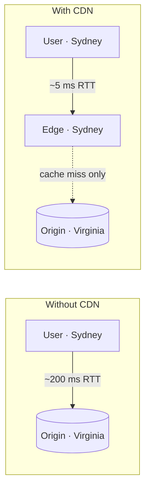

Imagine a video platform whose servers all live in one data center in Virginia. A viewer in Sydney requests a video: every byte crosses the Pacific, taking roughly 200 ms per round trip, competing with every other viewer for the same long-haul links, and loading the origin servers with millions of identical requests. The experience is slow, and the bandwidth bill is enormous.

A **content delivery network (CDN)** solves this by caching content on servers distributed around the world, close to users. The Sydney viewer fetches the video from a server in Sydney, and the origin sees only a tiny fraction of requests.

## Problems a CDN addresses

- **Latency.** Physical distance limits speed: light in fiber travels about 200 km per millisecond, and every request needs multiple round trips for TCP and TLS handshakes. Serving from nearby cuts these dramatically.
- **Bandwidth and cost.** Transferring popular content once to each region, then serving it locally, reduces expensive long-haul traffic and origin egress.
- **Origin load.** Absorbing repeated requests at the edge lets origin servers focus on dynamic work.
- **Availability.** If the origin is slow or briefly down, edge servers can keep serving cached content.
- **Traffic spikes and attacks.** A globally distributed CDN has enormous aggregate capacity to absorb flash crowds and distributed denial-of-service attacks.



## Why distance costs more than one round trip

Fetching a small image over a brand-new HTTPS connection takes several round trips before the first byte arrives:

| Step | Round trips |
| --- | --- |
| TCP handshake | 1 |
| TLS 1.3 handshake | 1 |
| HTTP request and first response bytes | 1 |
| **Total before the image starts arriving** | **3** |

At 200 ms per round trip, that is about **600 ms** from Sydney to Virginia. From a Sydney edge at 5 ms per round trip, it is about **15 ms**. For larger files, TCP's slow start adds further round trips as the sending rate ramps up, so the advantage grows. No amount of server optimization at the origin can beat the speed of light; only moving the content closer can.

## Why bandwidth matters

Consider a video service delivering 2 petabytes a day:

```text
2 PB / 86,400 s ≈ 23 GB/s ≈ 185 Gbps average, perhaps 500 Gbps at peak
```

Serving that from a single origin would need enormous network capacity in one place and would pay long-haul transit prices for every byte. With a 95% cache hit ratio at the edge, the origin serves only 5% — about 9 Gbps on average — and most bytes travel only a few kilometers to users, often within the users' own ISP.

## Requirements for our CDN

### Functional

- **Retrieve** content from origin servers when needed.
- **Deliver** content to users from the most suitable edge server.
- **Search** for content within the CDN hierarchy before going to the origin.
- **Update and invalidate** content when the origin changes it.
- **Delete** expired content automatically.

### Non-functional

- **Performance** — minimize latency for end users.
- **Availability** — keep serving during server, site or origin failures, and under sudden load.
- **Scalability** — handle growth in users, content and request rates by adding servers and sites.
- **Reliability and security** — avoid single points of failure and protect against attacks.

## What a CDN serves

CDNs started with static assets — images, scripts, stylesheets — and now serve video segments, software downloads and even dynamic API responses through techniques such as edge computing and connection optimization. Large media platforms often run their own CDNs, placing cache servers inside Internet service providers' networks.

## How a website starts using a CDN

Onboarding is usually a DNS change. The site owner points a hostname at the CDN with a CNAME record and tells the CDN where the origin is:

```text
static.example.com.   300  IN  CNAME  example.cdn-provider.net.
```

From then on, requests for `static.example.com` resolve to the CDN's edge servers, which fetch from the configured origin on a miss. Nothing changes in the application except the hostnames it uses for assets.

<Ponder question="A page loads 40 small images from the origin in another continent over a single HTTP/2 connection. Would a CDN still help, even though the images are multiplexed?">
Yes. The connection setup (about three round trips) and every request still pay the long-distance round-trip time, and TCP slow start limits throughput on high-latency paths. A nearby edge cuts each round trip from roughly 150–200 ms to a few milliseconds and serves cached images without contacting the origin at all. Multiplexing avoids opening 40 connections, but it cannot remove distance.
</Ponder>

<Callout type="interview">
Whenever a design serves large volumes of static or media content to geographically spread users — images, videos, downloads — add a CDN and say why: latency, egress cost and origin protection.
</Callout>

## Chapter roadmap

1. **Introduction** — vocabulary, request flow, HTTP caching controls and hit ratios.
2. **Design** — components, workflow and the cache hierarchy.
3. **Caching strategies** — push versus pull, eviction, admission and sharding within a PoP.
4. **Routing and consistency** — sending users to the best edge and keeping content fresh.
5. **Evaluation** — how the design meets its requirements, and build-versus-buy.

<KeyTakeaways>
- A CDN caches content on edge servers close to users.
- Connection setup costs several round trips, so distance multiplies latency; only proximity removes it.
- CDNs reduce latency, bandwidth costs and origin load while improving availability; a high hit ratio shrinks origin egress dramatically.
- Globally distributed capacity helps absorb traffic spikes and attacks.
- Sites adopt a CDN mostly through DNS: a CNAME to the CDN plus origin configuration.
- Our CDN must retrieve, deliver, search, update and delete content with high performance, availability and scalability.
</KeyTakeaways>
