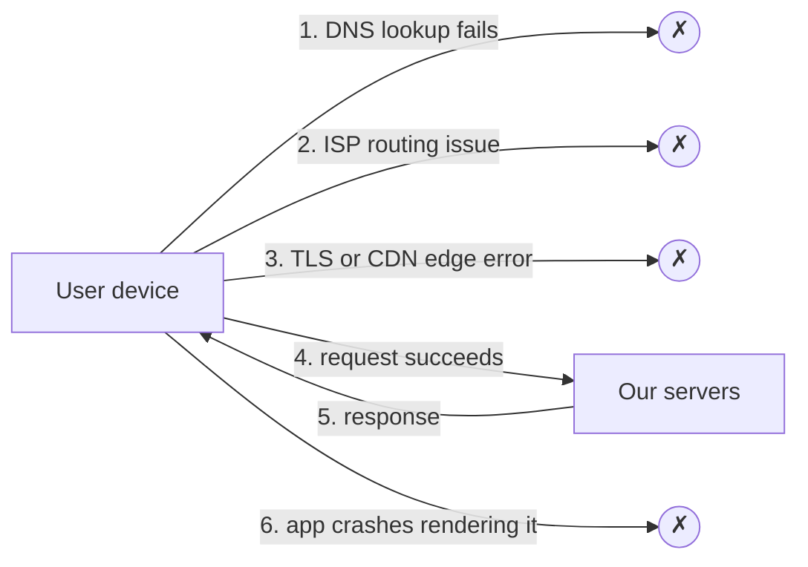

Server-side monitoring tells us what happens inside our infrastructure. But some of the most damaging failures happen **before requests reach us** or **after responses leave us**. From the server's perspective, everything looks fine — traffic is simply a bit lower — while thousands of users see errors.

## Failures invisible to servers

- **DNS failures** — a misconfigured record or a resolver outage means users cannot find our servers at all.
- **Network and routing problems** — an ISP's routing error or a regional Internet outage prevents users from reaching our data centers.
- **Edge failures** — a CDN PoP or certificate problem affects users in one region.
- **Client-side crashes and slowness** — JavaScript errors, mobile app crashes and slow rendering happen on the device.

In each case, server metrics show a **drop in traffic** at most, which is easy to misread as normal variation.

## Why this matters

Users do not care where the failure occurred. If they cannot use the product, it is down for them. A strong monitoring strategy must therefore measure the experience **from the user's side**.

## Approaches to client-side monitoring

### Synthetic monitoring

**Probes** running in many locations around the world periodically perform key actions — load the home page, log in, add to cart — and report success and timing. Synthetic checks catch outages even when there is no real traffic (for example, at night), and they detect regional problems quickly. Their limitation is coverage: they exercise only scripted paths from a limited set of locations and networks.

### Real user monitoring (RUM)

Code embedded in web pages and apps reports what **real users** experience: page load times, errors, crashes and failed requests. RUM covers every device, network and path users actually take. Its challenge is that when users cannot reach our servers at all, their reports cannot reach us either — unless we collect them through an independent path.

### Traffic anomaly detection

Comparing request rates against expected seasonal patterns per region, ISP or app version can reveal problems indirectly: a 30% drop in traffic from one country at 3 p.m. is suspicious even if no errors are recorded.

<Callout type="interview">
When a design has strict availability requirements, mention measuring availability from the client's perspective — synthetic probes from multiple regions plus real user monitoring — because server-side metrics alone can miss complete outages for some users.
</Callout>

<KeyTakeaways>
- Some failures — DNS, routing, edge, device-side crashes — are invisible or ambiguous to server-side monitoring.
- Users experience these as outages regardless of where the fault lies.
- Synthetic monitoring probes key journeys from many locations, even without real traffic.
- Real user monitoring captures actual experience across all devices and networks.
- Traffic anomaly detection can reveal problems indirectly through unexpected drops.
</KeyTakeaways>
