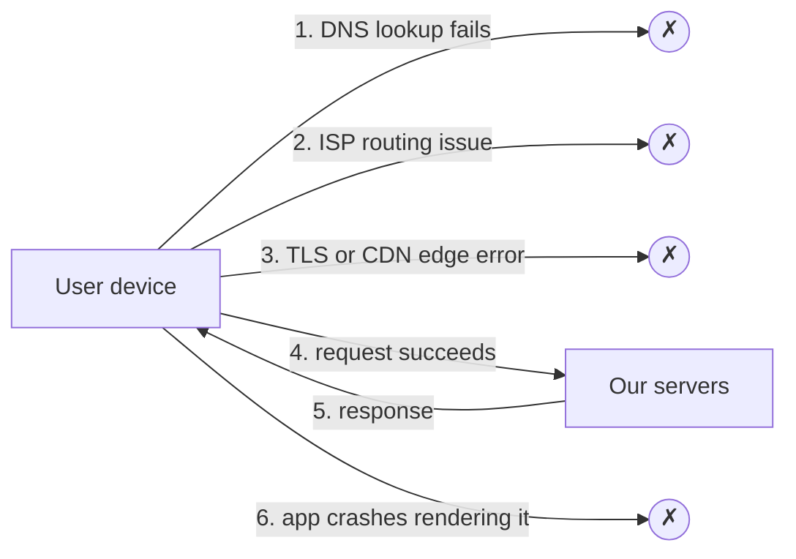

Server-side monitoring tells us what happens inside our infrastructure. But some of the most damaging failures happen **before requests reach us** or **after responses leave us**. From the server's perspective, everything looks fine — traffic is simply a bit lower — while thousands of users see errors.

## Failures invisible to servers

- **DNS failures** — a misconfigured record or a resolver outage means users cannot find our servers at all.
- **Network and routing problems** — an ISP's routing error or a regional Internet outage prevents users from reaching our data centers. Mistaken route announcements between networks have repeatedly made popular services unreachable for parts of the world while their servers were perfectly healthy.
- **Edge failures** — a CDN PoP or certificate problem affects users in one region. An expired or misissued certificate makes browsers refuse to connect, and the request never reaches application servers.
- **Client-side crashes and slowness** — JavaScript errors, mobile app crashes and slow rendering happen on the device. A new app release that crashes on launch on one phone model generates no server errors at all.

In each case, server metrics show a **drop in traffic** at most, which is easy to misread as normal variation.

## Why this matters

Users do not care where the failure occurred. If they cannot use the product, it is down for them. A strong monitoring strategy must therefore measure the experience **from the user's side**.

This changes how availability should be defined. **Server-side availability** counts successful responses among requests that arrived. **Client-perceived availability** counts successful interactions among interactions users attempted — including those that never reached us.

| Scenario | Server-side view | User's view |
| --- | --- | --- |
| DNS provider outage in one country | Traffic from that country drops; zero errors | Site completely down |
| Web page loads, but a JavaScript error breaks the "Pay" button | Pages served successfully | Cannot buy anything |
| CDN edge in one city serves a bad certificate | Nothing unusual | Browser security warning |
| New app version crashes on start on older phones | Fewer requests from that version | App unusable |

## What to measure on the client

- **Page and screen performance** — for the web, metrics such as time to first byte, how long until the largest content element is painted, how quickly the page responds to the first interaction, and how much the layout shifts while loading. For mobile apps, cold-start time and screen render time.
- **Request outcomes** — success, HTTP errors, timeouts, DNS and TLS failures, measured from the client's side of every API call.
- **Errors and crashes** — uncaught exceptions with stack traces, mobile crash reports, "application not responding" events.
- **Key journey completion** — did the user who started checkout finish it? A drop in completion rate often signals a client-side bug.

## Approaches to client-side monitoring

### Synthetic monitoring

**Probes** running in many locations around the world periodically perform key actions — load the home page, log in, add to cart — and report success and timing. Synthetic checks catch outages even when there is no real traffic (for example, at night), and they detect regional problems quickly. Their limitation is coverage: they exercise only scripted paths from a limited set of locations and networks, usually from data centers rather than home and mobile networks.

### Real user monitoring (RUM)

Code embedded in web pages and apps reports what **real users** experience: page load times, errors, crashes and failed requests. RUM covers every device, network and path users actually take. Its challenge is that when users cannot reach our servers at all, their reports cannot reach us either — unless we collect them through an independent path.

### Traffic anomaly detection

Comparing request rates against expected seasonal patterns per region, ISP or app version can reveal problems indirectly: a 30% drop in traffic from one country at 3 p.m. is suspicious even if no errors are recorded.

| Approach | Covers | Misses | Best at |
| --- | --- | --- | --- |
| Synthetic probes | Scripted journeys, 24/7, from chosen locations | Real devices, rare paths, most home networks | Fast, reliable outage detection |
| Real user monitoring | Every real device, network and path | Users who cannot reach the collector | Measuring true experience and regressions |
| Traffic anomalies | Everything that normally sends traffic | The cause of the drop | Catching failures nothing else reports |

<Callout type="interview">
When a design has strict availability requirements, mention measuring availability from the client's perspective — synthetic probes from multiple regions plus real user monitoring — because server-side metrics alone can miss complete outages for some users.
</Callout>

<Ponder question="Server dashboards show a 25% drop in traffic from one mobile carrier in Brazil, with no errors anywhere. Synthetic probes from São Paulo data centers pass. What might be happening, and how would you confirm it?">
Likely a problem between that carrier's users and your servers: a routing issue, a DNS resolver failure at the carrier, or a CDN edge that carrier is mapped to. Data-center probes use different networks, so they pass. Confirm with RUM reports sent through an independent collection path (which should show DNS or connection failures for users on that carrier), and with probes running on that carrier's mobile network, then work with the CDN or carrier to reroute.
</Ponder>

<KeyTakeaways>
- Some failures — DNS, routing, edge, certificates, device-side crashes — are invisible or ambiguous to server-side monitoring.
- Users experience these as outages regardless of where the fault lies, so measure client-perceived availability.
- Measure page and screen performance, request outcomes from the client side, crashes and journey completion.
- Synthetic monitoring probes key journeys from many locations, even without real traffic.
- Real user monitoring captures actual experience across all devices and networks.
- Traffic anomaly detection can reveal problems indirectly through unexpected drops.
</KeyTakeaways>
