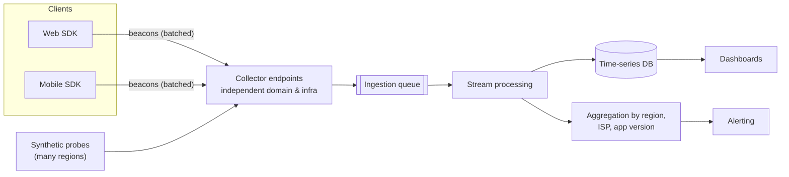

Let's design a system that measures user experience directly from clients, including failures that prevent clients from reaching our main infrastructure.

## Requirements

- Collect errors, crashes and performance timings from web and mobile clients.
- Detect regional and network-specific outages quickly, ideally within minutes.
- Keep working when our primary infrastructure or DNS is failing.
- Minimize impact on client performance, battery and data usage, and respect user privacy.

## Components

### Client SDK

A small library embedded in web pages and apps:

- Captures page load and interaction timings, failed requests, JavaScript errors and crashes.
- **Batches and samples** reports to limit overhead — for example, sending full data for 1% of sessions and error reports for all.
- Stores reports locally when offline and sends them later.
- Strips personal data and respects consent settings.

### Independent collection path

If reports travel through the same domain, DNS provider and data center as the product, an outage of those components silences the reports that would reveal it. The collector therefore uses:

- A **separate domain** hosted with a **different DNS provider**.
- **Separate infrastructure**, ideally multiple cloud regions or providers.
- **Anycast** endpoints so reports reach the nearest healthy collector.

When the SDK cannot reach the main service, it records the failure and sends it through this independent path — so an outage of the main service shows up as a surge of client-reported failures.

### Processing and alerting

Reports flow into a queue that absorbs bursts (for example, when an outage causes millions of error reports at once). Stream processors aggregate them by dimensions such as country, ISP, device type and app version, then compare against baselines. Alerts fire when, say, the error rate for users on one ISP in one country jumps from 0.1% to 20%.

## Synthetic probes

Probes deployed in many regions and networks run scripted journeys every minute. They report through the same collection path and provide a steady baseline even at low-traffic times. Checking both the **full journey** and **individual layers** (DNS resolution, TLS handshake, first byte) helps pinpoint which layer failed.

<Callout type="note">
Client-side data is noisy: user devices are slow, networks are flaky and clocks are wrong. Rely on aggregates and changes relative to baselines rather than individual reports.
</Callout>

## Evaluation

- **Detects invisible failures:** independent collection reveals DNS, routing and edge outages.
- **Scales:** batching, sampling and queue-based ingestion handle millions of devices.
- **Low overhead:** small SDK, batched beacons, sampling.
- **Privacy:** personal data is stripped on the device and aggregated before storage.

<KeyTakeaways>
- A client SDK captures timings, errors and crashes, batching and sampling to limit overhead.
- Reports must travel through an independent path — separate domain, DNS provider and infrastructure.
- A queue absorbs bursts; stream processing aggregates by region, ISP, device and version.
- Synthetic probes provide a baseline and help pinpoint the failing layer.
- Rely on aggregates and baselines because client data is noisy.
</KeyTakeaways>
