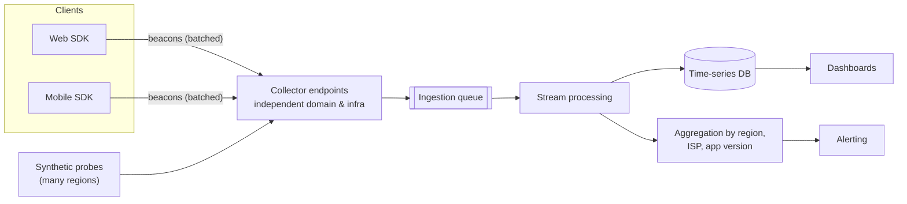
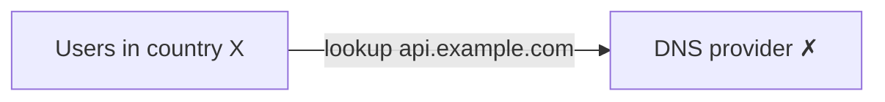
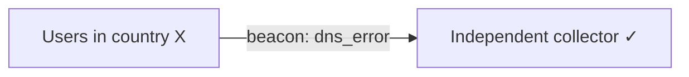
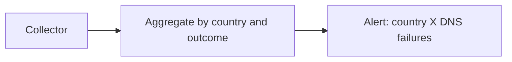

Let's design a system that measures user experience directly from clients, including failures that prevent clients from reaching our main infrastructure.

## Requirements

- Collect errors, crashes and performance timings from web and mobile clients.
- Detect regional and network-specific outages quickly, ideally within minutes.
- Keep working when our primary infrastructure or DNS is failing.
- Minimize impact on client performance, battery and data usage, and respect user privacy.

## Estimation

Assume 100 million daily active users, each generating 20 sessions' worth of events per day, with the SDK sending one batched beacon per session plus immediate reports for errors:

```text
Beacons:   100M × 20                  = 2 billion per day ≈ 23,000 per second
Peak (5×)                             ≈ 115,000 per second
Size:      ~2 KB compressed per beacon → ~46 MB/s ≈ 4 TB/day raw
During an outage, error reports can spike 10–50× within minutes
```

The spike requirement is the most important: the system is used most heavily exactly when something is broken.

## Components



### Client SDK

A small library embedded in web pages and apps:

- Captures page load and interaction timings, failed requests, JavaScript errors and crashes.
- **Batches and samples** reports to limit overhead — for example, sending full data for 1% of sessions and error reports for all.
- Stores reports locally when offline and sends them later.
- Strips personal data and respects consent settings.
- Sends beacons in the background at low priority, using browser APIs that deliver data even as a page is closing.

A beacon might look like this:

```json
{
  "sessionId": "b7f2...",
  "app": { "platform": "android", "version": "8.14.2", "device": "model-x" },
  "network": { "type": "cellular", "carrier": "carrier-a", "country": "BR" },
  "events": [
    { "type": "request", "endpoint": "/api/feed", "outcome": "dns_error", "ms": 5012, "at": 1790000123 },
    { "type": "screen", "name": "home", "renderMs": 840, "at": 1790000130 },
    { "type": "crash", "signature": "NullPointer at FeedAdapter.bind", "at": 1790000141 }
  ]
}
```

The endpoint is a **route template** (`/api/feed`), not a full URL with IDs, keeping cardinality manageable and personal data out.

### Independent collection path

If reports travel through the same domain, DNS provider and data center as the product, an outage of those components silences the reports that would reveal it. The collector therefore uses:

- A **separate domain** hosted with a **different DNS provider**.
- **Separate infrastructure**, ideally multiple cloud regions or providers.
- **Anycast** endpoints so reports reach the nearest healthy collector.

When the SDK cannot reach the main service, it records the failure and sends it through this independent path — so an outage of the main service shows up as a surge of client-reported failures.

<Slides title="Detecting a DNS outage from the client side">
<Slide caption="1. A DNS provider fails for users in one country. App requests to api.example.com fail at the lookup step.">



</Slide>
<Slide caption="2. The SDK records dns_error outcomes and sends them to collect.example-telemetry.net, which uses a different DNS provider and infrastructure.">



</Slide>
<Slide caption="3. Stream processing sees dns_error rise from 0.01% to 40% for country X within two minutes and pages the on-call engineer.">



</Slide>
</Slides>

### Processing and alerting

Reports flow into a queue that absorbs bursts (for example, when an outage causes millions of error reports at once). Stream processors aggregate them by dimensions such as country, ISP, device type and app version, then compare against baselines. Alerts fire when, say, the error rate for users on one ISP in one country jumps from 0.1% to 20%.

Because every combination of dimensions multiplies the number of series, aggregation is done in two stages: stream processors keep counts for a fixed set of useful dimension combinations (country, country × ISP, app version, app version × device), and raw sampled events are stored separately for ad-hoc investigation.

### Crash reporting

Mobile and web crash reports arrive as raw stack traces with memory addresses or minified names. A **symbolication** step uses the build's debug symbols or source maps (uploaded at release time) to turn them into readable function names and line numbers. Crashes are then grouped by signature, so the dashboard shows "crash X affects 3% of sessions on version 8.14.2" rather than a million separate reports.

## Synthetic probes

Probes deployed in many regions and networks run scripted journeys every minute. They report through the same collection path and provide a steady baseline even at low-traffic times. Checking both the **full journey** and **individual layers** (DNS resolution, TLS handshake, first byte) helps pinpoint which layer failed.

<Callout type="note">
Client-side data is noisy: user devices are slow, networks are flaky and clocks are wrong. Rely on aggregates and changes relative to baselines rather than individual reports, and use server-side receive time rather than device time for ordering.
</Callout>

## Evaluation

| Requirement | How the design meets it |
| --- | --- |
| Detects invisible failures | Independent collection path reveals DNS, routing, certificate and edge outages |
| Fast detection | Streaming aggregation against baselines, alerts within minutes |
| Scales to spikes | Anycast collectors, queue-based ingestion, batching and sampling |
| Low client overhead | Small SDK, batched low-priority beacons, sampling of performance data |
| Privacy | Personal data stripped on the device, route templates instead of URLs, aggregation before storage |

<Ponder question="Why should the client SDK sample performance data but not error reports?">
Performance data is plentiful and useful in aggregate: 1% of sessions still gives millions of samples a day, enough for accurate percentiles per country and device, at a hundredth of the cost. Errors are rarer and each one may reveal a new failure mode, a crash signature or a regional outage; sampling them could hide small but important problems, and their volume is normally low (except during outages, which is exactly when you want them all).
</Ponder>

<KeyTakeaways>
- A client SDK captures timings, request outcomes, errors and crashes, batching and sampling to limit overhead.
- Reports must travel through an independent path — separate domain, DNS provider and infrastructure — so outages of the main service are still reported.
- A queue absorbs bursts; stream processing aggregates by a fixed set of dimensions such as region, ISP, device and version.
- Crash reports are symbolicated and grouped by signature.
- Synthetic probes provide a baseline and help pinpoint the failing layer.
- Rely on aggregates and baselines because client data is noisy.
</KeyTakeaways>
