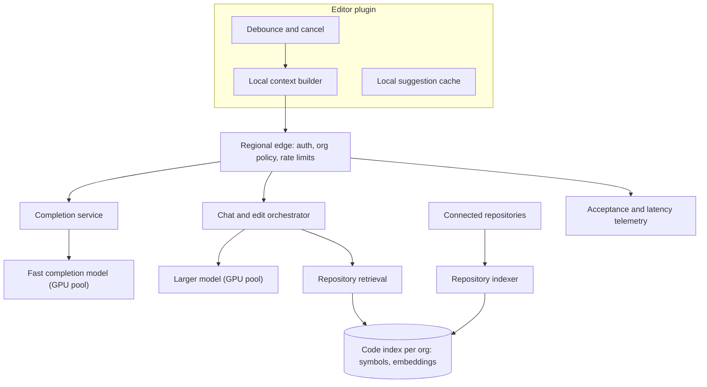
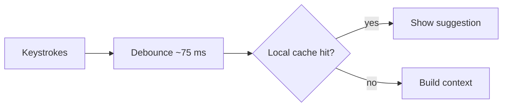
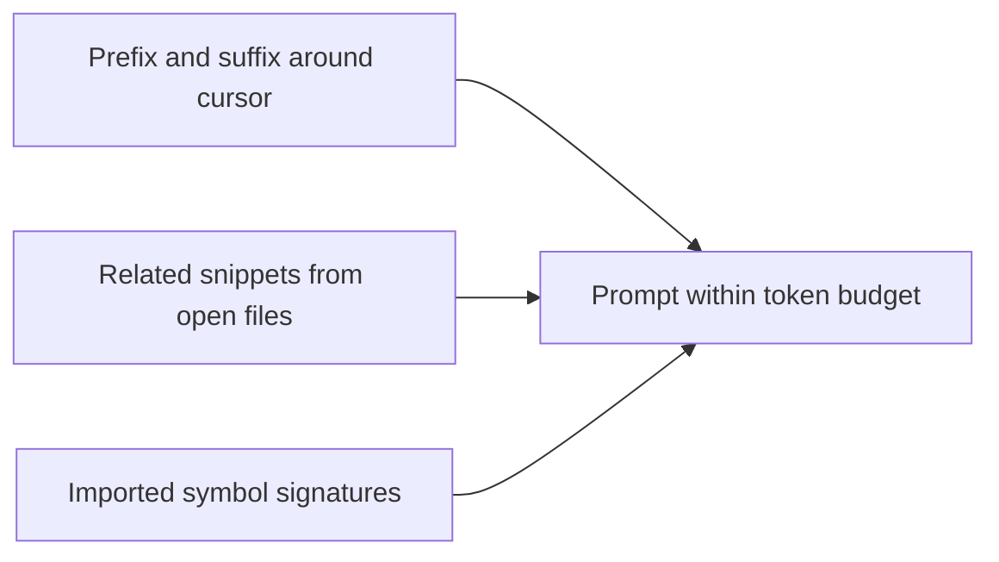
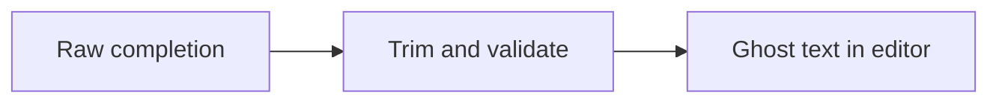

This lesson designs the code assistant: the editor plugin, context gathering, the low-latency completion path, the chat and edit path with repository retrieval, and the privacy controls around them.

## Architecture

## The completion path

Latency is everything, so work is pushed to the client and every step is minimized.

<Slides title="From keystroke to suggestion">
<Slide caption="1. The plugin waits for a brief pause in typing, cancels any in-flight request that is now stale, and checks a local cache.">

</Slide>
<Slide caption="2. The plugin builds a prompt locally: code before and after the cursor, plus snippets from open files and recently edited files that look related.">

</Slide>
<Slide caption="3. The request goes to the nearest region over a persistent connection. A small, fast model generates a short completion using fill-in-the-middle.">

</Slide>
<Slide caption="4. The plugin post-processes the result, trimming it to a sensible boundary and checking brackets, then shows it as ghost text.">

</Slide>
</Slides>

Key techniques:

- **Fill-in-the-middle prompting** gives the model both the code before and after the cursor, so it completes code that fits between them.
- **Local context selection** in the plugin avoids sending whole files. It ranks snippets from open and recently edited files by similarity to the code near the cursor, and includes signatures of imported symbols, all within a strict token budget.
- **Cancellation**: when the developer keeps typing, the plugin cancels the outdated request, and the server stops generation to free GPU capacity.
- **Persistent connections** to the nearest region (HTTP/2 or WebSocket) avoid connection setup on each request.
- **Small, specialized models** on dedicated GPU pools with small batch sizes favor latency over throughput. Prompts that share a file prefix can reuse cached attention state.

## The chat and edit path

Chat questions like "where is the retry logic for payments?" need knowledge beyond open files. The orchestrator uses **repository retrieval**:

- The **indexer** watches connected repositories and, on each change, parses files into structural chunks (functions, classes) using language parsers, extracts symbols and references, and embeds the chunks. Indexes are per organization and updated incrementally per commit.
- **Retrieval** combines embedding search with symbol lookups ("find the definition of `PaymentRetryPolicy`") and keyword search, then assembles the most relevant chunks into a larger prompt.
- The larger model produces an answer or a proposed diff. Edits are always shown to the developer for review before being applied.

## Privacy and security controls

- Code snippets are sent over encrypted connections and processed in memory; prompts are not retained or are kept only briefly for abuse monitoring, according to the organization's settings.
- Indexes and caches are partitioned by organization, with encryption keys per tenant.
- Organization policies can exclude files matching patterns, such as secrets or configuration, from ever being sent, enforced in the plugin before anything leaves the machine.
- Suggestions can be filtered to avoid reproducing long verbatim passages of public code with incompatible licenses.

## Reliability and cost

If the completion service is slow or unavailable, the plugin simply shows nothing; the editor never blocks. Rate limits protect against runaway clients. Telemetry on acceptance rates and latency per model version drives canary rollouts of new models, which must beat the current version on both quality and speed before replacing it.

## Latency budget for a completion

| Step | Budget |
| --- | --- |
| Debounce after the last keystroke | 50–75 ms |
| Build context locally in the plugin | 10–20 ms |
| Network to nearest region (persistent connection) | 20–50 ms |
| Queue and prefill of ~1,500 tokens (with prefix reuse) | 40–80 ms |
| Generate ~30 tokens | 30–60 ms |
| Post-process and render ghost text | under 10 ms |
| **Total after the pause** | **~150–300 ms** |

## Evaluating the design

| Requirement | How the design meets it |
| --- | --- |
| Completion latency | Debounce and cancel, local context, nearby regions, small models, prefix caching |
| Relevance | Fill-in-the-middle, ranked snippets from related files, repository retrieval for chat |
| Privacy | Client-side exclusions, minimal retention, per-organization indexes and keys |
| Availability | Silent degradation; editor never blocks |
| Cost | Small models for completions, cancellation of stale requests, local caching |

<Ponder question="Roughly how many completion requests are cancelled before they finish, and why does handling cancellation on the server matter so much?">
Many — developers often keep typing after a pause, so a large fraction of requests become stale before their result is shown. If the server kept generating for cancelled requests, a substantial share of GPU capacity would be spent on output nobody sees. Propagating cancellation to the inference server frees batch slots immediately, which directly lowers the fleet size and cost needed for the same number of useful suggestions.
</Ponder>

<KeyTakeaways>
- Completions are optimized end to end: debouncing, cancellation, local caching, local context building and nearby regions.
- Fill-in-the-middle prompts with carefully budgeted snippets from open files make suggestions relevant.
- Small, dedicated models on latency-optimized GPU pools serve completions; larger models serve chat and edits.
- Chat uses an incremental, per-organization code index with structural chunks, symbols and embeddings.
- Privacy controls include minimal retention, per-tenant isolation and client-side exclusion of sensitive files; failures degrade silently.
- A completion fits in roughly 150–300 ms after the typing pause when every step is minimized.
</KeyTakeaways>
