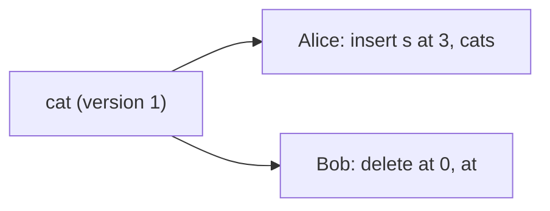
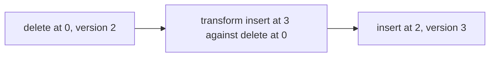
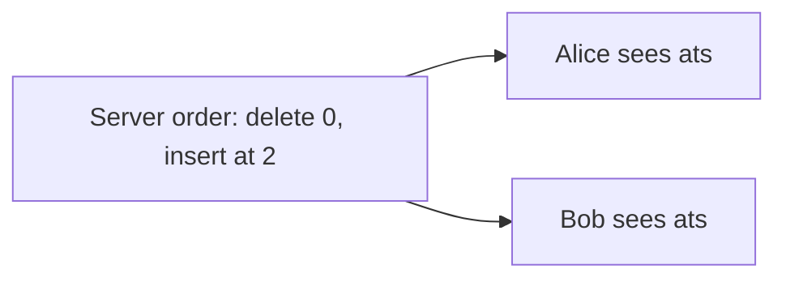
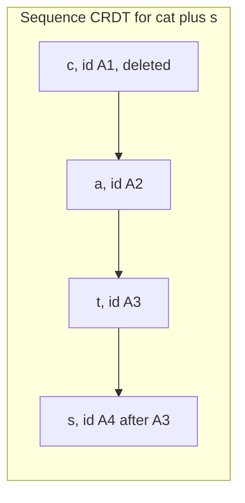

This lesson explains the two main techniques for merging concurrent edits, **operational transformation** and **conflict-free replicated data types**, and compares them.

## Operational transformation (OT)

OT represents edits as operations with positions, such as `insert(pos, char)` and `delete(pos)`. When an operation arrives that was created concurrently with operations already applied, it is **transformed** so that it has the intended effect on the current document.

Take the document "cat". Alice inserts "s" at position 3 to get "cats". Concurrently, Bob deletes position 0 to get "at".

- On Bob's side, Alice's `insert(3, "s")` arrives. Bob's own delete at position 0 happened before it in his view, and it shifted everything left by one. The transform adjusts Alice's operation to `insert(2, "s")`, giving "ats".
- On Alice's side, Bob's `delete(0)` arrives. Alice's insert at position 3 is after position 0, so Bob's delete is unaffected and stays `delete(0)`, giving "ats".

Both converge on "ats", which preserves both intentions: Bob removed the "c" and Alice pluralized the word.

<Slides title="Transforming concurrent operations">
<Slide caption="1. Both users start from the same version and make concurrent edits.">

</Slide>
<Slide caption="2. The server orders Bob's delete first. Alice's insert is transformed: its position shifts from 3 to 2.">

</Slide>
<Slide caption="3. Every client applies the same ordered, transformed operations and converges on ats.">

</Slide>
</Slides>

Transformation functions must be defined for every pair of operation types, which is manageable for plain text but grows complex for rich text, tables and nested structures. Getting them right for every edge case is notoriously difficult.

In practice, OT systems use a **central server** to impose a single order on operations, as in the design lesson. With a server, each client only needs to transform against operations it has not yet seen, and many of the hardest theoretical cases disappear. This is why OT has powered major web-based editors for years.

## Conflict-free replicated data types (CRDTs)

CRDTs take a different approach: design the data structure so that concurrent operations **commute**, meaning applying them in any order gives the same result. No transformation is needed.

For text, a sequence CRDT gives every character a **unique, immutable identifier**, and positions are expressed relative to identifiers rather than indexes. An insertion says "insert 's' after the character with ID (Alice, 7)." A deletion marks a character's ID as deleted (a **tombstone**) instead of removing it. Because identifiers never change, operations can be applied in any order, and ties between concurrent insertions at the same spot are broken deterministically, for example by replica ID.

**Advantages:** no central server is required; peers can sync directly, and offline edits merge automatically when devices reconnect. This fits local-first and peer-to-peer applications.

**Costs:** metadata per character and tombstones increase memory and storage, sometimes dramatically. Modern implementations use compact encodings, run-length compression of consecutive characters from the same author, and garbage collection of tombstones once all replicas have seen them.

## Comparison

| Aspect | OT | CRDT |
| --- | --- | --- |
| Needs central ordering | Usually yes, in practice | No |
| Offline and peer-to-peer | Harder | Natural |
| Metadata overhead | Low | Higher, per element and tombstones |
| Correctness burden | Transformation functions for every operation pair | Designing commutative data types |
| Maturity for rich text | Long track record in centralized editors | Rapidly maturing libraries |

Both are valid choices. For a centrally hosted editor with a server per document, OT is simple and efficient. For offline-first or peer-to-peer collaboration, CRDTs are the natural fit. Many modern systems use CRDTs even with a server, treating the server as just another replica that also persists and relays updates.

<Callout type="interview">
You do not need to derive transformation functions in an interview. Explain the problem, show one transformation example, and compare OT and CRDTs in terms of central ordering, offline support and overhead.
</Callout>

<Ponder question="Alice and Bob both type a character at exactly the same position at the same moment. How does a sequence CRDT decide which comes first, and why does it not matter which rule is used?">
Both insertions reference the same predecessor character, so the CRDT breaks the tie deterministically — for example, by comparing the inserting replicas' IDs or the operations' logical timestamps. Any rule works as long as every replica applies the same one, because convergence only requires that all copies end up identical. Users see the two characters side by side in some order, which is acceptable for truly simultaneous typing.
</Ponder>

<KeyTakeaways>
- OT transforms position-based operations against concurrent ones so every replica converges.
- OT is usually paired with a central server that orders operations, which simplifies correctness.
- CRDTs give each element a unique identifier so operations commute and need no transformation.
- CRDTs suit offline and peer-to-peer editing but carry metadata and tombstone overhead.
- OT fits centralized editors; CRDTs fit local-first designs, and both are used in production.
</KeyTakeaways>
