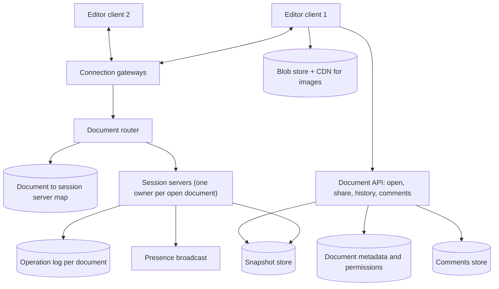
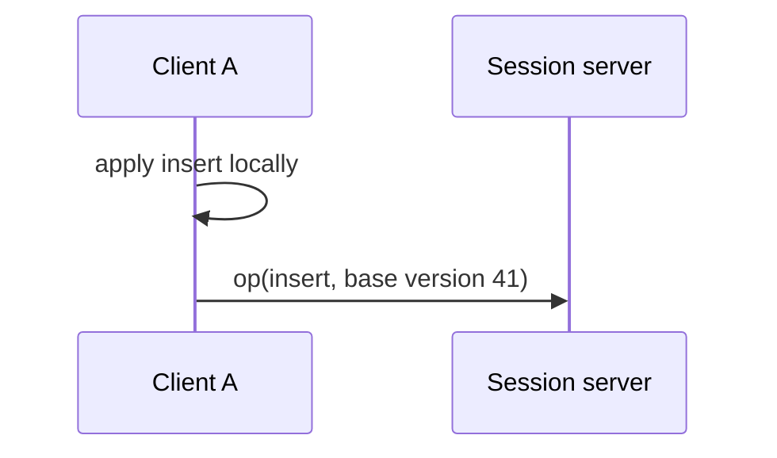
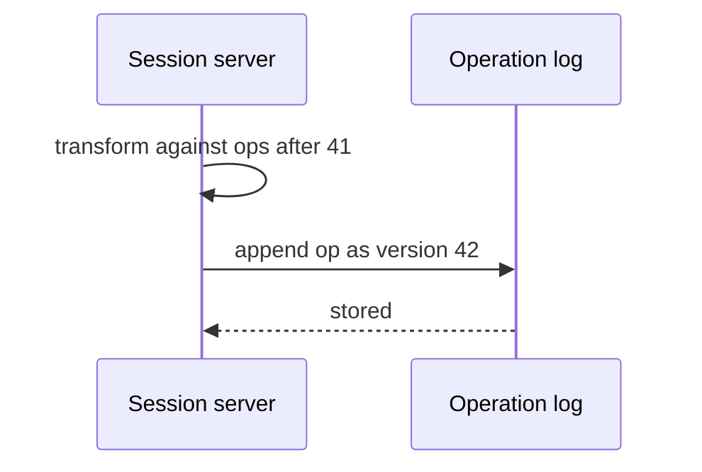
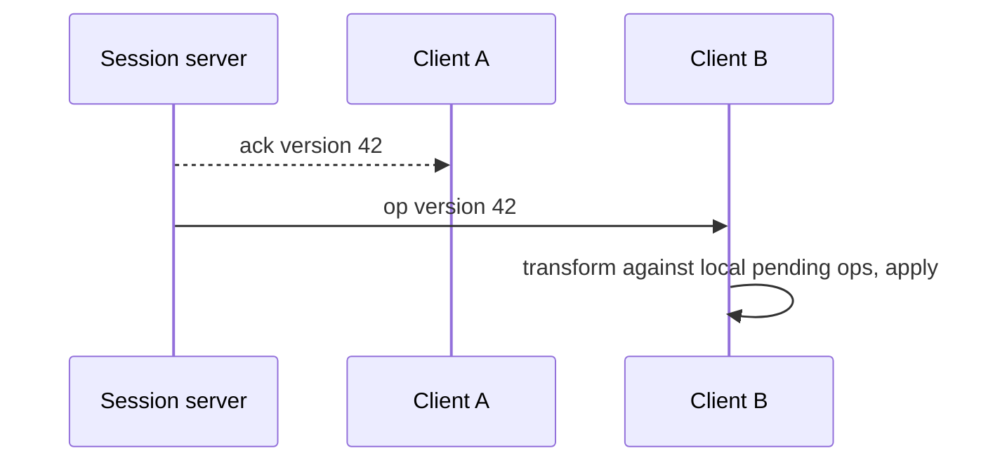

This lesson designs the architecture of the collaborative editor: how clients connect to a document session, how operations flow and are stored, and how presence, comments and history fit in.

## Key idea: one active session server per document

Because each document has a modest rate of operations, we route all collaborators of a document to **one session server** that owns the document while it is open. That server orders every incoming operation, applies the concurrency algorithm, persists the result and broadcasts it. A single owner gives us a total order of operations per document without distributed consensus on every keystroke.

## Architecture

- **Connection gateways** keep WebSocket connections open for each editor tab.
- **Document router** finds, or assigns, the session server that owns a document, recorded in a directory with a lease so only one server owns it at a time.
- **Session servers** hold the live document state in memory, order and transform operations, append them to the operation log and broadcast them.
- **Operation log** is an append-only, durable log per document, the source of truth for recent changes.
- **Snapshot store** keeps periodic full snapshots of each document, so loading does not require replaying the entire history.
- **Document API** handles non-real-time actions: listing, sharing, permissions, comments and version history.

## Opening a document

1. The client calls the document API, which checks permissions and returns the latest snapshot plus its version number.
2. The client renders the snapshot immediately, then opens a real-time connection for that document, sending the version it has.
3. The router directs the connection to the owning session server, loading the document there if nobody owns it yet.
4. The session server sends any operations after the client's version, so the client catches up.

## Editing

<Slides title="The life of an edit">
<Slide caption="1. The user types. The client applies the operation locally at once and sends it with the document version it was based on.">

</Slide>
<Slide caption="2. The session server transforms the operation against any operations accepted since version 41, assigns version 42 and appends it to the durable log.">

</Slide>
<Slide caption="3. The server acknowledges the sender and broadcasts the operation to other clients, which transform it against their own pending edits and apply it.">

</Slide>
</Slides>

Clients keep a queue of **pending** operations sent but not yet acknowledged, and typically send one batch at a time, which simplifies transformation. Keystrokes typed while waiting are combined into the next batch.

## Snapshots and history

Replaying millions of operations to open a long-lived document would be slow. The session server writes a **snapshot** every few hundred operations or few minutes. Opening loads the latest snapshot and replays only the operations after it.

**Version history** is built from snapshots and operations: named versions are snapshots marked by users, and the history view groups operations by author and time. Old operations can be compacted into coarser snapshots to save space.

## Presence and comments

Cursor positions and selections are **ephemeral**: they are broadcast through the session server but not persisted. They are throttled, for example sent at most every 100 ms, because they change constantly.

Comments are stored separately through the document API and are **anchored** to ranges in the text. As text is inserted or deleted, the anchors are transformed like any other position, so a comment stays attached to the words it refers to.

## Session server failure

If a session server crashes, clients detect the dropped connection and reconnect. The router's lease on the document expires, and another server takes ownership, loads the latest snapshot and replays the operation log. Operations the log had acknowledged are safe; unacknowledged client operations are still pending on the clients and are resent.

<KeyTakeaways>
- One session server owns each open document, giving a total order of operations without per-keystroke consensus.
- Clients apply edits locally, send them with their base version and keep a pending queue until acknowledged.
- The server transforms, versions and durably logs each operation before acknowledging and broadcasting it.
- Periodic snapshots make opening fast and form the basis of version history.
- Presence is ephemeral and throttled; comments are anchored to ranges that move with edits.
</KeyTakeaways>
