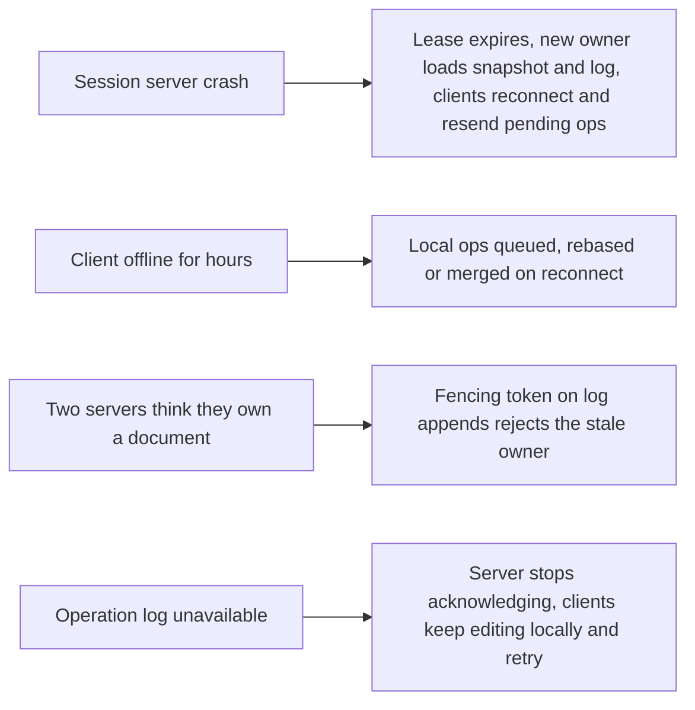

This lesson evaluates the collaborative editor against its requirements and discusses failure modes, scaling limits and trade-offs.

## Requirements check

| Requirement | How the design meets it |
| --- | --- |
| Instant local edits | Operations are applied locally before being sent. |
| Low remote latency | Persistent connections to a single session server per document; operations are broadcast immediately after being logged. |
| Convergence | The session server orders operations and transformation (or CRDT merge) guarantees identical results on every client. |
| No lost edits | Clients keep pending operations until acknowledged; the server acknowledges only after appending to a durable log. |
| Fast opening | Latest snapshot plus a short tail of operations. |
| Offline editing | Clients queue operations offline and rebase or merge them on reconnect. |
| Scalability | Documents are distributed across session servers; idle documents consume no session resources, only storage. |

## Failure scenarios

The trickiest failure is **split ownership**: after a network partition, an old owner might still believe it holds the document while a new owner has taken over. If both accept edits, their orders diverge. The fix is a **fencing token**: each ownership lease comes with an increasing number, and the operation log rejects appends carrying an older token. The stale owner discovers it has lost ownership and disconnects its clients, which reconnect to the new owner.

## Long offline sessions

A user who edits offline for hours may return with hundreds of operations based on an old version, while others have made thousands of changes. With OT, the client's operations must be transformed against everything that happened in between, which is expensive but bounded. With CRDTs, the merge is automatic. Either way, the result may be semantically surprising, such as two people rewriting the same paragraph differently, so editors highlight large merged changes and rely on version history for recovery.

## Scaling limits

**Many editors on one document.** A document with hundreds of simultaneous editors, such as a shared agenda during an all-hands meeting, concentrates load on one session server. Throttling cursor updates, batching operations and limiting the number of active editors (with others joining as viewers) keep it manageable.

**Very large documents.** Huge documents make snapshots slow and in-memory state large. Splitting a document into independently versioned sections, or lazy-loading parts, helps.

**Hot documents across regions.** Collaborators in different continents all connect to one owner, so distant users see slightly higher latency. Their own edits are still instant locally; only remote edits arrive a bit later. Choosing the owner's region based on where most editors are reduces the impact.

## Trade-offs

- **Central owner versus peer-to-peer:** a single owner simplifies ordering and persistence but adds a dependency and cross-region latency. Peer-to-peer CRDTs remove it at the cost of metadata and more complex access control.
- **Log granularity:** storing every keystroke gives fine-grained history but costs storage; batching and compaction trade history detail for efficiency.
- **Presence fidelity:** frequent cursor updates look smooth but consume bandwidth; throttling saves resources at the cost of slightly jumpy cursors.

<KeyTakeaways>
- The design meets latency, convergence and durability requirements with local application, a single owner per document and a durable log.
- Fencing tokens prevent a stale owner from accepting edits after ownership moves.
- Long offline sessions are merged by transformation or CRDT merging, with version history as a safety net.
- Scaling limits include very busy documents, very large documents and globally distributed editors.
- Key trade-offs are central ownership versus peer-to-peer, log granularity and presence fidelity.
</KeyTakeaways>
