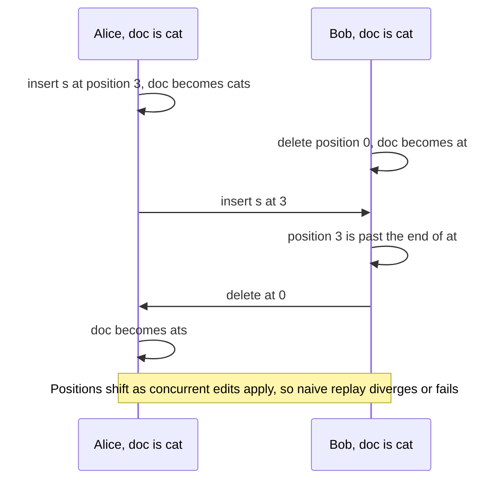

A collaborative editor lets several people edit the same document at the same time and see each other's changes, cursors and comments within a fraction of a second. It feels simple, as if everyone were typing into one shared text box, but it hides one of the most subtle problems in distributed systems: **keeping replicas of a document consistent when everyone edits concurrently**.

## The core problem

Each user edits a local copy of the document, because waiting for a server round trip on every keystroke would make typing unbearable. Edits are then sent to others. When two users edit the same region at the same time, their edits were made against different versions of the document, and naively applying them can produce different results on different screens.

In the example, Bob receives an insertion at position 3, but his document is now only two characters long. Worse, in other cases both sides may apply the edits without errors but end up with different text, and neither realizes it. The editor must guarantee **convergence**: once everyone has received all edits, every copy is identical, and each user's **intention** is preserved.

Two families of algorithms solve this:

- **Operational transformation (OT)** transforms incoming operations against concurrent ones so they apply correctly.
- **Conflict-free replicated data types (CRDTs)** give every character a unique, ordered identity so that operations commute naturally.

The concurrency lesson compares them in depth.

## Beyond text

Real editors also handle:

- **Rich text and structure:** formatting, headings, tables, images and embedded objects.
- **Presence:** each collaborator's cursor and selection, shown live.
- **Comments and suggestions** anchored to text ranges that move as the text changes.
- **Version history:** browsing and restoring earlier versions.
- **Offline editing:** editing on a plane and merging when back online.
- **Permissions:** owners, editors, commenters and viewers.

## Chapter plan

1. **Requirements:** features, scale and latency goals.
2. **Design:** the architecture of document sessions, storage and real-time sync.
3. **Concurrency:** OT versus CRDTs, with examples.
4. **Evaluation:** how the design holds up and where its trade-offs lie.

<Callout type="interview">
In a collaborative editing interview, show that you understand why naive "last write wins" or locking does not work for keystroke-level collaboration, then explain one of OT or CRDTs clearly.
</Callout>

## Why not just lock or use last-write-wins?

| Approach | What happens | Why it fails for live editing |
| --- | --- | --- |
| Lock the whole document | One person edits at a time | Collaboration disappears; others wait |
| Lock per paragraph | Users edit different paragraphs freely | Two people often edit the same paragraph; locks feel clunky and must be released reliably |
| Last write wins on the whole document | Each save overwrites the previous | Concurrent edits are silently lost |
| Last write wins per character | Positions shift as others type | Edits land in the wrong place or vanish |

Keystroke-level collaboration requires merging concurrent edits so that all of them survive in sensible positions — the job of OT and CRDTs.

<Ponder question="Why must each client apply its own edits locally before the server confirms them?">
Typing must feel instant. A round trip to the server takes tens to hundreds of milliseconds, and waiting for it on every keystroke would make the editor feel broken, especially on mobile networks. Applying edits optimistically means the local document can temporarily differ from others' — which is exactly why a merging algorithm that guarantees convergence is needed.
</Ponder>

<KeyTakeaways>
- Collaborative editors apply edits locally first, then share them, so concurrent edits are the norm.
- Naively replaying position-based edits can fail or make copies diverge silently.
- Editors must guarantee convergence of all copies while preserving each user's intention.
- Operational transformation and CRDTs are the two main solutions.
- Rich text, presence, comments, history, offline editing and permissions add further complexity.
- Locking and last-write-wins either block collaboration or lose edits, so concurrent edits must be merged.
</KeyTakeaways>
