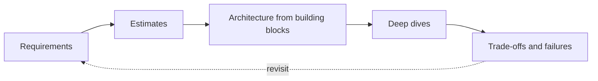

You have reached the end of the main course. Along the way you studied the foundations of distributed systems, built a toolkit of more than a dozen building blocks, applied them to over twenty design problems, explored how AI changes system design and learned from real outages. This lesson steps back to consolidate what matters most.

## The big ideas

**1. Requirements drive everything.** Every design in this course started by clarifying what the system must do and how well. The same product, a messaging app for example, has a completely different design when it needs end-to-end encryption, or huge broadcast channels, or strict ordering. When in doubt, go back to the requirements.

**2. Numbers turn opinions into decisions.** Back-of-the-envelope estimates told us when data fits in memory (typeahead, proximity), when a CDN is mandatory (video, photos), when the hot path is compute rather than storage (LLM chat) and when a single server per entity is enough (collaborative editing). Estimates do not need to be precise; they need to be in the right order of magnitude.

**3. Separate paths with different characteristics.** Reads and writes, uploads and views, online serving and offline pipelines, control planes and data planes: again and again, the key move was recognizing that two flows behave differently and giving each its own infrastructure.

**4. Every design is a set of trade-offs.** Consistency versus availability, latency versus freshness, storage versus bandwidth, simplicity versus flexibility. There is rarely a single right answer, but there is always a reasoned one. Being able to say why a trade-off fits this product is the heart of system design.

**5. Design for failure.** Machines crash, networks partition, dependencies slow down and humans make mistakes. Idempotency, retries with backoff, replication, graceful degradation, cells and staged rollouts appear in almost every chapter because failure is normal at scale.

## The SCALED habit

The SCALED framework (Scope, Capacity, API and data model, Layout, Evolve, Defend) is not a script to recite. It is a habit of thinking that makes you systematic under pressure. Over time it becomes automatic: you will find yourself asking about scale and consistency needs before drawing anything, whether in an interview or in a design review at work.

## From interviews to real systems

Interview designs are simplified by necessity. Real systems also involve:

- **Evolution over time:** designs start simple and change as products grow, as we saw with the Q&A platform.
- **Organizations:** team boundaries shape service boundaries, and operational ownership matters as much as architecture.
- **Cost:** cloud bills, hardware and people's time constrain every decision.
- **Migration:** moving from one design to another without downtime is often harder than either design.
- **Operations:** monitoring, on-call, incident response and postmortems keep systems healthy.

Keep learning from real-world engineering blogs and postmortems, and look for the building blocks and trade-offs you now recognize.

## What to do next

1. Revisit the design problems without looking at the lessons, and practice them aloud under time pressure.
2. Take the final assessment in the appendix to find gaps.
3. Use the primer lessons as a quick reference before interviews.
4. Pick a system you use daily and sketch how you think it works, then compare with its public engineering write-ups.

## Patterns you will reuse everywhere

| Pattern | Where you saw it |
| --- | --- |
| Precompute for reads | News feeds, typeahead tries, year-in-review summaries |
| Push versus pull fan-out | Microblogging, newsfeed, photo sharing |
| Single owner per entity for ordering | Messaging conversations, collaborative documents, city partitions in ride-hailing |
| Store before acknowledging | Messaging inboxes, queues, payment state machines |
| Idempotency keys | Payments, queues, task schedulers, messaging |
| Commit metadata last | Blob stores, multipart uploads, Pastebin |
| Cells and staged rollouts | Deployment systems, outage remediations |
| Separate online serving from offline pipelines | Typeahead, search, ML data infrastructure |

<Ponder question="If you could remember only one question to ask about any design, which would be most valuable?">
"What happens when this fails?" Asked of every component and every step, it surfaces single points of failure, missing idempotency, retry storms, stale caches, lost messages and recovery surges — the issues behind most real outages and most interview follow-ups. Good designs answer it with detection, recovery and a limited blast radius.
</Ponder>

<KeyTakeaways>
- Requirements and estimates drive design decisions; revisit them whenever you are unsure.
- Separating flows with different characteristics is one of the most powerful design moves.
- Every design is a set of trade-offs justified by the product's needs.
- Failure is normal at scale; idempotency, retries, replication and staged rollouts appear everywhere.
- SCALED is a habit of systematic thinking, useful in interviews and real design reviews alike.
- A small set of patterns — precomputation, fan-out choices, single owners, idempotency, commit-last, cells — recurs across nearly every design.
</KeyTakeaways>
