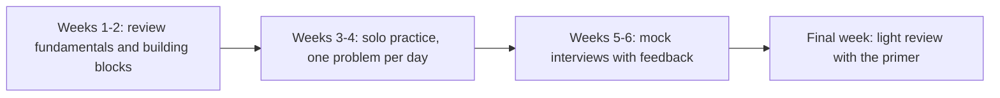

System design is learned through practice and exposure to real systems. This lesson suggests how to keep improving after the course, with types of resources to seek out and a practice plan for interviews.

## Types of resources

**Foundational books.** Books on the design of data-intensive applications, distributed systems theory and site reliability engineering go deeper than any course can on replication, consistency, stream processing and operations. Read them slowly, a chapter at a time, and connect each concept to a design from this course.

**Original papers.** Many building blocks come from well-known papers: distributed file systems, key-value stores with consistent hashing and vector clocks, wide-column databases, consensus algorithms, stream processors and globally distributed databases with synchronized clocks. Papers explain not just what systems do but why their designers chose particular trade-offs. Start with the introduction and design sections; skim the evaluation.

**Engineering blogs.** Large technology companies publish detailed write-ups of how they built their feeds, storage systems, payment platforms and inference infrastructure. These show how the ideas in this course are adapted under real constraints and at real scale.

**Postmortems.** Public incident reports, like those discussed in the outages chapter, are among the best learning material available. For each one, identify the trigger, the amplifying mechanism, why recovery took time and what changed afterwards.

**Open-source systems.** Reading the architecture documentation of open-source databases, message brokers and caches, and running them locally, turns abstract diagrams into concrete understanding. Try breaking them: kill nodes, partition the network and watch what happens.

## A practice plan for interviews

1. **Review the fundamentals.** Revisit the non-functional characteristics, estimation, and every building block. Be able to explain each in two minutes, with its main trade-offs.
2. **Practice solo.** Pick a problem from Part III or IV, set a 40-minute timer and design it aloud using SCALED, drawing on paper or a whiteboard tool. Afterwards, compare with the lesson and write down what you missed.
3. **Do mock interviews.** Practice with peers, taking turns as interviewer. The interviewer should push on trade-offs and failure scenarios. Record sessions if you can and review your communication.
4. **Keep a mistakes journal.** Note recurring gaps, such as forgetting estimates, skipping failure handling or running out of time before deep dives, and target them in the next session.
5. **Taper before the interview.** Review the primer and your journal, and rest. Fatigue hurts more than one more practice problem helps.

## Communication tips

- Think aloud; the interviewer grades your reasoning, not just the final diagram.
- Check in periodically: "Does this level of detail work, or would you like me to go deeper here?"
- When you are unsure, state assumptions explicitly and move on.
- Manage time: reserve the last few minutes for trade-offs, bottlenecks and what you would improve.

<Callout type="tip">
The most effective preparation is repetition with feedback. Ten problems practiced aloud with honest review are worth more than thirty read passively.
</Callout>

<KeyTakeaways>
- Deepen knowledge with foundational books, original papers, engineering blogs, postmortems and open-source systems.
- Practice problems aloud under time pressure using SCALED, then compare and record what you missed.
- Mock interviews with feedback on trade-offs and failures are the most valuable preparation.
- Communicate clearly: think aloud, check in, state assumptions and reserve time for trade-offs.
</KeyTakeaways>
