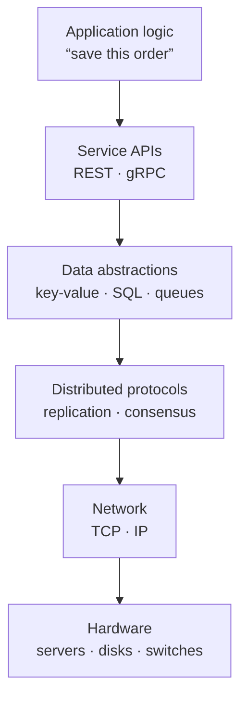

An **abstraction** hides the details of how something works behind a simpler interface. You use abstractions constantly: a file hides disk sectors, a TCP socket hides packet loss and retransmission, and a database query hides indexes and storage engines. Abstractions let us build complex systems without holding every detail in our heads at once.

Distributed systems are among the hardest things engineers build, so abstractions matter even more. They let an application developer write `db.get(key)` without thinking about which of fifty machines holds the key, whether a replica is lagging, or how the network routes the request.

## Layers of abstraction

Each layer offers guarantees to the layer above and relies on guarantees from the layer below. TCP, for example, offers an ordered, reliable byte stream on top of IP, which only promises best-effort delivery of individual packets. A replicated database offers "a single durable table" on top of many machines that crash independently. System design is largely about choosing which guarantees each layer should offer and at what cost.

## Why abstractions are powerful

- **Separation of concerns.** Teams can work on the storage layer and the product layer independently.
- **Replaceability.** If an application depends on a "key-value store" interface rather than a specific product, you can swap the implementation as requirements change.
- **Reuse.** One well-built abstraction serves thousands of applications. An object store such as Amazon S3 offers just `PUT`, `GET`, `LIST` and `DELETE` on named objects, yet hides replication, erasure coding, disk failures and data-center outages behind that tiny interface.
- **Reasoning at the right level.** In an interview, you can say "a distributed queue with at-least-once delivery" without describing its internals, then zoom in only if asked.

## Famous abstractions in distributed systems

Some of the most influential systems are remembered primarily for the abstraction they offered:

| System | Abstraction offered | What it hid |
| --- | --- | --- |
| MapReduce | "Write a map function and a reduce function" | Scheduling, data shuffling and machine failures across thousands of nodes |
| Distributed log (Kafka) | An append-only, partitioned, replayable sequence of records | Replication, retention, consumer offsets |
| Object storage (S3) | Unlimited buckets of immutable named objects | Placement, durability, repair |
| Lock service (Chubby, ZooKeeper) | A small file system with locks and watches | Consensus among replicas |
| Container orchestration (Kubernetes) | "Keep N copies of this container running" | Scheduling, health checks, restarts |

Each succeeded because its interface was small, its guarantees were clear, and it solved a problem many teams had.

## Leaky abstractions

No abstraction over a network is perfect. A remote call *looks* like a local function call but can be thousands of times slower, can fail halfway through and can leave you unsure whether the operation happened. A replicated database *looks* like a single database but may return stale data after a failover. These are **leaky abstractions**: details of the underlying layer that seep through the interface.

<Callout type="warning">
Most production incidents happen where an abstraction leaks: a timeout that assumed the network was fast, a retry that assumed an operation was idempotent, a cache that assumed data never changed.
</Callout>

Good designs acknowledge the leaks. They set timeouts, make operations idempotent so retries are safe, and choose consistency guarantees explicitly.

## The fallacies of distributed computing

In the 1990s, engineers at Sun Microsystems listed assumptions that developers new to distributed systems tend to make — all of which are false. They remain a useful checklist for spotting leaks:

1. **The network is reliable.** Packets are dropped, links fail and switches reboot.
2. **Latency is zero.** A cross-region round trip costs tens to hundreds of milliseconds.
3. **Bandwidth is infinite.** Large payloads and chatty protocols saturate links.
4. **The network is secure.** Traffic can be observed or tampered with unless encrypted and authenticated.
5. **Topology doesn't change.** Servers come and go; IP addresses change.
6. **There is one administrator.** Different teams and providers control different parts of the path.
7. **Transport cost is zero.** Serialization costs CPU, and cloud providers charge for data transfer.
8. **The network is homogeneous.** Clients use different devices, protocols and network qualities.

<Ponder question="A team replaces an in-process function call with a call to a new microservice, and page latency rises from 80 ms to 400 ms. Which fallacies did they fall for, and what would you look for?">
Mainly "latency is zero" and "transport cost is zero". A function called in a loop — say, once per item on a page of 50 items — becomes 50 network round trips plus 50 serializations. Look for chatty call patterns and fix them with batching (one call for all items), caching, or moving the logic back in-process if it does not need to be separate.
</Ponder>

## Abstractions used throughout this course

Three families of abstraction recur in almost every design:

1. **Network abstractions** — remote procedure calls and messaging, which hide how bytes move between machines. The next lesson explores RPC in detail.
2. **Consistency abstractions** — the guarantees a replicated data store makes about what readers observe, from eventual to strict consistency.
3. **Failure abstractions** — models of how components can fail, from simply crashing to behaving arbitrarily, which determine the protocols needed to tolerate them.

Understanding these three families lets you describe any building block precisely: "a key-value store with tunable consistency that tolerates crash failures of a minority of replicas."

## Designing good abstractions

When you define an interface for a service or building block, a few principles help:

- **Make guarantees explicit.** State ordering, durability and consistency guarantees rather than leaving them to be discovered.
- **Keep the surface small.** Every operation you expose is one you must support, scale and keep compatible forever.
- **Expose failure honestly.** Return distinguishable errors — "not found", "conflict", "retry later" — so callers can react correctly.
- **Allow escape hatches.** Let expert callers tune behavior where it matters, such as choosing a read's consistency level.

## Choosing the right level

In an interview, operate at the highest level of abstraction that still answers the question. Start with boxes such as "user service" and "message queue." Drop down a level when a requirement depends on the details — for example, when message ordering matters, discuss how the queue partitions and orders messages.

<KeyTakeaways>
- Abstractions hide complexity behind simpler interfaces and let us reason at the right level.
- Distributed systems stack many layers, each offering guarantees to the one above.
- Influential systems such as MapReduce, S3 and Kafka succeeded through small interfaces with clear guarantees.
- Network-based abstractions leak; the fallacies of distributed computing list the assumptions that fail.
- Consistency and failure models are key abstractions for describing distributed components precisely.
- In interviews, start at a high level and zoom in only where requirements demand it.
</KeyTakeaways>
