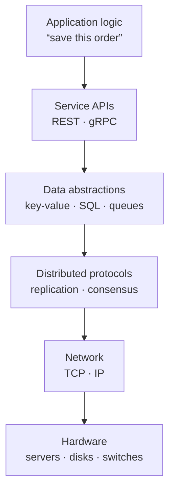

An **abstraction** hides the details of how something works behind a simpler interface. You use abstractions constantly: a file hides disk sectors, a TCP socket hides packet loss and retransmission, and a database query hides indexes and storage engines. Abstractions let us build complex systems without holding every detail in our heads at once.

Distributed systems are among the hardest things engineers build, so abstractions matter even more. They let an application developer write `db.get(key)` without thinking about which of fifty machines holds the key, whether a replica is lagging, or how the network routes the request.

## Layers of abstraction

Each layer offers guarantees to the layer above and relies on guarantees from the layer below. System design is largely about choosing which guarantees each layer should offer and at what cost.

## Why abstractions are powerful

- **Separation of concerns.** Teams can work on the storage layer and the product layer independently.
- **Replaceability.** If an application depends on a “key-value store” interface rather than a specific product, you can swap the implementation as requirements change.
- **Reasoning at the right level.** In an interview, you can say “a distributed queue with at-least-once delivery” without describing its internals, then zoom in only if asked.

## Leaky abstractions

No abstraction over a network is perfect. A remote call *looks* like a local function call but can be thousands of times slower, can fail halfway through and can leave you unsure whether the operation happened. A replicated database *looks* like a single database but may return stale data after a failover. These are **leaky abstractions**: details of the underlying layer that seep through the interface.

<Callout type="warning">
Most production incidents happen where an abstraction leaks: a timeout that assumed the network was fast, a retry that assumed an operation was idempotent, a cache that assumed data never changed.
</Callout>

Good designs acknowledge the leaks. They set timeouts, make operations idempotent so retries are safe, and choose consistency guarantees explicitly.

## Abstractions used throughout this course

Three families of abstraction recur in almost every design:

1. **Network abstractions** — remote procedure calls and messaging, which hide how bytes move between machines. The next lesson explores RPC in detail.
2. **Consistency abstractions** — the guarantees a replicated data store makes about what readers observe, from eventual to strict consistency.
3. **Failure abstractions** — models of how components can fail, from simply crashing to behaving arbitrarily, which determine the protocols needed to tolerate them.

Understanding these three families lets you describe any building block precisely: “a key-value store with tunable consistency that tolerates crash failures of a minority of replicas.”

## Choosing the right level

In an interview, operate at the highest level of abstraction that still answers the question. Start with boxes such as “user service” and “message queue.” Drop down a level when a requirement depends on the details — for example, when message ordering matters, discuss how the queue partitions and orders messages.

<KeyTakeaways>
- Abstractions hide complexity behind simpler interfaces and let us reason at the right level.
- Distributed systems stack many layers, each offering guarantees to the one above.
- Network-based abstractions leak: latency, partial failure and staleness show through.
- Consistency and failure models are key abstractions for describing distributed components precisely.
- In interviews, start at a high level and zoom in only where requirements demand it.
</KeyTakeaways>
