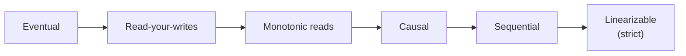
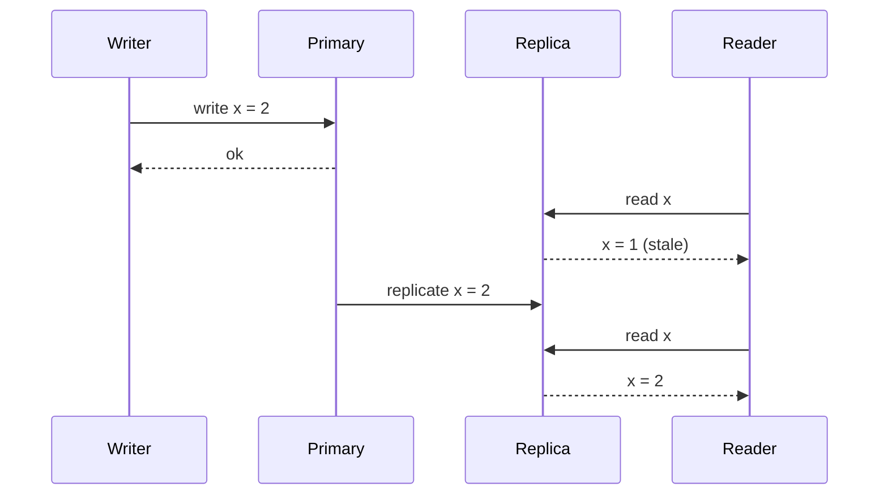

When data is replicated across several machines, a write reaches the replicas at slightly different times. A **consistency model** is a contract that describes what a reader may observe while this happens. Stronger models are easier to program against but cost more latency and availability; weaker models are faster and more available but push complexity to the application.

The diagram orders common models from weakest to strongest. Let's walk through them.

## The problem in one picture

Consider a value `x` replicated on two nodes. A client writes `x = 2`, and the primary asynchronously forwards it to a replica. A second client reads from the replica before the update arrives.

The writer has been told the write succeeded, yet the reader sees the old value. Whether that is acceptable depends on the consistency model the system promises.

## Eventual consistency

If no new writes occur, all replicas **eventually** converge to the same value. Until then, a reader may see old data, and two readers may see different values. There is no bound on how long "eventually" takes, though in practice it is usually milliseconds to seconds.

Eventual consistency works well for data where brief staleness is harmless: like counts, view counters, product reviews, DNS records. It enables high availability and low latency because any replica can serve any request.

A stronger variant, **strong eventual consistency**, guarantees that any two replicas that have received the same set of updates are in the same state, regardless of order. Conflict-free replicated data types (CRDTs), used in collaborative editors and shopping carts, provide it.

## Session guarantees

Several practical guarantees sit between eventual and strong consistency. They are defined from the perspective of one client session:

- **Read-your-writes** — after you update your profile picture, you always see the new one, even if other users briefly see the old one.
- **Monotonic reads** — once you have seen a value, you never see an older one. Without this, refreshing a page could make a comment appear and then disappear.
- **Monotonic writes** — your writes are applied in the order you made them.
- **Writes-follow-reads** — if you read a value and then write, your write is ordered after the value you read.

These are often implemented by routing a user's requests to the same replica ("sticky sessions"), by reading from the primary for a short window after the user writes, or by having the client remember the latest version it has seen and refusing replicas that are behind it.

## Causal consistency

If one operation **causally depends** on another — a reply depends on the message it replies to — then everyone sees them in that order. Unrelated operations may appear in different orders to different readers. Causal consistency prevents confusing anomalies such as seeing an answer before its question, while remaining achievable without global coordination. Systems track causality with version vectors or by attaching the IDs of the operations a write depends on.

## Sequential consistency

All clients observe all operations in the **same order**, and each client's operations appear in the order it issued them. However, that single order does not have to match real time exactly: a write that finished before another began could still appear after it.

## Linearizability (strict consistency)

The strongest common model. Every operation appears to take effect **instantaneously at some point between its start and end**, and all clients agree on that order. Once a write completes, every subsequent read — from any client, on any replica — returns that value or a newer one. The system behaves as if there were a single copy of the data.

Linearizability is essential for things like leader election, distributed locks, unique usernames and bank balances. It requires coordination (for example, a consensus protocol such as Raft, or synchronous replication to a quorum), which adds latency and means the system may refuse requests during network partitions.

<Callout type="note" title="Linearizability is not serializability">
The names are confusingly similar. **Serializability** is a guarantee about *transactions* — groups of operations over many objects appear to run one at a time in some order. **Linearizability** is a guarantee about *single operations* on a single object matching real time. A database can offer either, both ("strict serializability") or neither.
</Callout>

## How systems implement stronger guarantees

| Technique | What it provides | Cost |
| --- | --- | --- |
| Read from primary only | Read-your-writes for everyone | Primary becomes a bottleneck |
| Sticky sessions to one replica | Monotonic reads per user | Uneven load; lost on failover |
| Quorum reads and writes (R + W > N) | Reads see the latest acknowledged write | Higher latency; partial unavailability |
| Consensus (Raft, Paxos) | Linearizable operations | A round trip to a majority for each write |
| Synchronized clocks with bounded error | Externally consistent transactions across regions | Specialized hardware and commit waits |

The quorum rule deserves a closer look because it appears in many designs. With `N` replicas, a write succeeds once `W` replicas acknowledge it, and a read queries `R` replicas and takes the newest value. If `R + W > N`, every read quorum overlaps every write quorum in at least one replica, so a read always sees the latest acknowledged write. We return to this in the key-value store chapter.

<Ponder question="A social network shows a user's own new post immediately but lets friends see it a second later. Which guarantee does this use, and why not make everything linearizable?">
It provides **read-your-writes** for the author while leaving other readers eventually consistent. Linearizability everywhere would force every feed read to coordinate with the replica holding the latest write, adding cross-region latency to the most frequent operation for no user-visible benefit: friends cannot tell whether a post appeared one second late.
</Ponder>

<Callout type="interview">
Do not default to "strong consistency everywhere." For each piece of data, ask what goes wrong if a reader sees stale data. Money, inventory and uniqueness usually need strong guarantees; feeds, counters and recommendations usually do not.
</Callout>

## Choosing a model

| Data | Suitable model | Why |
| --- | --- | --- |
| Account balance | Linearizable | Double-spending is unacceptable |
| Seat or ticket inventory | Linearizable per seat | Two buyers must not get the same seat |
| Chat messages in a thread | Causal | Replies must follow what they reply to |
| User's own profile edits | Read-your-writes | Users expect to see their changes |
| Shopping cart | Strong eventual (CRDT) | Merging adds from two devices beats rejecting one |
| Like counts | Eventual | Small, temporary errors are harmless |

<KeyTakeaways>
- Consistency models define what readers may observe while replicas converge.
- Eventual consistency is fast and available but allows stale reads; CRDTs strengthen it to guaranteed convergence.
- Session guarantees such as read-your-writes fix the most user-visible anomalies cheaply.
- Causal consistency preserves cause-and-effect ordering without global coordination.
- Linearizability behaves like a single copy of the data but costs latency and availability; it differs from serializability.
- Quorums with R + W > N and consensus are the standard ways to get stronger guarantees.
- Choose the model per data type based on the harm caused by staleness.
</KeyTakeaways>
