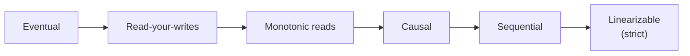

When data is replicated across several machines, a write reaches the replicas at slightly different times. A **consistency model** is a contract that describes what a reader may observe while this happens. Stronger models are easier to program against but cost more latency and availability; weaker models are faster and more available but push complexity to the application.

The diagram orders common models from weakest to strongest. Let's walk through them.

## Eventual consistency

If no new writes occur, all replicas **eventually** converge to the same value. Until then, a reader may see old data, and two readers may see different values. There is no bound on how long “eventually” takes, though in practice it is usually milliseconds to seconds.

Eventual consistency works well for data where brief staleness is harmless: like counts, view counters, product reviews, DNS records. It enables high availability and low latency because any replica can serve any request.

## Session guarantees

Several practical guarantees sit between eventual and strong consistency. They are defined from the perspective of one client session:

- **Read-your-writes** — after you update your profile picture, you always see the new one, even if other users briefly see the old one.
- **Monotonic reads** — once you have seen a value, you never see an older one. Without this, refreshing a page could make a comment appear and then disappear.
- **Monotonic writes** — your writes are applied in the order you made them.

These are often implemented by routing a user's requests to the same replica or by tracking the version each client has seen.

## Causal consistency

If one operation **causally depends** on another — a reply depends on the message it replies to — then everyone sees them in that order. Unrelated operations may appear in different orders to different readers. Causal consistency prevents confusing anomalies such as seeing an answer before its question, while remaining achievable without global coordination.

## Sequential consistency

All clients observe all operations in the **same order**, and each client's operations appear in the order it issued them. However, that single order does not have to match real time exactly.

## Linearizability (strict consistency)

The strongest common model. Every operation appears to take effect **instantaneously at some point between its start and end**, and all clients agree on that order. Once a write completes, every subsequent read — from any client, on any replica — returns that value or a newer one. The system behaves as if there were a single copy of the data.

Linearizability is essential for things like leader election, distributed locks, unique usernames and bank balances. It requires coordination (for example, a consensus protocol or synchronous replication to a quorum), which adds latency and means the system may refuse requests during network partitions.

<Callout type="interview">
Do not default to “strong consistency everywhere.” For each piece of data, ask what goes wrong if a reader sees stale data. Money, inventory and uniqueness usually need strong guarantees; feeds, counters and recommendations usually do not.
</Callout>

## Choosing a model

| Data | Suitable model | Why |
| --- | --- | --- |
| Account balance | Linearizable | Double-spending is unacceptable |
| Chat messages in a thread | Causal | Replies must follow what they reply to |
| User's own profile edits | Read-your-writes | Users expect to see their changes |
| Like counts | Eventual | Small, temporary errors are harmless |

<KeyTakeaways>
- Consistency models define what readers may observe while replicas converge.
- Eventual consistency is fast and available but allows stale reads.
- Session guarantees such as read-your-writes fix the most user-visible anomalies cheaply.
- Causal consistency preserves cause-and-effect ordering without global coordination.
- Linearizability behaves like a single copy of the data but costs latency and availability.
- Choose the model per data type based on the harm caused by staleness.
</KeyTakeaways>
